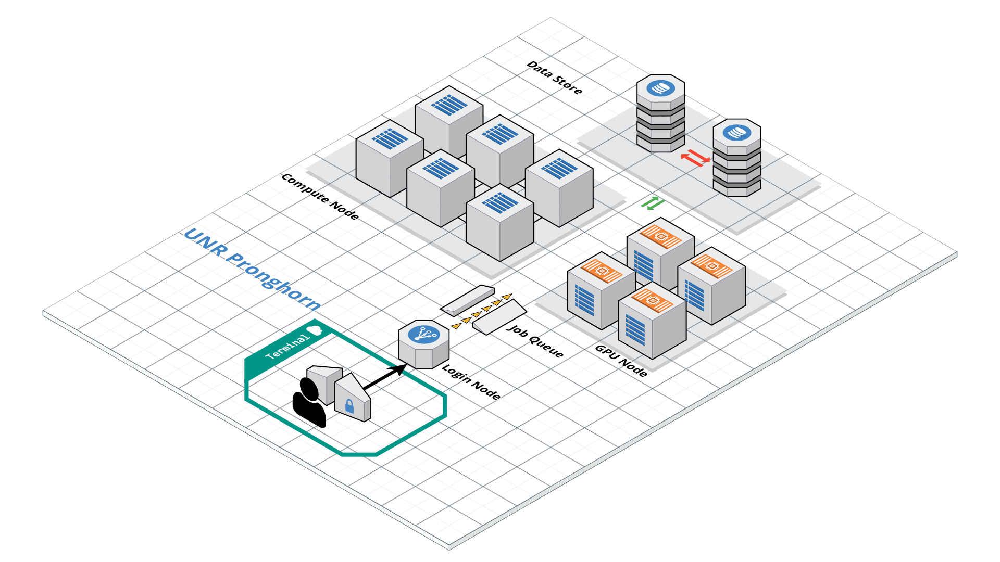

## Overview

### Why do we need an HPC cluster?

Modern bioinformatics datasets are *huge*. A single human genome sequencing run can be hundreds of gigabytes; an RNA-Seq experiment with a dozen samples can take days to align on a laptop — assuming your laptop even has enough RAM, which it usually doesn't. **High-Performance Computing (HPC)** solves this by giving you access to many large servers at once.

### What is a cluster, really?

Imagine a normal computer scaled up and multiplied:

- A **cluster** is a roomful of powerful servers connected by a fast network.
- Each server is called a **node**, and each node has many **CPU cores** (think: workers) and a lot of **RAM** (think: desk space).
- All nodes share the same **storage** (think: a giant filing cabinet everyone can see).

When you log in, you don't get a node to yourself — you share the cluster with hundreds of other users. A scheduler (Slurm) decides who runs where and when, so everyone gets a fair turn.

### What's different from your laptop?

You already know Linux from previous classes — `cd`, `ls`, `nano`, `grep`, all of those work the same on the cluster. Only three new ideas:

1. **Remote access** — you connect over the network with SSH instead of opening a terminal locally.
2. **File transfer** — your data lives on your laptop, but compute happens on the cluster, so you'll move files back and forth.
3. **Job scheduling** — instead of running a program directly, you ask Slurm to run it for you on a free node.

> ## Learning Objectives
> By the end of this lesson you will be able to:
> - Connect to the UNR Pronghorn HPC cluster over SSH
> - Move files between your laptop and the cluster with `scp` and `rsync`
> - Install bioinformatics tools with Micromamba
> - Set up scratch storage for working data
> - Write, submit, monitor, and cancel jobs with Slurm (`sbatch`, `squeue`, `scancel`)
> - Download and preprocess public RNA-Seq data on HPC
{: .objectives}

> ## Lesson roadmap
> We'll do everything in this order — each step builds on the last:
>
> 1. **Log in** to Pronghorn with SSH
> 2. **Make your shell nicer** with a colored prompt (one-time setup)
> 3. **Move files** between your laptop and the cluster
> 4. **Set up scratch storage** for big data files (one-time setup)
> 5. **Install Micromamba** and create an RNA-Seq software environment (one-time setup)
> 6. **Submit a Slurm job** to actually do work on a compute node
> 7. **Run a real workflow**: download SRA data and quality-trim it
{: .callout}

## Terminal Survival Kit (Read This First!)

Before we touch the cluster, here are the absolutely essential terminal skills you'll use **every minute**. Skim this even if you think you know it — these are the things that trip up beginners most.

### Keyboard shortcuts that save your life

| Shortcut | What it does | When to use it |
|----------|--------------|----------------|
| `Ctrl-C` | **Stop** the running command | Something is hung, looping, or you typed the wrong thing |
| `Ctrl-D` | Send "end of input" / log out | Cleanly exit a shell or close `cat`-style input |
| `Ctrl-L` | Clear the screen | Screen is messy; same as `clear` |
| `Tab` | **Auto-complete** filename or command | Always use it — saves typing AND prevents typos |
| `↑` / `↓` | Cycle through your previous commands | Re-run the last thing without retyping |
| `Ctrl-R` | Search command history | Type a few letters, find old commands fast |
| `Ctrl-A` / `Ctrl-E` | Jump cursor to start / end of line | Editing long commands |

> ## The single most important habit: press Tab
> Half of all "command not found" and "no such file" errors come from typos. **Press Tab after typing a few letters of any path or command** — the shell finishes it for you, or beeps if it doesn't recognize what you typed (which means you have the name wrong). Tab twice shows all matching options.
{: .callout}

### Copy-paste in the terminal

Regular `Ctrl-C` / `Ctrl-V` **don't work** in most terminals (Ctrl-C means "cancel" here!). Use:

- **Mac Terminal**: `Cmd+C` / `Cmd+V` (normal)
- **Linux / WSL**: `Ctrl+Shift+C` / `Ctrl+Shift+V`
- **Windows Terminal / PuTTY**: right-click to paste, or `Ctrl+Shift+V`

### Where am I right now?

When you have multiple terminals open, it's easy to lose track of whether you're on your laptop, on the Pronghorn login node, or inside a Slurm job. **When in doubt, run these two commands:**

```bash
hostname        # Which machine am I on?
pwd             # Which directory am I in?
whoami          # Who am I logged in as?
```

| `hostname` shows… | You're on… |
|-------------------|------------|
| your laptop's name (e.g., `Macbook-Pro.local`, `DESKTOP-XYZ`) | Your laptop |
| `pronghorn` (or similar) | The Pronghorn **login node** (don't run heavy jobs here!) |
| `cpu-1`, `cpu-23`, etc. | A compute node (you're inside a Slurm job — heavy work OK) |

### Editing files with `nano`

`nano` is the simplest text editor on the cluster. Open or create a file:

```bash
nano myfile.sh
```

Inside `nano`, the commands are listed at the bottom (the `^` symbol means **Ctrl**):

| Shortcut | Action |
|----------|--------|
| `Ctrl-O`, then Enter | **Save** (Output) the file |
| `Ctrl-X` | **Exit** nano |
| `Ctrl-K` | Cut current line |
| `Ctrl-U` | Paste cut line |
| `Ctrl-W` | Search inside the file |
| `Ctrl-G` | Help |

A typical save-and-exit sequence: `Ctrl-O` → Enter → `Ctrl-X`.

### Reading and decoding error messages

The terminal isn't trying to be cryptic — it's literally telling you what's wrong. Learn these three:

| Message | Translation | Fix |
|---------|-------------|-----|
| `command not found` | I don't know that program | Typo in command, or you forgot to `micromamba activate` an environment |
| `No such file or directory` | The path you gave doesn't exist | Check spelling with Tab; check `pwd` to make sure you're where you think you are |
| `Permission denied` | You don't have rights to do that | Script needs `chmod +x`; you're trying to write where you can't (someone else's folder) |

> ## Read the WHOLE error
> Long error messages usually have the actual problem on the **first** or **last** line. Everything in the middle is a stack trace — you can ignore it for now. Quote the first/last line when asking for help.
{: .callout}

### Mini glossary

You'll hear these words a lot — here's the one-line version of each:

| Term | What it means |
|------|---------------|
| **Shell** / **terminal** | The text-based program where you type commands (Bash on the cluster). |
| **Command line** | Same as "shell" — the place after the `$` prompt. |
| **Path** | The address of a file: `/data/gpfs/assoc/bch709-6/jdoe/file.txt`. |
| **`PATH`** (uppercase) | An environment variable listing where the shell looks for commands. Activating an environment adds its tools to `PATH`. |
| **Home directory** (`~`) | Your personal folder; `~` is shorthand for `/home/<netid>`. |
| **Node** | One physical computer in the cluster. |
| **Login node** | The small node you SSH into. For editing/submitting only. |
| **Compute node** | A big node where Slurm runs your real work. |
| **Core** / **CPU** | A processing unit; `--cpus-per-task=8` means "give me 8 cores." |
| **Job** | A unit of work submitted to Slurm. Has an ID like `12345`. |
| **Queue** / **partition** | A pool of compute nodes you're allowed to use (e.g. `cpu-core-0`). |
| **Account** | Who pays for the compute time (e.g., `cpu-s5-bch709-6`). |
| **Environment** | A self-contained set of installed software (Micromamba). |
{: .callout}

## Pronghorn HPC Cluster

**Pronghorn** is the name of UNR's HPC cluster — it's the specific machine we'll use for the rest of this course. It's a shared resource for researchers and students across the Nevada System of Higher Education.

Roughly, what's inside:

- **CPU section** — 93 nodes, ~3,000 CPU cores total, 21 TiB of memory (for normal compute jobs like ours)
- **GPU section** — 44 NVIDIA Tesla P100 GPUs (for deep learning / GPU-accelerated tools)
- **Storage** — 1 PB (= 1,000 TB) of fast parallel storage shared by all nodes

The hardware lives at the Switch Citadel Campus, about 25 miles east of campus — but you'll never see it in person, you only ever talk to it through SSH. Up-to-date specs are on the [UNR Research Computing page](https://www.unr.edu/research-computing/hpc).

{: width="70%" height="70%"}

> ## Your account
> All students in this course already have a Pronghorn account using your **UNR NetID** and password — the same ones you use for WebCampus. If you didn't receive a confirmation email, message the instructor before continuing. (Researchers outside the course request access through their department or advisor.)
{: .callout}

## Connecting to Pronghorn

We connect to the cluster using **SSH** (Secure Shell) — a program that opens a remote terminal session over the network. Once connected, your keystrokes travel to Pronghorn and its responses come back to your screen, but everything is actually running on the cluster, not your laptop.

**Before you start, know which terminal to use:**

- **Mac / Linux** — open the built-in **Terminal** app. SSH is already installed.
- **Windows** — open **WSL (Ubuntu)** that you set up earlier in the course. Alternatively, MobaXterm or PuTTY also work.

Now log in (replace `<YOUR_NET_ID>` with your actual NetID, e.g., `jdoe`):

```bash
ssh <YOUR_NET_ID>@pronghorn.rc.unr.edu
```

What happens next:

1. **First time only:** SSH shows a long fingerprint and asks `Are you sure you want to continue connecting (yes/no)?` — type `yes` and press Enter. (This memorizes Pronghorn's identity so it can warn you if you ever connect to a fake server.)
2. It prompts for your password. **Type your NetID password — nothing will appear on the screen as you type, not even dots.** This is normal. Press Enter when done.
3. You'll see a welcome message and a new prompt like `[jdoe@pronghorn ~]$`. You're now on the cluster.

To leave the cluster and return to your laptop, type `exit` or press `Ctrl-D`.

> ## Tip — losing your connection
> If your laptop sleeps or you lose Wi-Fi, your SSH session will freeze or die. That's fine — just `ssh` back in. (For long jobs, this doesn't matter because Slurm runs them on a compute node independently of your session — see the Slurm section below.)
{: .callout}

## Customizing Your Shell Prompt (Optional but Helpful)

The default prompt on Pronghorn is just `$` — easy to confuse with your laptop's terminal when you have several windows open. A colored prompt showing your username, host, time, and current directory makes it obvious where you are.

`~/.bashrc` runs every time you open a new shell, so anything you append there becomes permanent. **Run this once, inside your SSH session:**

```bash
echo '###BCH709' >> ~/.bashrc
echo 'tty -s && export PS1="\[\033[38;5;164m\]\u\[$(tput sgr0)\]\[\033[38;5;15m\] \[$(tput sgr0)\]\[\033[38;5;231m\]@\[$(tput sgr0)\]\[\033[38;5;15m\] \[$(tput sgr0)\]\[\033[38;5;2m\]\h\[$(tput sgr0)\]\[\033[38;5;15m\] \[$(tput sgr0)\]\[\033[38;5;172m\]\t\[$(tput sgr0)\]\[\033[38;5;15m\] \[$(tput sgr0)\]\[\033[38;5;2m\]\w\[$(tput sgr0)\]\[\033[38;5;15m\]\n \[$(tput sgr0)\]"' >> ~/.bashrc
echo "alias ls='ls --color=auto'" >> ~/.bashrc
source ~/.bashrc
```

The last line, `source ~/.bashrc`, re-loads the file so the changes take effect immediately — you don't have to log out and back in. From now on, every new SSH session will already look this way.

## Transferring Files

Your laptop and the cluster have **completely separate file systems** — files on one are not visible from the other. So whenever you want the cluster to work on data from your laptop (or pull results back), you have to copy them explicitly.

Two main tools for this, both run from **your laptop's terminal** (not from inside the SSH session):

| Tool | Best for | Why |
|------|----------|-----|
| `scp` | A few small files | Simple syntax, like `cp` but across machines |
| `rsync` | Folders, big datasets, anything that might fail mid-transfer | Resumes interrupted transfers, shows progress, only re-copies what changed |

> ## Direction matters
> Both `scp` and `rsync` use the same template:
> `command  <source>  <destination>`
>
> The `<username>@pronghorn.rc.unr.edu:` prefix marks a path on the cluster. Whichever side has that prefix is the cluster side. **Run these from your laptop's terminal**, not from inside SSH.
{: .callout}

### scp — Secure Copy

`scp` stands for **secure copy** — it copies files between two computers over the same encrypted SSH connection you used to log in. If you already know `cp`, you already mostly know `scp`:

```bash
cp   <source>  <destination>          # local copy
scp  <source>  <destination>          # copy over SSH
```

The only new piece is how you write a path on the remote machine. A remote path looks like:

```
<username>@<server>:<path>
```

For us that's:

```
jdoe@pronghorn.rc.unr.edu:/home/jdoe/data.txt
└─┬─┘ └────────┬────────┘ └──────┬──────────┘
NetID    Pronghorn host       Path on cluster
```

The `:` between the host and the path is **mandatory** — without it, `scp` thinks the whole thing is a local filename and creates a weird file like `jdoe@pronghorn.rc.unr.edu`. (Common beginner mistake.)

> ## Tilde shortcuts
> - `~` means "my home directory" — works on both your laptop and the cluster.
> - `~/data.txt` means "file `data.txt` in my home directory".
> - On the cluster, `~/` and `/home/<your_netid>/` point to the same place.
{: .callout}

#### 1. Send a file from your laptop → cluster (upload)

```bash
scp <source_file>  <username>@pronghorn.rc.unr.edu:<target_location>
```

Try this end-to-end as a sanity check (run from your **laptop terminal**, not from inside SSH):

```bash
# 1. Make a small test file on your laptop
mkdir ~/bch709
cd ~/bch709
echo "hello world" > test_uploading_file.txt

# 2. Copy it to your home directory on Pronghorn
scp test_uploading_file.txt <username>@pronghorn.rc.unr.edu:~/
```

`scp` will ask for your NetID password (no characters appear as you type — that's normal). When it finishes you'll see a progress line like:

```
test_uploading_file.txt   100%   12   0.5KB/s   00:00
```

Now log into Pronghorn and confirm the file arrived:

```bash
ssh <username>@pronghorn.rc.unr.edu
ls ~/                       # you should see test_uploading_file.txt
cat test_uploading_file.txt # prints "hello world"
exit                        # back to your laptop
```

You can also rename the file as you upload — just put the new name at the end of the remote path:

```bash
scp test_uploading_file.txt <username>@pronghorn.rc.unr.edu:~/hello.txt
```

#### 2. Pull a file from cluster → laptop (download)

Just **flip the order** — put the remote path first (as the source) and a local path second (as the destination):

```bash
scp <username>@pronghorn.rc.unr.edu:<source_file>  <destination>
```

Example:

```bash
# Pull a file from your Pronghorn home into your laptop's current directory
scp <username>@pronghorn.rc.unr.edu:~/test_downloading_file.txt  ./
```

`./` means "right here, in the directory I'm currently in." You can also give a specific destination folder:

```bash
scp <username>@pronghorn.rc.unr.edu:~/results.csv  ~/Downloads/
```

#### 3. Copy an entire folder — add `-r` (recursive)

A folder can contain many files and subfolders, so `scp` refuses to copy it unless you tell it to descend recursively:

```bash
scp -r <source_directory>  <username>@pronghorn.rc.unr.edu:<target_directory>
```

Example — upload a whole project folder:

```bash
scp -r ~/bch709  <username>@pronghorn.rc.unr.edu:~/
```

This creates `~/bch709/` on Pronghorn containing everything inside your local `~/bch709/`.

The same `-r` works in the other direction:

```bash
scp -r <username>@pronghorn.rc.unr.edu:~/scratch/results  ~/Downloads/
```

#### 4. Copy multiple specific files at once

You can list several source files before the destination:

```bash
scp file1.txt file2.txt file3.txt  <username>@pronghorn.rc.unr.edu:~/bch709/
```

Or use a shell wildcard (`*`) to match a pattern:

```bash
# Upload every .fastq.gz file in the current folder
scp *.fastq.gz  <username>@pronghorn.rc.unr.edu:~/scratch/raw_data/
```

#### 5. Useful `scp` flags

| Flag | What it does |
|------|--------------|
| `-r` | Recursive — required for folders |
| `-P 22` | Use a non-default SSH port (Pronghorn uses 22 by default, so you usually don't need this) |
| `-p` | Preserve original timestamps and permissions |
| `-C` | Compress data during transfer (faster on slow networks) |
| `-v` | Verbose — show what's happening (useful for debugging) |
| `-i ~/.ssh/mykey` | Use a specific SSH key file |

> ## Common scp gotchas
> - **Forgot the `:`** — `scp file user@host~/` treats the whole right side as a local filename. The `:` is what makes it remote.
> - **Forgot `-r` on a folder** — error: `not a regular file`. Add `-r`.
> - **Wrong direction** — overwriting a file because you swapped source and destination. `scp` *does not warn you*, it just overwrites. Read your command twice before pressing Enter.
> - **Run it inside SSH by mistake** — `scp` from inside a Pronghorn shell will try to copy *between two cluster paths*, not to your laptop. Always run `scp` from your **laptop terminal**.
> - **Big folders** — `scp` can't resume if the connection drops mid-transfer; you have to start over. For anything bigger than a few GB, use `rsync` (next section) instead.
{: .callout}

### Open the local folder in your file browser

Sometimes it's easier to drag-and-drop or check what's actually in the folder. Open the local copy in your OS file manager:

- **Windows (WSL)**

```bash
cd ~/bch709
explorer.exe .
```

- **Mac**

```bash
cd ~/bch709
open .
```

### rsync — the smarter choice for big transfers

For folders, datasets, or anything that takes more than a few seconds, `rsync` is almost always the better choice:

- **Resumes** if your Wi-Fi drops mid-transfer (just re-run the same command).
- **Only copies what's changed** — re-running it after editing one file copies just that file, not the whole folder again.
- Shows a **progress bar** so you know it's actually working.

**Send a folder laptop → cluster:**

```bash
rsync -avhP <source_directory> <username>@pronghorn.rc.unr.edu:<target_directory>
```

**Pull a folder cluster → laptop:**

```bash
rsync -avhP <username>@pronghorn.rc.unr.edu:<source_directory> <target_directory>
```

The flags `-avhP` mean: `a`rchive (preserve permissions/timestamps), `v`erbose, `h`uman-readable sizes, show `P`rogress.

> ## Prefer drag-and-drop?
> Graphical SFTP clients work too — try **Cyberduck** (Mac/Win), **FileZilla** (cross-platform), or **WinSCP** (Windows). Use server `pronghorn.rc.unr.edu`, port `22`, and your NetID/password.
{: .callout}

## Installing Micromamba (Package Manager)

### What's a "package manager" and why do I need one?

On the cluster you don't have admin (`sudo`) rights — you can't install software the normal way. A **package manager** solves this by installing tools into a folder inside your home directory that only you control. No admin needed, and you can have multiple versions of the same tool side by side without conflicts.

We'll use **Micromamba**. It's a faster, smaller version of Conda that does the same job: creates isolated **environments** (folders that hold a specific set of software). Each environment is independent, so installing something into one project will never break another.

Install it with one command:

```bash
"${SHELL}" <(curl -L https://micro.mamba.pm/install.sh)
```

When prompted, accept the defaults:

- Install location: `~/.local/bin`
- Initialize your shell? **yes**
- Root prefix: `~/micromamba`

Then reload your shell so the `micromamba` command is on your `PATH`:

```bash
source ~/.bashrc
```

Verify the installation:

```bash
micromamba --version
```

## Creating the RNA-Seq Environment

Now create one environment for this course and install every tool we'll use later. (One-time setup — the environment persists across logins.)

```bash
micromamba create -n RNASEQ_bch709 -c bioconda -c conda-forge python=3.11
micromamba activate RNASEQ_bch709

micromamba install -c bioconda -c conda-forge sra-tools minimap2 star samtools subread
micromamba install -c bioconda -c conda-forge openjdk=17 trinity gffread seqkit kraken2 fastp
pip install multiqc
```

Once activated, your shell prompt will show `(RNASEQ_bch709)` and the installed tools will be on your `PATH`. Use `micromamba deactivate` to leave the environment.

> ## Fix: `libcrypto.so.1.0.0` error in samtools
> If `samtools` complains that it cannot find `libcrypto.so.1.0.0`, symlink the newer library shipped with the environment:
>
> ```bash
> ln -s ${CONDA_PREFIX}/lib/libcrypto.so.1.1 ${CONDA_PREFIX}/lib/libcrypto.so.1.0.0
> ```
{: .callout}

## Setting Up Scratch Storage

### Why two different storage areas?

On Pronghorn (and almost every HPC cluster) you have **two main places to keep files**, and they serve very different purposes:

| Location | Path | Size | Speed | Backed up? | Use it for |
|----------|------|------|-------|------------|------------|
| **Home** | `~` (`/home/<netid>`) | Small (~50 GB) | Slower | **Yes** | Scripts, configs, software, small important results |
| **Scratch** | `/data/gpfs/assoc/bch709-6/<netid>` | Huge (TBs) | **Very fast** (parallel) | **No** | Raw sequencing data, intermediate files, large outputs |

Think of it like a desk + warehouse:

- **Home** is your *desk drawer* — small but safe. The IT team backs it up, so don't worry about losing important files. But it fills up quickly, and putting big sequencing data there will get you in trouble.
- **Scratch** is the *warehouse loading dock* — enormous and built for speed. Bioinformatics jobs read and write huge files (FASTQ, BAM, etc.), and scratch can handle it. But there are **no backups**, and old files may be cleaned up periodically. Anything you actually want to keep long-term, copy back to your laptop or to home.

> ## Rule of thumb
> - **Code, scripts, notes** → home (`~`)
> - **Data and analysis outputs** → scratch (`~/scratch`)
> - **Final figures / tables you want to keep** → download to your laptop with `rsync`
{: .callout}

### Why "parallel" storage matters

Scratch lives on a **parallel file system** (IBM SpectrumScale / GPFS), meaning many compute nodes can read and write to it *simultaneously* at full speed. Your home directory isn't built for that — if 8 cores all hammer it at once, throughput crawls. Always run heavy I/O jobs from scratch.

### Create your scratch directory

You only do this **once**. After that, the folder is yours and stays put.

```bash
# 1. Create your personal folder inside the class scratch space
mkdir -p /data/gpfs/assoc/bch709-6/${USER}

# 2. Move into it to confirm it exists
cd /data/gpfs/assoc/bch709-6/${USER}

# 3. Make a shortcut so you can type "~/scratch" instead of the full path
ln -s /data/gpfs/assoc/bch709-6/${USER} ~/scratch
```

What each line does:

1. **`mkdir -p`** creates your folder under the shared course directory `bch709-6`. The `${USER}` variable expands to your NetID, so each student gets their own space and can't see each other's files. The `-p` flag means "no error if the parent already exists."
2. **`cd`** moves you into the new folder so you can verify it.
3. **`ln -s`** creates a *symbolic link* (a shortcut) called `~/scratch` that points to the long path. Now `cd ~/scratch` always takes you to your scratch space — much easier to remember and type.

### Verify it worked

```bash
ls -la ~/scratch
# the first line should show:  ~/scratch -> /data/gpfs/assoc/bch709-6/<your_netid>

cd ~/scratch && pwd
# should print:  /data/gpfs/assoc/bch709-6/<your_netid>
```

From now on, every time you start a new analysis, do it inside `~/scratch`:

```bash
cd ~/scratch
mkdir my_project
cd my_project
# ... download data, run jobs, etc.
```

> ## Don't lose your work
> Scratch is **not backed up** and may be purged on a schedule. Before the semester ends, copy anything you want to keep (final results, figures) back to your laptop with `rsync` (see the File Transfer section).
{: .callout}

### How much space am I using?

Sequencing data is huge — it's easy to fill scratch without realizing it. Two commands to know:

```bash
# How big is each file/folder in the current directory? (-h = human-readable)
du -sh *

# How big is one specific folder, total?
du -sh ~/scratch

# How much space is left on the file system?
df -h ~/scratch

# Find your biggest folders (top 10 in scratch)
du -h ~/scratch | sort -hr | head
```

If your home directory fills up (`df -h ~` shows nearly 100% used), `micromamba` and even `ssh` start failing in weird ways. Move large files to scratch.

## Submitting Jobs with Slurm

### Why a job scheduler?

When you log into Pronghorn with SSH, you land on a **login node** — a small server shared by everyone. The login node is for editing files, copying data, and submitting work. **You should never run real analyses on it.** A heavy job there slows down every other user and will be killed by the system.

The actual computing happens on dozens of much larger **compute nodes**. Because hundreds of users want them at once, a piece of software called **Slurm** acts as the traffic controller:

1. You write a small text file (a **batch script**) saying *"I need this many CPUs, this much memory, for this long, and here are the commands to run."*
2. You hand the script to Slurm with `sbatch`.
3. Slurm puts your job in a **queue**, finds a free compute node that matches your request, runs your commands there, and writes the output back to your home directory.

> ## Mental model
> Think of Slurm like a hotel reservation system. The login node is the lobby — fine for waiting around, not for sleeping. To actually use a room (compute node), you fill in a request form (batch script) saying how many beds (CPUs), how big a room (memory), and for how many nights (time). Slurm is the front desk that hands you a key when a matching room is free.
{: .callout}

### Step 1 — Find your account and partition

Slurm needs to know **who is paying** (`--account`) and **which pool of machines** to use (`--partition`). If you guess wrong, your job is rejected immediately. Check what is assigned to *you*:

```bash
# The most useful single command — shows your account, partition, and QOS
# (the %N suffix sets each column's width so long names don't get cut off)
sacctmgr show user $USER withassoc format=User%15,Account%30,Partition%30,QOS%20

# Summary of all partitions and how busy they are
sinfo -s

# Your default account (used if you omit --account in sbatch)
sacctmgr show user $USER format=User%15,DefaultAccount%30

# Detailed view including limits like MaxJobs, MaxSubmit
sacctmgr show assoc user=$USER format=Cluster%15,Account%30,User%15,Partition%30,Share,QOS%20,MaxJobs,MaxSubmit
```

> ## Tip — column widths in `sacctmgr`
> By default, `sacctmgr` columns are narrow and **truncate long names with a `+`** at the end (e.g., `cpu-s5-bch7+`). Add `%<width>` after each column to widen it: `Account%30` = 30 characters. If you ever see a `+` in the output, widen that column.
{: .callout}

The output from the first command should look something like this (your NetID will appear in the `User` column):

```
           User                        Account                      Partition                  QOS
--------------- ------------------------------ ------------------------------ --------------------
           wyim                cpu-s5-bch709-6                     cpu-core-0              student
```

Read across one row: **User** = your NetID, **Account** = `cpu-s5-bch709-6`, **Partition** = `cpu-core-0`, **QOS** = `student`. These are the exact strings to paste into your `#SBATCH --account=` and `#SBATCH --partition=` lines below. (Some students may see multiple rows if they belong to several accounts — pick the one that ends in `bch709-6` for this course.)

Write down the **Account** and **Partition** values — you'll paste them into every batch script.

> ## Common error
> `sbatch: error: Batch job submission failed: Invalid account or account/partition combination specified` → re-run the first command above and copy the values exactly.
{: .callout}

### Step 2 — Quick sanity test (no script needed)

Before you spend time writing a full batch script, you want to know: **does Slurm even accept my submission?** Are my `--account` and `--partition` correct? The fastest way to find out is a 30-second test.

#### Why not just run the test directly on the login node?

You might be tempted to do this:

```bash
# ❌ BAD — runs on the login node
echo "Hello from $(hostname)"
sleep 300
echo "Done"
```

This works, but **it runs on the login node** — the small server everyone shares. Even a 5-minute `sleep` is fine, but the moment you replace it with a real bioinformatics command, you'll slow everyone down and Pronghorn's "watchdog" will kill your process. We need it to run on a **compute node** instead. That means going through Slurm.

#### Why not write a full batch script for a quick test?

You could create a file:

```bash
# Create a script
nano test.sh
```

```bash
#!/bin/bash
#SBATCH -A cpu-s5-bch709-6
#SBATCH -p cpu-core-0
#SBATCH --time=00:10:00
echo "Hello from $(hostname)"
sleep 300
echo "Done"
```

```bash
sbatch test.sh
```

This works too, but for **just testing whether Slurm is happy with you**, opening an editor, writing 6 lines of header, saving, then submitting is a lot of typing. There's a faster way.

#### The fastest way: `sbatch --wrap`

The `--wrap` flag tells `sbatch`: *"The command I want to run is right here in quotes — wrap it in a temporary script for me."* Slurm builds a tiny one-shot script behind the scenes and submits it. **No file. No editor. One line.**

```bash
sbatch -A cpu-s5-bch709-6 -p cpu-core-0 --time=00:10:00 \
       --wrap="echo 'Hello from $(hostname)' && sleep 300 && echo 'Done'"
```

What each piece does:

| Piece | Meaning |
|-------|---------|
| `sbatch` | Submit a job to Slurm |
| `-A cpu-s5-bch709-6` | Charge it to this account (short form of `--account`) |
| `-p cpu-core-0` | Run on this partition (short form of `--partition`) |
| `--time=00:10:00` | Kill it if it runs longer than 10 minutes |
| `--wrap="..."` | The command(s) to run on the compute node, in quotes |
| `\` at line end | "Continue this command on the next line" — purely for readability |

**Why use `--wrap` for tests:**

- **One line**, no separate file to manage or delete later
- Lets you experiment quickly: change a flag, hit Up-arrow, edit, submit again
- Forces the command onto a compute node (so it's a *real* Slurm test, not just a login-node command)
- Slurm still gives it a job ID, log file, `squeue` entry — exactly like a "real" job

**When to stop using `--wrap` and write a script:**

- More than 1–2 commands → readability suffers fast inside one quoted string
- You want comments, loops, or variables → much cleaner in a script
- You'll want to re-run this exact job later → a script is reusable

#### Submit it and watch it run

```bash
# 1. Submit — you'll see "Submitted batch job 12345" immediately
sbatch -A cpu-s5-bch709-6 -p cpu-core-0 --time=00:10:00 \
       --wrap="echo 'Hello from $(hostname)' && sleep 300 && echo 'Done'"

# 2. Check that it's queued (PD) or running (R) — should appear within seconds
squeue -u $USER

# 3. After ~5 minutes, look for the log file Slurm wrote
ls slurm-*.out
cat slurm-12345.out          # use your actual job ID
```

What the tiny job does:
- Prints `Hello from cpu-XX` — note this is a **compute node** name like `cpu-3`, *not* `pronghorn`. That's how you know it really ran somewhere else!
- Sleeps for 5 minutes (so you can see it sitting in `squeue`)
- Prints `Done`

When you don't specify `-o`, Slurm writes the log to `slurm-<jobid>.out` in the directory you submitted from. Open it and you should see your two echo lines.

> ## What this test confirms
> - Your `--account` and `--partition` are spelled correctly (no "Invalid account" error)
> - Slurm is letting you submit jobs (you're properly enrolled in the course allocation)
> - The job actually ran on a **compute node**, not the login node (the `hostname` in the log proves it)
> - You know where to find the output (`slurm-<jobid>.out`)
>
> If this works → you're ready for full batch scripts below.
> If `sbatch` complains about the account/partition → go back to Step 1 and re-run `sacctmgr show user $USER ...`.
{: .callout}

### Step 3 — Write your first batch script

A batch script is just a normal shell script with extra `#SBATCH` lines at the top that Slurm reads as your "request form." For anything more than a one-liner, scripts are easier to read, edit, and re-run. Create one:

```bash
nano submit.sh
```

```bash
#!/bin/bash
#SBATCH --job-name=test                  # name shown in the queue
#SBATCH --account=cpu-s5-bch709-6        # who pays (from Step 1)
#SBATCH --partition=cpu-core-0           # which pool of machines (from Step 1)
#SBATCH --cpus-per-task=1                # CPU cores to reserve
#SBATCH --mem=1g                         # RAM (1 gigabyte)
#SBATCH --time=00:10:00                  # max runtime (10 minutes)
#SBATCH --mail-type=ALL                  # email on start/end/fail
#SBATCH --mail-user=<YOUR_EMAIL>
#SBATCH -o test_%j.out                   # log file; %j becomes the job ID

# --- everything below runs on the compute node ---
echo "Job started on $(hostname) at $(date)"
for i in {1..1000}; do
  echo $i
  sleep 1
done
echo "Job finished at $(date)"
```

> ## Anatomy of a #SBATCH line
> Every directive is just `#SBATCH --option=value`. The most common ones:
>
> | Directive | What it asks for | Example |
> |-----------|------------------|---------|
> | `--job-name` | A label so you can find your job in the queue | `--job-name=trim_ATH` |
> | `--account` | Which allocation to charge | `--account=cpu-s5-bch709-6` |
> | `--partition` | Which group of machines to run on | `--partition=cpu-core-0` |
> | `--cpus-per-task` | CPU cores reserved for the job — match this to your tool's `--threads` flag | `--cpus-per-task=8` |
> | `--mem` | RAM per node (`g` = GB, `m` = MB) | `--mem=16g` |
> | `--time` | Wall-clock limit; job is killed if exceeded | `--time=2-15:00:00` (= 2 days, 15 h) |
> | `--mail-type` / `--mail-user` | Email notifications | `--mail-type=ALL` |
> | `-o` / `-e` | Where stdout / stderr are written | `-o trim_%j.out` |
>
> **`--ntasks` vs `--cpus-per-task`** — `--ntasks` is the number of *independent processes* (almost always `1` for bioinformatics), and `--cpus-per-task` is the number of *CPU cores* each process can use. For typical multi-threaded tools like `samtools`, `STAR`, or `fastp`, leave `--ntasks` at its default (1) and set `--cpus-per-task` to however many cores you want.
>
> **Rule of thumb:** ask for *just enough*. The more you request, the longer you wait in the queue, and an over-asked job blocks resources from your classmates.
{: .callout}

### Step 4 — Submit your job

```bash
chmod +x submit.sh             # make it executable (only needed once)
sbatch submit.sh
# → "Submitted batch job 12345"   ← write down this number, it's your job ID
```

That's it — the job is now in Slurm's hands. You can close your laptop, log out, lose Wi-Fi… the job will keep running on a compute node. It only depends on Slurm, not on your shell.

### Step 5 — Check what's running (`squeue`)

`squeue` shows the queue of jobs on the cluster. By itself it dumps **everyone's** jobs, which is overwhelming, so almost always filter it:

```bash
squeue -u $USER                # only YOUR jobs (most common)
squeue -j 12345                # one specific job by ID
squeue -u $USER -t RUNNING     # only your jobs currently running
squeue -u $USER -t PENDING     # only your jobs still waiting in line
squeue -p cpu-core-0           # everything on a particular partition
```

The columns you'll actually look at:

```
JOBID  PARTITION   NAME      USER  ST  TIME      NODES  NODELIST(REASON)
12345  cpu-core-0  trim_ATH  jdoe  R   00:03:21  1      cpu-1
12346  cpu-core-0  fastqdump jdoe  PD  0:00      1      (Resources)
```

| Column | Meaning |
|--------|---------|
| `JOBID` | Use this with `scancel` and `sacct` |
| `ST` | State — see table below |
| `TIME` | How long it has been running so far |
| `NODES` / `NODELIST` | Which compute node(s) it's on (or *why* it's pending, in parentheses) |

State codes (`ST` column):

| State | Meaning |
|-------|---------|
| `PD` | **Pending** — waiting in line for resources |
| `R`  | **Running** — currently executing on a compute node |
| `CG` | **Completing** — finishing up, flushing files |
| `CD` | **Completed** successfully |
| `F`  | **Failed** — exited with a non-zero status |
| `TO` | **Timed out** — hit the `--time` limit and was killed |
| `CA` | **Cancelled** — you (or an admin) ran `scancel` |

> ## Why is my job still `PD` (pending)?
> The reason is in the `NODELIST(REASON)` column. Common ones:
>
> | Reason | What it means |
> |--------|---------------|
> | `(Resources)` | Cluster is busy, you're in line — usually fine, just wait. |
> | `(Priority)` | Higher-priority jobs are ahead of you. |
> | `(QOSMaxJobsPerUserLimit)` | You've already hit your concurrent-job limit. |
> | `(ReqNodeNotAvail, Reserved)` | The node you asked for is in a maintenance reservation. |
> | `(AssocGrpCpuLimit)` | Your account's total CPU allocation is exhausted. |
>
> Estimate when it will start:
> ```bash
> squeue -j 12345 --start
> ```
{: .callout}

#### Useful `squeue` view tweaks

```bash
# Long format: full job names + accounts (default cuts them off)
squeue -u $USER -o "%.10i %.20j %.10P %.10a %.8T %.10M %.6D %R"

# Refresh every 5 seconds (Ctrl-C to quit) — like watching a live monitor
watch -n 5 'squeue -u $USER'

# Just count how many jobs you have running
squeue -u $USER -t RUNNING -h | wc -l
```

### Step 6 — Cancel jobs (`scancel`)

If you submitted by accident, see a typo, or realize the job is misconfigured, kill it:

```bash
scancel 12345                       # cancel one job by ID
scancel 12345 12346 12347           # cancel several at once
scancel -u $USER                    # cancel ALL of your jobs (nuclear option)
scancel -u $USER -t PENDING         # cancel only your queued (not-yet-running) jobs
scancel -u $USER -t RUNNING         # cancel only running jobs
scancel --name=trim_ATH -u $USER    # cancel by job name
scancel -p cpu-core-0 -u $USER      # cancel only your jobs on a specific partition
```

> ## Cancel safely
> - `scancel` takes effect almost instantly — there's **no undo**, so double-check the ID first.
> - Cancelled jobs still produce a (partial) log file. Check it to see how far they got.
> - If `scancel` doesn't seem to work, the job may be in `CG` (completing) — give it a few seconds.
{: .callout}

### Step 7 — Read the log file

Every batch job writes everything it printed to a log file (the `-o` path you set in your `#SBATCH` lines, e.g. `test_12345.out` if you used `-o test_%j.out`). This is your single most important debugging tool.

```bash
ls *.out                       # find the log
cat test_12345.out             # print the whole log
tail -f test_12345.out         # follow it live while the job runs (Ctrl-C to stop)
less test_12345.out            # browse a long log (q to quit)
grep -i "error\|warn" test_12345.out   # quickly find errors / warnings
```

> ## Tip — separate stdout and stderr
> By default `-o` captures both normal output and errors mixed together. To split them, add `-e`:
>
> ```bash
> #SBATCH -o trim_%j.out      # normal messages
> #SBATCH -e trim_%j.err      # errors only
> ```
>
> `%j` always expands to the job ID, so logs from many runs don't overwrite each other.
{: .callout}

### Step 8 — Inspect a finished job (`sacct`)

`squeue` only shows **active** jobs. Once a job finishes (success or failure) it disappears from `squeue` — to look at past jobs, use **`sacct`** (Slurm accounting):

```bash
# Full record of one job
sacct -j 12345

# Just the columns you usually care about
sacct -j 12345 --format=JobID,JobName,State,Elapsed,MaxRSS,ReqMem,AllocCPUS,ExitCode

# All of your jobs from today
sacct -u $USER --starttime=$(date +%Y-%m-%d)

# All of your jobs from the last 7 days
sacct -u $USER --starttime=$(date -d '7 days ago' +%Y-%m-%d)
```

What the columns mean:

| Column | Meaning | Why you care |
|--------|---------|--------------|
| `State` | `COMPLETED`, `FAILED`, `TIMEOUT`, `OUT_OF_MEMORY`, `CANCELLED` | First thing to check |
| `Elapsed` | How long it actually ran (`HH:MM:SS`) | Helps right-size `--time` |
| `MaxRSS` | Peak memory used | Helps right-size `--mem` |
| `ReqMem` | Memory you *requested* | Compare to `MaxRSS` |
| `AllocCPUS` | CPUs you actually got | Sanity check |
| `ExitCode` | Program's exit status (`0:0` = success) | `0:0` good, anything else = bug |

> ## Right-size your next job
> If `MaxRSS` says 2.1 GB and you reserved 16 GB, drop `--mem` to 4 GB. If `Elapsed` was 8 minutes and you reserved 2 days, drop `--time` to 30 minutes. Smaller requests start sooner *and* are kinder to your classmates.
{: .callout}

### Step 9 — Email notifications (very useful!)

The `--mail-type` and `--mail-user` directives tell Slurm to email you when something happens to your job. **This is a huge quality-of-life upgrade** — instead of running `squeue` every five minutes, you go do something else and let Pronghorn ping you.

```bash
#SBATCH --mail-user=you@example.com
#SBATCH --mail-type=ALL
```

Available `--mail-type` values:

| Value | Email when |
|-------|------------|
| `BEGIN` | The job starts running on a compute node |
| `END` | The job finishes normally |
| `FAIL` | The job fails (non-zero exit code, OOM, etc.) |
| `TIME_LIMIT_50` | The job has used 50% of its requested time (good warning) |
| `TIME_LIMIT_90` | 90% of requested time used — about to time out |
| `TIME_LIMIT` | Hit the time limit (was killed) |
| `ALL` | All of the above |
| `NONE` | No emails (default) |

**Why this matters:**

- A long alignment job might run for hours. With `BEGIN` + `END` you know exactly when to come back and check results.
- `FAIL` lets you debug quickly instead of finding out the next morning.
- `TIME_LIMIT_50` / `TIME_LIMIT_90` give you early warning so you can `scontrol update` more time before it gets killed (saves work!).

A typical professional setup:

```bash
#SBATCH --mail-user=jdoe@nevada.unr.edu
#SBATCH --mail-type=BEGIN,END,FAIL,TIME_LIMIT_90
```

> ## Tip — use a real address
> Use an inbox you actually check (your @nevada.unr.edu address works well). The email subject is something like `Slurm Job_id=12345 Name=trim_ATH Began, Queued time 00:01:23` — easy to filter into a folder.
{: .callout}

### Status-at-a-glance commands

When you come back to the cluster after a few hours, these are the commands to run, in order:

```bash
# 1. What's still going?
squeue -u $USER

# 2. What just finished today?
sacct -u $USER --starttime=$(date +%Y-%m-%d) \
      --format=JobID,JobName,State,Elapsed,MaxRSS,ExitCode

# 3. How busy is the cluster overall (do I have a chance of starting soon)?
sinfo -s

# 4. Read the latest log to see what happened
ls -lt *.out | head    # newest log files first
tail -50 trim_12345.out
```

> ## Common Slurm mistakes
> - **Job stuck in `PD` forever** — you asked for more resources than the partition has, or used the wrong account/partition. Run `squeue -j <ID> --start` and `sinfo` to investigate.
> - **Job killed with "Out Of Memory" / `OOM`** — bump `--mem` (check actual usage with `sacct ... MaxRSS`).
> - **Job killed with `TIMEOUT`** — bump `--time`, or split the work into smaller pieces.
> - **Tool only uses one core even though I asked for 8** — most bioinformatics tools need their own threads flag (`--threads N`, `-p`, `-t`, `-@`) to actually use the cores you reserved.
> - **Forgot `micromamba activate`** in the script — `command not found` errors. Always activate inside the script, not just on the login node.
> - **Job runs but nothing happens in scratch** — you forgot to `cd` into your scratch directory inside the script (Slurm starts in the directory you ran `sbatch` from, but it's safer to `cd` explicitly).
{: .callout}

## Workflow: Download and Clean RNA-Seq Data

Now that you can submit jobs, let's put everything together in a real workflow: **download published RNA-Seq data, then quality-trim it** so it's ready for alignment in the next lesson.

> ## What is the SRA?
> The **Sequence Read Archive (SRA)** is NCBI's giant public archive of raw sequencing data — every published genomics paper that includes sequencing usually deposits its reads here so others can re-analyze them. As of today it stores tens of petabytes from every kind of organism and experiment.
>
> SRA organizes data in a tree:
>
> - **BioProject** (`PRJNA…`) — the umbrella for one study (e.g., "ROS1 demethylation in Arabidopsis").
> - **BioSample** (`SAMN…`) — one biological sample within the study.
> - **Run** (`SRR…`) — one actual sequencing run; this is the file you download.
>
> When a paper says *"sequencing data are available at SRA accession PRJNA272719"*, you go to that page, list its runs, and download the `SRR…` IDs you want.
{: .prereq}

> ### The dataset we'll use (Arabidopsis ABA response)
>
> [Kim JS et al., "ROS1-Dependent DNA Demethylation Is Required for ABA-Inducible NIC3 Expression", *Plant Physiol.* 2019 Apr;179(4):1810-1821](http://www.plantphysiol.org/content/179/4/1810)
>
> The authors compared *Arabidopsis thaliana* seedlings with and without ABA (abscisic acid) treatment, with three biological replicates per condition. We'll use 6 of their RNA-Seq runs (3 wild-type + 3 ABA-treated).
{: .callout}

### BioProject page

The full project page on NCBI:

```
https://www.ncbi.nlm.nih.gov/bioproject/PRJNA272719
```

### Full run table (from NCBI's "Run Selector")

This is the metadata table you would download from NCBI to see *every* run in the project. Don't worry about reading it cell-by-cell — the columns we actually care about for this exercise are **Run** (the SRR ID), **LibraryStrategy** (RNA-Seq), **LibraryLayout** (PAIRED = two FASTQ files per run), and **ScientificName**.

| Run        | ReleaseDate     | LoadDate        | spots    | bases      | spots_with_mates | avgLength | size_MB | AssemblyName | download_path                                                                           | Experiment | LibraryName | LibraryStrategy | LibrarySelection | LibrarySource  | LibraryLayout | InsertSize | InsertDev | Platform | Model               | SRAStudy  | BioProject  | Study_Pubmed_id | ProjectID | Sample    | BioSample    | SampleType | TaxID | ScientificName       | SampleName | g1k_pop_code | source | g1k_analysis_group | Subject_ID | Sex | Disease | Tumor | Affection_Status | Analyte_Type | Histological_Type | Body_Site | CenterName | Submission | dbgap_study_accession | Consent | RunHash                          | ReadHash                         |
|------------|-----------------|-----------------|----------|------------|------------------|-----------|---------|--------------|-----------------------------------------------------------------------------------------|------------|-------------|-----------------|------------------|----------------|---------------|------------|-----------|----------|---------------------|-----------|-------------|-----------------|-----------|-----------|--------------|------------|-------|----------------------|------------|--------------|--------|--------------------|------------|-----|---------|-------|------------------|--------------|-------------------|-----------|------------|------------|-----------------------|---------|----------------------------------|----------------------------------|
| SRR1761506 | 1/15/2016 15:51 | 1/15/2015 12:43 | 7379945  | 1490748890 | 7379945          | 202       | 899     |              | https://sra-downloadb.be-md.ncbi.nlm.nih.gov/sos1/sra-pub-run-5/SRR1761506/SRR1761506.1 | SRX844600  |             | RNA-Seq         | cDNA             | TRANSCRIPTOMIC | PAIRED        | 0          | 0         | ILLUMINA | Illumina HiSeq 2500 | SRP052302 | PRJNA272719 | 3               | 272719    | SRS820503 | SAMN03285048 | simple     | 3702  | Arabidopsis thaliana | GSM1585887 |              |        |                    |            |     |         | no    |                  |              |                   |           | GEO        | SRA232612  |                       | public  | F335FB96DDD730AC6D3AE4F6683BF234 | 12818EB5275BCB7BCB815E147BFD0619 |
| SRR1761507 | 1/15/2016 15:51 | 1/15/2015 12:43 | 9182965  | 1854958930 | 9182965          | 202       | 1123    |              | https://sra-downloadb.be-md.ncbi.nlm.nih.gov/sos1/sra-pub-run-5/SRR1761507/SRR1761507.1 | SRX844601  |             | RNA-Seq         | cDNA             | TRANSCRIPTOMIC | PAIRED        | 0          | 0         | ILLUMINA | Illumina HiSeq 2500 | SRP052302 | PRJNA272719 | 3               | 272719    | SRS820504 | SAMN03285045 | simple     | 3702  | Arabidopsis thaliana | GSM1585888 |              |        |                    |            |     |         | no    |                  |              |                   |           | GEO        | SRA232612  |                       | public  | 00FD62759BF7BBAEF123BF5960B2A616 | A61DCD3B96AB0796AB5E969F24F81B76 |
| SRR1761508 | 1/15/2016 15:51 | 1/15/2015 12:47 | 19060611 | 3850243422 | 19060611         | 202       | 2324    |              | https://sra-downloadb.be-md.ncbi.nlm.nih.gov/sos1/sra-pub-run-5/SRR1761508/SRR1761508.1 | SRX844602  |             | RNA-Seq         | cDNA             | TRANSCRIPTOMIC | PAIRED        | 0          | 0         | ILLUMINA | Illumina HiSeq 2500 | SRP052302 | PRJNA272719 | 3               | 272719    | SRS820505 | SAMN03285046 | simple     | 3702  | Arabidopsis thaliana | GSM1585889 |              |        |                    |            |     |         | no    |                  |              |                   |           | GEO        | SRA232612  |                       | public  | B75A3E64E88B1900102264522D2281CB | 657987ABC8043768E99BD82947608CAC |
| SRR1761509 | 1/15/2016 15:51 | 1/15/2015 12:51 | 16555739 | 3344259278 | 16555739         | 202       | 2016    |              | https://sra-downloadb.be-md.ncbi.nlm.nih.gov/sos1/sra-pub-run-5/SRR1761509/SRR1761509.1 | SRX844603  |             | RNA-Seq         | cDNA             | TRANSCRIPTOMIC | PAIRED        | 0          | 0         | ILLUMINA | Illumina HiSeq 2500 | SRP052302 | PRJNA272719 | 3               | 272719    | SRS820506 | SAMN03285049 | simple     | 3702  | Arabidopsis thaliana | GSM1585890 |              |        |                    |            |     |         | no    |                  |              |                   |           | GEO        | SRA232612  |                       | public  | 27CA2B82B69EEF56EAF53D3F464EEB7B | 2B56CA09F3655F4BBB412FD2EE8D956C |
| SRR1761510 | 1/15/2016 15:51 | 1/15/2015 12:46 | 12700942 | 2565590284 | 12700942         | 202       | 1552    |              | https://sra-downloadb.be-md.ncbi.nlm.nih.gov/sos1/sra-pub-run-5/SRR1761510/SRR1761510.1 | SRX844604  |             | RNA-Seq         | cDNA             | TRANSCRIPTOMIC | PAIRED        | 0          | 0         | ILLUMINA | Illumina HiSeq 2500 | SRP052302 | PRJNA272719 | 3               | 272719    | SRS820508 | SAMN03285050 | simple     | 3702  | Arabidopsis thaliana | GSM1585891 |              |        |                    |            |     |         | no    |                  |              |                   |           | GEO        | SRA232612  |                       | public  | D3901795C7ED74B8850480132F4688DA | 476A9484DCFCF9FFFDAADAAF4CE5D0EA |
| SRR1761511 | 1/15/2016 15:51 | 1/15/2015 12:44 | 13353992 | 2697506384 | 13353992         | 202       | 1639    |              | https://sra-downloadb.be-md.ncbi.nlm.nih.gov/sos1/sra-pub-run-5/SRR1761511/SRR1761511.1 | SRX844605  |             | RNA-Seq         | cDNA             | TRANSCRIPTOMIC | PAIRED        | 0          | 0         | ILLUMINA | Illumina HiSeq 2500 | SRP052302 | PRJNA272719 | 3               | 272719    | SRS820507 | SAMN03285047 | simple     | 3702  | Arabidopsis thaliana | GSM1585892 |              |        |                    |            |     |         | no    |                  |              |                   |           | GEO        | SRA232612  |                       | public  | 5078379601081319FCBF67C7465C404A | E3B4195AFEA115ACDA6DEF6E4AA7D8DF |
| SRR1761512 | 1/15/2016 15:51 | 1/15/2015 12:44 | 8134575  | 1643184150 | 8134575          | 202       | 1067    |              | https://sra-downloadb.be-md.ncbi.nlm.nih.gov/sos1/sra-pub-run-5/SRR1761512/SRR1761512.1 | SRX844606  |             | RNA-Seq         | cDNA             | TRANSCRIPTOMIC | PAIRED        | 0          | 0         | ILLUMINA | Illumina HiSeq 2500 | SRP052302 | PRJNA272719 | 3               | 272719    | SRS820509 | SAMN03285051 | simple     | 3702  | Arabidopsis thaliana | GSM1585893 |              |        |                    |            |     |         | no    |                  |              |                   |           | GEO        | SRA232612  |                       | public  | DDB8F763B71B1E29CC9C1F4C53D88D07 | 8F31604D3A4120A50B2E49329A786FA6 |
| SRR1761513 | 1/15/2016 15:51 | 1/15/2015 12:43 | 7333641  | 1481395482 | 7333641          | 202       | 960     |              | https://sra-downloadb.be-md.ncbi.nlm.nih.gov/sos1/sra-pub-run-5/SRR1761513/SRR1761513.1 | SRX844607  |             | RNA-Seq         | cDNA             | TRANSCRIPTOMIC | PAIRED        | 0          | 0         | ILLUMINA | Illumina HiSeq 2500 | SRP052302 | PRJNA272719 | 3               | 272719    | SRS820510 | SAMN03285053 | simple     | 3702  | Arabidopsis thaliana | GSM1585894 |              |        |                    |            |     |         | no    |                  |              |                   |           | GEO        | SRA232612  |                       | public  | 4068AE245EB0A81DFF02889D35864AF2 | 8E05C4BC316FBDFEBAA3099C54E7517B |
| SRR1761514 | 1/15/2016 15:51 | 1/15/2015 12:44 | 6160111  | 1244342422 | 6160111          | 202       | 807     |              | https://sra-downloadb.be-md.ncbi.nlm.nih.gov/sos1/sra-pub-run-5/SRR1761514/SRR1761514.1 | SRX844608  |             | RNA-Seq         | cDNA             | TRANSCRIPTOMIC | PAIRED        | 0          | 0         | ILLUMINA | Illumina HiSeq 2500 | SRP052302 | PRJNA272719 | 3               | 272719    | SRS820511 | SAMN03285059 | simple     | 3702  | Arabidopsis thaliana | GSM1585895 |              |        |                    |            |     |         | no    |                  |              |                   |           | GEO        | SRA232612  |                       | public  | 0A1F3E9192E7F9F4B3758B1CE514D264 | 81BFDB94C797624B34AFFEB554CE4D98 |
| SRR1761515 | 1/15/2016 15:51 | 1/15/2015 12:44 | 7988876  | 1613752952 | 7988876          | 202       | 1048    |              | https://sra-downloadb.be-md.ncbi.nlm.nih.gov/sos1/sra-pub-run-5/SRR1761515/SRR1761515.1 | SRX844609  |             | RNA-Seq         | cDNA             | TRANSCRIPTOMIC | PAIRED        | 0          | 0         | ILLUMINA | Illumina HiSeq 2500 | SRP052302 | PRJNA272719 | 3               | 272719    | SRS820512 | SAMN03285054 | simple     | 3702  | Arabidopsis thaliana | GSM1585896 |              |        |                    |            |     |         | no    |                  |              |                   |           | GEO        | SRA232612  |                       | public  | 39B37A0BD484C736616C5B0A45194525 | 85B031D74DF90AD1815AA1BBBF1F12BD |
| SRR1761516 | 1/15/2016 15:51 | 1/15/2015 12:44 | 8770090  | 1771558180 | 8770090          | 202       | 1152    |              | https://sra-downloadb.be-md.ncbi.nlm.nih.gov/sos1/sra-pub-run-5/SRR1761516/SRR1761516.1 | SRX844610  |             | RNA-Seq         | cDNA             | TRANSCRIPTOMIC | PAIRED        | 0          | 0         | ILLUMINA | Illumina HiSeq 2500 | SRP052302 | PRJNA272719 | 3               | 272719    | SRS820514 | SAMN03285055 | simple     | 3702  | Arabidopsis thaliana | GSM1585897 |              |        |                    |            |     |         | no    |                  |              |                   |           | GEO        | SRA232612  |                       | public  | E4728DFBF0F9F04B89A5B041FA570EB3 | B96545CB9C4C3EE1C9F1E8B3D4CE9D24 |
| SRR1761517 | 1/15/2016 15:51 | 1/15/2015 12:44 | 8229157  | 1662289714 | 8229157          | 202       | 1075    |              | https://sra-downloadb.be-md.ncbi.nlm.nih.gov/sos1/sra-pub-run-5/SRR1761517/SRR1761517.1 | SRX844611  |             | RNA-Seq         | cDNA             | TRANSCRIPTOMIC | PAIRED        | 0          | 0         | ILLUMINA | Illumina HiSeq 2500 | SRP052302 | PRJNA272719 | 3               | 272719    | SRS820513 | SAMN03285058 | simple     | 3702  | Arabidopsis thaliana | GSM1585898 |              |        |                    |            |     |         | no    |                  |              |                   |           | GEO        | SRA232612  |                       | public  | C05BC519960B075038834458514473EB | 4EF7877FC59FF5214DBF2E2FE36D67C5 |
| SRR1761518 | 1/15/2016 15:51 | 1/15/2015 12:44 | 8760931  | 1769708062 | 8760931          | 202       | 1072    |              | https://sra-downloadb.be-md.ncbi.nlm.nih.gov/sos1/sra-pub-run-5/SRR1761518/SRR1761518.1 | SRX844612  |             | RNA-Seq         | cDNA             | TRANSCRIPTOMIC | PAIRED        | 0          | 0         | ILLUMINA | Illumina HiSeq 2500 | SRP052302 | PRJNA272719 | 3               | 272719    | SRS820515 | SAMN03285052 | simple     | 3702  | Arabidopsis thaliana | GSM1585899 |              |        |                    |            |     |         | no    |                  |              |                   |           | GEO        | SRA232612  |                       | public  | 7D8333182062545CECD5308A222FF506 | 382F586C4BF74E474D8F9282E36BE4EC |
| SRR1761519 | 1/15/2016 15:51 | 1/15/2015 12:44 | 6643107  | 1341907614 | 6643107          | 202       | 811     |              | https://sra-downloadb.be-md.ncbi.nlm.nih.gov/sos1/sra-pub-run-5/SRR1761519/SRR1761519.1 | SRX844613  |             | RNA-Seq         | cDNA             | TRANSCRIPTOMIC | PAIRED        | 0          | 0         | ILLUMINA | Illumina HiSeq 2500 | SRP052302 | PRJNA272719 | 3               | 272719    | SRS820516 | SAMN03285056 | simple     | 3702  | Arabidopsis thaliana | GSM1585900 |              |        |                    |            |     |         | no    |                  |              |                   |           | GEO        | SRA232612  |                       | public  | 163BD8073D7E128D8AD1B253A722DD08 | DFBCC891EB5FA97490E32935E54C9E14 |
| SRR1761520 | 1/15/2016 15:51 | 1/15/2015 12:44 | 8506472  | 1718307344 | 8506472          | 202       | 1040    |              | https://sra-downloadb.be-md.ncbi.nlm.nih.gov/sos1/sra-pub-run-5/SRR1761520/SRR1761520.1 | SRX844614  |             | RNA-Seq         | cDNA             | TRANSCRIPTOMIC | PAIRED        | 0          | 0         | ILLUMINA | Illumina HiSeq 2500 | SRP052302 | PRJNA272719 | 3               | 272719    | SRS820517 | SAMN03285062 | simple     | 3702  | Arabidopsis thaliana | GSM1585901 |              |        |                    |            |     |         | no    |                  |              |                   |           | GEO        | SRA232612  |                       | public  | 791BD0D8840AA5F1D74E396668638DA1 | AF4694425D34F84095F6CFD6F4A09936 |
| SRR1761521 | 1/15/2016 15:51 | 1/15/2015 12:46 | 13166085 | 2659549170 | 13166085         | 202       | 1609    |              | https://sra-downloadb.be-md.ncbi.nlm.nih.gov/sos1/sra-pub-run-5/SRR1761521/SRR1761521.1 | SRX844615  |             | RNA-Seq         | cDNA             | TRANSCRIPTOMIC | PAIRED        | 0          | 0         | ILLUMINA | Illumina HiSeq 2500 | SRP052302 | PRJNA272719 | 3               | 272719    | SRS820518 | SAMN03285057 | simple     | 3702  | Arabidopsis thaliana | GSM1585902 |              |        |                    |            |     |         | no    |                  |              |                   |           | GEO        | SRA232612  |                       | public  | 47C40480E9B7DB62B4BEE0F2193D16B3 | 1443C58A943C07D3275AB12DC31644A9 |
| SRR1761522 | 1/15/2016 15:51 | 1/15/2015 12:49 | 9496483  | 1918289566 | 9496483          | 202       | 1162    |              | https://sra-downloadb.be-md.ncbi.nlm.nih.gov/sos1/sra-pub-run-5/SRR1761522/SRR1761522.1 | SRX844616  |             | RNA-Seq         | cDNA             | TRANSCRIPTOMIC | PAIRED        | 0          | 0         | ILLUMINA | Illumina HiSeq 2500 | SRP052302 | PRJNA272719 | 3               | 272719    | SRS820519 | SAMN03285061 | simple     | 3702  | Arabidopsis thaliana | GSM1585903 |              |        |                    |            |     |         | no    |                  |              |                   |           | GEO        | SRA232612  |                       | public  | BB05DF11E1F95427530D69DB5E0FA667 | 7706862FB2DF957E4041D2064A691CF6 |
| SRR1761523 | 1/15/2016 15:51 | 1/15/2015 12:46 | 14999315 | 3029861630 | 14999315         | 202       | 1832    |              | https://sra-downloadb.be-md.ncbi.nlm.nih.gov/sos1/sra-pub-run-5/SRR1761523/SRR1761523.1 | SRX844617  |             | RNA-Seq         | cDNA             | TRANSCRIPTOMIC | PAIRED        | 0          | 0         | ILLUMINA | Illumina HiSeq 2500 | SRP052302 | PRJNA272719 | 3               | 272719    | SRS820520 | SAMN03285060 | simple     | 3702  | Arabidopsis thaliana | GSM1585904 |              |        |                    |            |     |         | no    |                  |              |                   |           | GEO        | SRA232612  |                       | public  | 101D3A151E632224C09A702BD2F59CF5 | 0AC99FAA6B8941F89FFCBB8B1910696E |

### The 6 runs we'll actually use

To keep things manageable, we'll only download 6 of the 18 runs — three replicates per condition:

| Sample   | Run        | Condition          |
|----------|------------|--------------------|
| WT_rep1  | SRR1761506 | Wild type          |
| WT_rep2  | SRR1761507 | Wild type          |
| WT_rep3  | SRR1761508 | Wild type          |
| ABA_rep1 | SRR1761509 | ABA-treated        |
| ABA_rep2 | SRR1761510 | ABA-treated        |
| ABA_rep3 | SRR1761511 | ABA-treated        |

### Workflow Step 1 — Download reads with `fastq-dump`

The data on SRA is stored in a compressed format called `.sra`. The tool **`fastq-dump`** (from the `sra-tools` package we installed earlier) downloads it and converts it into standard **FASTQ** format that all downstream tools understand.

Each of these 6 runs is several hundred MB to a few GB, and downloading takes minutes per file — way too long for the login node. So we package the work as a Slurm batch script and let a compute node do it.

First, make a place for the downloads (inside scratch — these are large data files):

```bash
mkdir -p ~/scratch/raw_data
cd ~/scratch
nano fastq-dump.sh
```

Paste in this batch script (remember to edit `--mail-user` to your real address):

```bash
#!/bin/bash
#SBATCH --job-name=fastqdump_ATH
#SBATCH --account=cpu-s5-bch709-6
#SBATCH --partition=cpu-core-0
#SBATCH --cpus-per-task=2
#SBATCH --time=2-15:00:00            # generous: up to 2 days 15 hours
#SBATCH --mem=16g
#SBATCH --mail-type=ALL
#SBATCH --mail-user=<YOUR_EMAIL>
#SBATCH -o fastq-dump.out            # log goes here

# Activate the environment so fastq-dump is on the PATH
micromamba activate RNASEQ_bch709

# Download each run as paired-end gzipped FASTQ
for SRR in SRR1761506 SRR1761507 SRR1761508 SRR1761509 SRR1761510 SRR1761511; do
  fastq-dump ${SRR} --split-3 --outdir ~/scratch/raw_data --gzip
done
```

Submit and watch it:

```bash
sbatch fastq-dump.sh
squeue -u $USER         # check it landed in the queue
tail -f fastq-dump.out  # follow progress live (Ctrl-C to stop watching)
```

What the `fastq-dump` flags mean:

| Flag | Meaning |
|------|---------|
| `--split-3` | If the run is paired-end, split into `_1.fastq.gz` (R1) and `_2.fastq.gz` (R2). If single-end, just one file. |
| `--outdir` | Where to put the output |
| `--gzip` | Compress the output FASTQ to save space |

When the job finishes you should see 12 files (`SRR1761506_1.fastq.gz`, `SRR1761506_2.fastq.gz`, ...) in `~/scratch/raw_data/`. Confirm with:

```bash
ls -lh ~/scratch/raw_data/
```

### Workflow Step 2 — Quality trim with `fastp`

Raw sequencing reads aren't perfect: they often have leftover **adapter** sequences from library prep and **low-quality bases**, especially near the ends. We clean these up before alignment.

**`fastp`** does three things in one fast pass:
1. Detects and trims adapter sequences,
2. Trims/discards low-quality bases and reads,
3. Writes an HTML quality-control report you can open in a browser.

Create the trimming script:

```bash
cd ~/scratch
nano trim.sh
```

```bash
#!/bin/bash
#SBATCH --job-name=trim_ATH
#SBATCH --account=cpu-s5-bch709-6
#SBATCH --partition=cpu-core-0
#SBATCH --cpus-per-task=2
#SBATCH --time=2-15:00:00
#SBATCH --mem=16g
#SBATCH --mail-type=ALL
#SBATCH --mail-user=<YOUR_EMAIL>
#SBATCH -o trim.out

micromamba activate RNASEQ_bch709
mkdir -p trim

# Loop over each sample so we don't have to repeat the command 6 times
for SRR in SRR1761506 SRR1761507 SRR1761508 SRR1761509 SRR1761510 SRR1761511; do
  fastp \
    --in1  raw_data/${SRR}_1.fastq.gz \
    --in2  raw_data/${SRR}_2.fastq.gz \
    --out1 trim/${SRR}_1.trimmed.fq.gz \
    --out2 trim/${SRR}_2.trimmed.fq.gz \
    --detect_adapter_for_pe \
    --qualified_quality_phred 20 \
    --length_required 50 \
    --thread 2 \
    --html trim/${SRR}_fastp.html \
    --json trim/${SRR}_fastp.json
done
```

Submit it (wait until the previous `fastq-dump` job has finished — `squeue -u $USER` should show nothing first):

```bash
sbatch trim.sh
squeue -u $USER
```

What the key fastp flags mean:

| Flag | What it does |
|------|--------------|
| `--in1` / `--in2` | The two paired FASTQ files (R1 and R2) |
| `--out1` / `--out2` | Where to write the trimmed reads |
| `--detect_adapter_for_pe` | Automatically figure out which adapter sequences were used (don't have to specify) |
| `--qualified_quality_phred 20` | Treat any base with quality below Phred 20 (= 1% error rate) as "bad" |
| `--length_required 50` | After trimming, throw away reads shorter than 50 bp (too short to align reliably) |
| `--thread 2` | Use 2 CPU cores — **must match `--cpus-per-task` above**, otherwise you waste cores or oversubscribe |
| `--html` / `--json` | Write a per-sample QC report you can open in a browser (HTML) or parse with a script (JSON) |

When the job finishes, copy one of the HTML reports to your laptop with `rsync` and open it in a browser to see before/after quality plots:

```bash
# from your laptop's terminal:
rsync -avhP <username>@pronghorn.rc.unr.edu:~/scratch/trim/SRR1761506_fastp.html ~/Downloads/
open ~/Downloads/SRR1761506_fastp.html      # Mac
explorer.exe SRR1761506_fastp.html          # Windows (WSL)
```

You now have clean, trimmed reads in `~/scratch/trim/` — ready for alignment in the next lesson!

## Stuck? Getting Help

Everyone gets stuck on HPC. Here's how to unstick yourself — and how to ask for help when you can't.

### Self-help checklist (try these first, in order)

Before asking anyone, run through this list. 80% of issues are solved by step 1 or 2:

1. **Read the error message.** The first or last line usually tells you exactly what's wrong (see the [Reading and decoding error messages](#reading-and-decoding-error-messages) section).
2. **Check where you are.** Run `hostname` and `pwd` — are you on the right machine and in the right folder?
3. **Check the log file.** For Slurm jobs, `cat <jobname>_<jobid>.out` and `cat <jobname>_<jobid>.err`.
4. **Check the job state.** `sacct -j <jobid>` will show if it failed, ran out of memory, or timed out.
5. **Did you activate the environment?** `which fastp` should print a path inside `~/micromamba/envs/RNASEQ_bch709/`. If it says "not found," run `micromamba activate RNASEQ_bch709`.
6. **Is the file actually there?** `ls -la <path>` — Tab-complete to avoid typos.
7. **Do you have disk space?** `df -h ~` and `df -h ~/scratch`.
8. **Re-read the command** — typos in `--account`, `--partition`, or paths are by far the most common bugs.

### How to ask for help (so you actually get help)

Vague questions get vague answers. When asking the instructor or a classmate, include **all four** of these:

1. **What you tried** — paste the exact command you ran.
2. **What you expected** to happen.
3. **What actually happened** — paste the full error message (use a code block, not a screenshot).
4. **What you've already checked** — "I confirmed the file exists with `ls`, and `which fastp` shows the right path."

> ## Bad vs. good question
> ❌ *"My job doesn't work, can you help?"*
>
> ✅ *"I submitted `trim.sh` (job 12345) and it failed with `OUT_OF_MEMORY` according to `sacct`. The script asks for `--mem=4g`, fastp processes a 2 GB FASTQ. Should I bump it to 8 G or is something else going on?"*
{: .callout}

### Where to get help

| Problem | Who to ask |
|---------|-----------|
| Course material, this lesson, your specific assignment | The instructor / TA |
| Account/login problems, can't SSH, password reset | UNR Research Computing (HPC team) — see the [Pronghorn page](https://www.unr.edu/research-computing/hpc) |
| A bioinformatics tool's flags or output | The tool's own documentation (`fastp --help`, `samtools --help`, GitHub README) |
| General Linux / Slurm command syntax | `man <command>` (e.g., `man sbatch`), or search "slurm sbatch examples" |

### The man page (built-in manual)

Almost every command has a manual. Press `q` to quit:

```bash
man ls           # documentation for ls
man sbatch       # documentation for sbatch
sbatch --help    # quick summary of options (for most tools)
```

## Quick Reference Cheat Sheet

A one-page summary of everything in this lesson — bookmark it.

**Connect**
```bash
ssh <netid>@pronghorn.rc.unr.edu       # log in
exit                                   # log out
```

**Move files (run from your laptop)**
```bash
scp file.txt   <netid>@pronghorn.rc.unr.edu:~/      # upload one file
scp -r mydir   <netid>@pronghorn.rc.unr.edu:~/      # upload a folder
scp <netid>@pronghorn.rc.unr.edu:~/result.csv ./    # download
rsync -avhP mydir/ <netid>@pronghorn.rc.unr.edu:~/dir/   # smart copy
```

**Storage**
```bash
~/                  # home — small, backed up, for code
~/scratch           # scratch — huge, fast, NOT backed up, for data
```

**Software (Micromamba)**
```bash
micromamba activate RNASEQ_bch709     # turn on the environment
micromamba deactivate                  # turn it off
micromamba env list                    # list environments
```

**Slurm — check what you can use**
```bash
sacctmgr show user $USER withassoc \
        format=User%15,Account%30,Partition%30,QOS%20    # your account/partition/QOS
sinfo -s                                                  # cluster status
```

**Slurm — submit & monitor**
```bash
# Quick one-line test (no script file)
sbatch -A cpu-s5-bch709-6 -p cpu-core-0 --time=00:10:00 \
       --wrap="echo Hello from \$(hostname)"

sbatch submit.sh                       # submit a real script
squeue -u $USER                        # see your jobs
squeue -j 12345 --start                # estimated start time for a pending job
watch -n 5 'squeue -u $USER'           # live monitor (Ctrl-C to quit)
scancel 12345                          # cancel one job
scancel -u $USER                       # cancel ALL your jobs
sacct -j 12345 --format=JobID,State,Elapsed,MaxRSS,ExitCode   # post-mortem
tail -f trim_12345.out                 # follow log live
```

**Minimal `#SBATCH` header**
```bash
#!/bin/bash
#SBATCH --job-name=myjob
#SBATCH --account=cpu-s5-bch709-6
#SBATCH --partition=cpu-core-0
#SBATCH --cpus-per-task=2
#SBATCH --mem=8g
#SBATCH --time=02:00:00
#SBATCH --mail-type=BEGIN,END,FAIL
#SBATCH --mail-user=you@nevada.unr.edu
#SBATCH -o myjob_%j.out
```

## References

- UNR Research Computing (Pronghorn): <https://www.unr.edu/research-computing/hpc>
- Slurm workload manager: <https://slurm.schedmd.com/>
- Micromamba: <https://mamba.readthedocs.io/en/latest/user_guide/micromamba.html>
- Bioconda: <https://bioconda.github.io/>
- SRA Toolkit: <https://github.com/ncbi/sra-tools>
- fastp: <https://github.com/OpenGene/fastp>
