

> ## Reading and Watching
>
> - Reading 1: [Luscombe et al., 2001](http://archive.gersteinlab.org/papers/e-print/whatis-mim/text.pdf)
> - Reading 2: [Attwood 2000](https://doi.org/10.1126/science.290.5491.471)
> - Reading 3: [Smith 2018](https://doi.org/10.15252/embr.201846262)
> - [Nano Text Editor Basics](https://www.youtube.com/watch?v=Jf0ZJZJ8jlI)
> - [Edit files on command line](https://www.youtube.com/watch?v=y4SzAr33st0)
{: .callout}

> ## Before you start
> - Access to a Unix-like terminal (Linux, macOS, or WSL) with internet connectivity.
> - Permission to install software (either `sudo` on Linux or Homebrew on macOS); on managed systems, check with your admin first.
> - Run install commands on your own machine or assigned training server—not on shared clusters unless instructed.
> - Comfort with copy/paste in your terminal and a basic text editor (nano/vim/emacs) available.
{: .prereq}

> ## Assignments
>
> Please complete the following assignments before the due date:
> - [DataCamp: Introduction to Shell](https://app.datacamp.com/learn/courses/introduction-to-shell)
> - [Data Processing in Shell](https://app.datacamp.com/learn/courses/data-processing-in-shell)
> - [Introduction to Git](https://campus.datacamp.com/courses/introduction-to-git)
{: .prereq}


## History of UNIX
Unix was conceived and implemented in 1969 at **AT&T's Bell Laboratories** by Ken Thompson, Dennis Ritchie, Douglas McIlroy, and Joe Ossanna. Initially released in 1971 and written in assembly language, Unix was re-written in C in 1973 by Dennis Ritchie, making it more portable across platforms. A legal issue forced AT&T to license the source code, which led to its widespread adoption in academia and industry. In 1984, AT&T began selling Unix as a proprietary product after divesting Bell Labs.

## Why UNIX
- Unix is historically significant in computing.
- Two dominant OS families: Unix-based and Windows-based.
- Widely used in back-end systems and personal computing.
- Unix derivatives like Linux are open source and community-developed.
- Skills learned in Unix transfer easily to other platforms.


## The Kernel
The kernel is the core of the operating system, managing memory, time, file storage, and communications in response to system calls.

## BSD
BSD (Berkeley Software Distribution) is a Unix variant developed at UC Berkeley. Derivatives like FreeBSD, OpenBSD, and NetBSD have emerged from BSD. OS X (macOS) and PS4 also have roots in BSD.

## LINUX
Linux, released by Linus Torvalds in 1991, is a Unix-like, open-source operating system. Initially built for Intel x86 PCs, Linux has since been ported to more platforms than any other OS. It is now widely used on servers, supercomputers, mobile phones (Android), and gaming consoles like the Nintendo Switch.

> ## Every Linux Concept Explained in 8 Minutes
> [](https://www.youtube.com/watch?v=gBuTIrEG87s)
>
> [Watch: Every LINUX Concept Explained in 8 Minutes](https://www.youtube.com/watch?v=gBuTIrEG87s)
{: .callout}

- Linux means *Linus's MINIX*. Linus Torvalds is known for his frank communication style.
- Famous quotes from Linus:
  - "Talk is cheap. Show me the code."
  - "What am I going to do without my coffee maker? I'm going to sit here in a corner, crying, that's what."

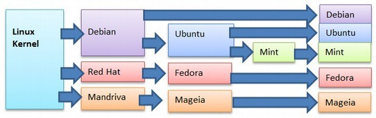

[Linux Family Tree](https://en.wikipedia.org/wiki/List_of_Linux_distributions)

## Unix/Linux Main Components
### Unix/Linux systems consist of three main parts:
- **User Space**: User-accessible programs, libraries, and utilities.
- **Kernel Space**: Manages interactions between user actions and hardware.
- **Hardware**: Physical components like CPU, memory, and I/O devices.


## What is GNU?
GNU is a free operating system that respects users' freedom. It is Unix-like but contains no Unix code. The GNU project was started by Richard Stallman, and the GNU General Public License ensures software freedom to use, modify, and share.

## How about macOS (XNU)?
macOS's kernel is XNU (XNU is Not Unix), a hybrid of the Mach kernel and BSD components. While macOS and Linux may seem similar, they have distinct histories and features.


GNU and Tux

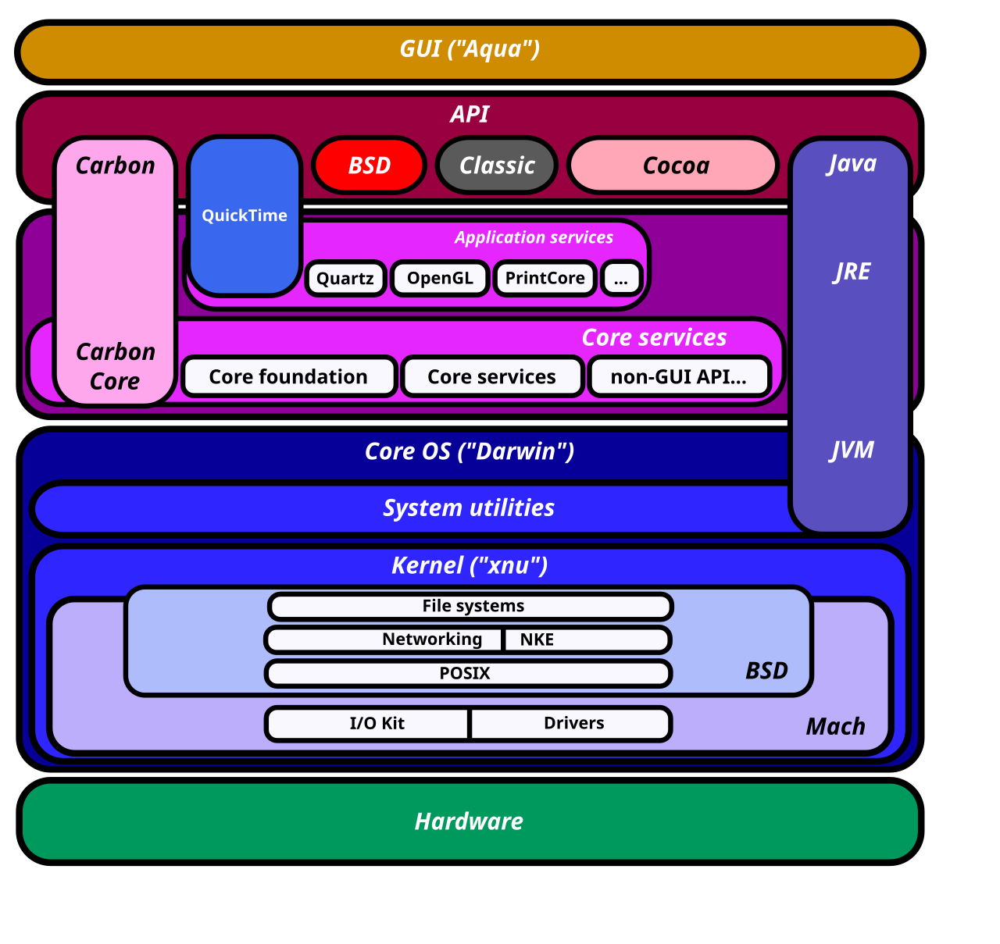{: width="50%" height="50%"}

### Operating Systems Tasks
OS tasks include managing file systems, device I/O, processes, memory management, and more.


### I/O
I/O (Input/Output) refers to the communication between a system and the outside world, such as with a human or another processing system.

### The Shell
The shell is an interface between the user and the kernel, interpreting commands and arranging their execution.

### Shell Types

> ## Bash in 100 Seconds
> [](https://www.youtube.com/watch?v=I4EWvMFj37g)
>
> [Watch: Bash in 100 Seconds](https://www.youtube.com/watch?v=I4EWvMFj37g)
{: .callout}

Different shells have unique features:
- **Bourne Shell (sh)**
- **Korn Shell (ksh)**
- **Bourne Again Shell (bash)** - Default in most Linux distributions.
- **C Shell (csh)**
- **TENEX/TOPS C Shell (tcsh)**

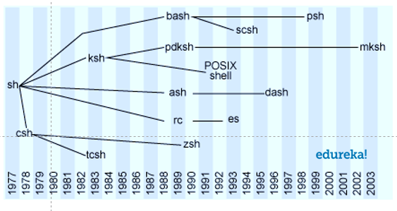

**Bourne Shell** was created in the mid-1970s by Stephen R. Bourne.

### BASH
Bash (Bourne Again Shell) offers command-line editing, job control, and more, making it a powerful interactive shell.


## Text Editor Options
Common text editors in Unix/Linux:
- **nano**
- **emacs**
- **vim**

{: width="150%" height="150%"}

### Using nano
Nano, created in 1999, is a free replacement for Pico and includes features like colored text and multiple buffers.

### Using emacs
GNU Emacs is a highly customizable text editor with an extensive feature set, including syntax highlighting and a built-in tutorial.

### Using vim
Vi is the standard Unix text editor and a powerful tool for text manipulation. Vim (Vi Improved) adds more features.

### Text Editor Cheat Sheets
- [VIM](https://preview.redd.it/ve1jv3m3qqj21.png?width=960&crop=smart&auto=webp&s=deb6dc83a462dc54523d703574e953638598af19)
- [nano](https://www.cheatography.com/bipinthite/cheat-sheets/nano-editor/)
- [Emacs](https://sachachua.com/blog/wp-content/uploads/2013/05/How-to-Learn-Emacs-v2-Large.png)


#### go to nano
```bash
#!/bin/bash
echo "hello world"
```
#### Save it "first.sh"

####
```bash
sh first.sh
```

### Shebang line
A shebang line (e.g., `#!/bin/bash`) at the top of a script tells the OS which interpreter to use for executing the file.

In order to make it possible to execute scripts as though they were first class executables, UNIX systems will looks for what we refer to as a shebang line at the top of the file. The origin of the name is murky. Some think it came from sharp-bang or hash-bang – contractions of # ("sharp") and ! ("bang"). Others think the "SH" is in reference to the first UNIX shell, named "sh".

In any case, if a UNIX system sees that the first line of an executable begins with #!, then it will execute the file using whatever command is specified in the rest of the line. For example, if there's a file named /path/to/bar that looks like:
```
#!/bin/bash
```

```
#!/bin/python
```

```
#!/bin/perl
```

#### Advanced shebang line

For perl
```
#!/usr/bin/env perl
```
For python
```
#!/usr/bin/env python
```


## Explainshell
[Explainshell](https://explainshell.com/)


## Your first Unix command.
```bash
echo "Hello World!"
```

## Basic commands

|Category|command|
|---|---|
|Navigation| cd, ls, pwd|
|File creation|touch,nano,mkdir,cp,mv,rm,rmdir|
|Reading|more,less,head,tail,cat|
|Compression|zip,gzip,bzip2,tar,compress|
|Uncompression|unzip,gunzip,bunzip2,uncompress|
|Permissions|chmod|
|Help|man|

> ## Open Current Folder in File Manager
> You can open your current terminal directory in a graphical file manager:
>
> **Mac (iTerm2/Terminal):**
> ```bash
> open .
> ```
> This opens the current directory in Finder.
>
> **Windows WSL:**
> ```bash
> explorer.exe .
> ```
> This opens the current directory in Windows Explorer.
>
> **Accessing WSL Files from Windows Explorer:**
> 1. Open Windows Explorer
> 2. Type in the address bar:
> ```
> \\wsl$
> ```
> 3. You'll see your Linux distributions listed (e.g., `Ubuntu`)
> 4. Navigate to your home directory: `\\wsl$\Ubuntu\home\{username}`
>
> **Tip:** Pin `\\wsl$\Ubuntu\home\{username}` to Quick Access for easy access!
>
> You can also type this directly in Explorer's address bar:
> ```
> \\wsl.localhost\Ubuntu\home\{username}
> ```
{: .callout}

> ## pwd
> Returns the `p`resent `w`orking `d`irectory (print working directory).
> ```bash
> $ pwd
> ```
> ```output
> /home/{username}
> ```
> This means you are now working in the home directory, located under your username. You can also avoid writing the full path by using `~` in front of your username, or simply `~`.
{: .keypoints}

> ## mkdir
> To create a directory, the `mkdir` (make directory) command can be used.
> ```bash
> $ mkdir <DIRECTORY>
> ```
> Example:
> ```bash
> $ cd ~
> $ mkdir bch709_test
> ```
> Like most Unix commands, `mkdir` supports command-line options. For example, the `-p` option allows you to create parent directories in one step:
> ```bash
> $ mkdir -p bch709_test/help
> ```
> Note: Unix allows spaces in directory names using `\` (e.g., `mkdir bch709\ test`), but this is not recommended.
{: .keypoints}

> ## cd
> The `cd` command stands for `c`hange `d`irectory.
> ```bash
> $ cd <DIRECTORY>
> ```
> Example:
> ```bash
> $ cd bch709_test
> ```
> To check your current directory, use:
> ```bash
> $ pwd
> ```
> ```output
> /home/{username}/bch709_test
> ```
> To move up one level to the parent directory:
> ```bash
> $ cd ..
> ```
> To move up two levels to the grandparent directory:
> ```bash
> $ cd ../../
> ```
> To navigate to the root directory:
> ```bash
> $ cd /
> ```
> To return to your home directory:
> ```bash
> $ cd ~
> ```
> To navigate to a specific directory:
> ```bash
> $ cd ~/bch709_test/help
> ```
> To move up one level again:
> ```bash
> $ cd ../
> ```
{: .keypoints}

> ## Absolute and relative paths
> The `cd` command allows you to change directories relative to your current location. However, you can also specify an absolute path to navigate directly to a folder.
> - **Absolute path**:
> ```bash
> $ cd /home/<username>/bch709_test/help
> ```
> - **Relative path**:
> ```bash
> $ cd ../
> ```
{: .checklist}

> ## The way back home
> Your home directory is `/home/<username>`. To quickly return to your home directory from any location, you can use:
> ```bash
> $ cd ~
> ```
> Or simply:
> ```bash
> $ cd
> ```
{: .checklist}

> ## Pressing `<TAB>` key
> The `<TAB>` key helps auto-complete file or directory names when typing in the terminal. If multiple matches exist, pressing `<TAB>` twice will show all possible options. This feature saves time and keystrokes.
{: .checklist}

> ## Pressing `<Arrow up/down>` key
> You can recall previously used commands by pressing the `up/down` arrow keys, or view your command history using the `history` command in the terminal.
{: .checklist}

> ## Copy & Paste
> In most terminal environments, dragging text automatically copies it, and right-clicking pastes it. On macOS, you can use `Command + C` and `Command + V` depending on your settings.
{: .checklist}

> ## ls
> The `ls` command lists the contents of a directory.
> 
> The `ls` command has various useful options:
> - List files in long format:
> ```bash
> $ ls -l
> ```
> - List files sorted by creation time:
> ```bash
> $ ls -t
> ```
> - List files sorted by size:
> ```bash
> $ ls -S
> ```
> - List all files, including hidden files:
> ```bash
> $ ls -a
> ```
> You can also try combining options:
> ```bash
> $ ls -ltr
> ```
> To list files in another directory:
> ```bash
> $ ls -l /usr/bin/
> ```
> 
{: .keypoints}

> ## man & help
> Every Unix command comes with a manual, accessible via the `man` command. To view the manual for `ls`:
> ```bash
> $ man ls
> ```
> Alternatively, many commands also support a `--help` option:
> ```bash
> $ ls --help
> ```
{: .keypoints}

> ## rmdir
> The `rmdir` (remove directory) command deletes empty directories.
> ```bash
> $ rmdir <DIRECTORY>
> ```
> Example (assuming you're in `bch709_test` directory):
> ```bash
> $ cd ~/bch709_test
> $ rmdir help
> ```
> 
> Note: The directory must be empty, and you must be outside the directory to remove it.
{: .keypoints}

> ## touch
> The `touch` command creates an empty file. Make sure you're in `bch709_test`:
> ```bash
> $ cd ~/bch709_test
> $ touch test.txt
> $ touch exam.txt
> $ touch ETA.txt
> ```
> To list files, use:
> ```bash
> $ ls
> ```
> ```output
> ETA.txt  exam.txt  test.txt
> ```
{: .keypoints}

> ## mv
> The `mv` (move) command moves files or directories from one location to another.
> ```bash
> $ mkdir Hello
> $ mv test.txt Hello
> $ ls Hello
> ```
> ```output
> test.txt
> ```
> You can also use wildcards like `*` to move multiple files:
> ```bash
> $ mv *.txt Hello
> $ ls Hello
> ```
> ```output
> ETA.txt  exam.txt  test.txt
> ```
> The `*` wildcard matches any sequence of characters. This allows you to move files that follow a particular pattern.
{: .keypoints}

> ## Renaming files with mv
> The `mv` command can also be used to rename files:
> ```bash
> $ mv Hello/test.txt Hello/renamed.txt
> $ ls Hello
> ```
> ```output
> ETA.txt  exam.txt  renamed.txt
> ```
{: .keypoints}

> ## Moving files back
> You can move files back to the current directory using `.`:
> ```bash
> $ mv Hello/renamed.txt .
> $ ls
> ```
> Here, `.` represents the current directory.
{: .keypoints}

> ## rm
> The `rm` (remove) command deletes files. Be cautious when using it, as deleted files cannot be recovered.
> To make `rm` safer, use the `-i` option for interactive deletion:
> ```bash
> $ rm -i renamed.txt
> ```
> ```output
> rm: remove regular empty file 'renamed.txt'? y
> ```
> This will ask for confirmation before deleting each file.
>
> To remove multiple files:
> ```bash
> $ rm Hello/ETA.txt Hello/exam.txt
> ```
{: .keypoints}

> ## cp
> The `cp` (copy) command copies files. Unlike `mv`, the original file remains at the source.
> ```bash
> $ touch file1
> $ cp file1 file2
> $ ls
> ```
> ```output
> file1  file2  Hello
> ```
>
> Copy a file into a directory:
> ```bash
> $ cp file1 Hello/
> $ ls Hello
> ```
> ```output
> file1
> ```
>
> Copy an entire directory using `-r` (recursive):
> ```bash
> $ cp -r Hello Hello_backup
> $ ls
> ```
> ```output
> file1  file2  Hello  Hello_backup
> ```
> Use `cp --help` or `man cp` for more options.
{: .keypoints}


>## using . < Dot> ?
>In Unix, the current directory can be represented by a . (dot) character. You will often use for copying files to the directory that you are in. Compare the following:
>```bash
>ls
>ls .
>ls ./
>```
>In this case, using the dot is somewhat pointless because ls will already list the contents of the current directory by default. Also note how the trailing slash is optional.
{: .checklist}

> ## Clean up and start new
> Before we start the next session, let's clean up the files and folders we created.
> ```bash
> $ cd ~/bch709_test
> $ ls
> ```
> You should see: `Hello`, `Hello_backup`, `file1`, `file2`
{: .challenge}

> ## Clean the folder with contents
> To remove folders and their contents, use `rm -r` (recursive):
> ```bash
> $ cd ~
> $ rm -r bch709_test
> $ ls
> ```
> This removes `bch709_test` and everything inside it (Hello, Hello_backup, file1, file2).
>
> **Warning:** `rm -r` permanently deletes folders and all contents. Use with caution!
{: .solution}

> ## Downloading a file
> Let's download a file from a website. There are several commands to download files, such as `wget`, `curl`, and `rsync`. In this case, we will use `curl`.
>
> First, create a working directory:
> ```bash
> $ cd ~
> $ mkdir -p bch709_data
> $ cd bch709_data
> ```
>
> File location:
> ```
> https://raw.githubusercontent.com/plantgenomicslab/BCH709/gh-pages/bch709_student.txt
> ```
> How to use `curl`:
> 
>
> To download the file using `curl`, use the following syntax:
> ```bash
> curl -L -o <output_name> <link>
> ```
> Example:
> ```bash
> $ curl -L -o bch709_student.txt https://raw.githubusercontent.com/plantgenomicslab/BCH709/gh-pages/bch709_student.txt
> $ ls
> ```
> ```output
> bch709_student.txt
> ```
{: .keypoints}


> ## Viewing file contents
> There are various commands to print the contents of a file in bash. Each command is often used in specific contexts, and when executed with filenames, they display the contents on the screen. Common commands include `less`, `more`, `cat`, `head`, and `tail`.
>
> - **`less` FILENAME**: Try this: `less bch709_student.txt`. It displays the file contents with line scrolling (use arrow keys, PgUp/PgDn, space bar, or Enter to scroll). Press `q` to exit.
> - **`more` FILENAME**: Try this: `more bch709_student.txt`. Similar to `less`, but you scroll using only the space bar or Enter. Press `q` to exit.
> - **`cat` FILENAME**: Try this: `cat bch709_student.txt`. This command displays the entire file content at once, which may result in the file scrolling off the screen for large files.
> - **`head` FILENAME**: Try this: `head bch709_student.txt`. It shows only the first 10 lines by default, but you can specify a different number using the `-n` option (e.g., `head -n 20`).
> - **`tail` FILENAME**: Try this: `tail bch709_student.txt`. It displays the last 10 lines by default, and similar to `head`, you can modify the number of lines with `-n`.
{: .keypoints}

> ## How many lines does the file have?
> You can pipe the output of your stream into another program rather than displaying it on the screen. Use the `|` (Vertical Bar) character to connect the programs. For example, the `wc` (word count) program:
> ```bash
> cat bch709_student.txt | wc
> ```
> prints the number of lines, words, and characters in the stream:
> ```output
>     106     140    956
> ```
> To count just the lines:
> ```bash
> cat bch709_student.txt | wc -l
> ```
> ```output
> 106
> ```
> *Of course, we can use `wc` directly:*
> ```bash
> wc -l bch709_student.txt
> ```
> This is equivalent to:
> ```bash
> cat bch709_student.txt | wc -l
> ```
> In general, it is better to open a stream with `cat` and then pipe it into the next program. This method simplifies building and understanding more complex pipelines.
>
> Let's also check the first few lines of the file using `head`:
> ```bash
> cat bch709_student.txt | head
> ```
> 
>
> Is this equivalent to running?
> ```bash
> head bch709_student.txt
> ```
> {: .solution}
{: .checklist}

> ## grep
> `grep` (Global Regular Expression Print) is one of the most useful commands in Unix. It is commonly used to filter a file/input, line by line, against a pattern. It prints each line of the file containing a match for the pattern.
> Check available options with:
> ```bash
> grep --help
> ```
> Syntax:
> ```
> grep [OPTIONS] PATTERN FILENAME
> ```
> Let's find how many people use macOS. First, check the file:
> ```bash
> wc -l bch709_student.txt
> ```
> ```bash
> less bch709_student.txt
> ```
> To find the macOS users:
> ```bash
> cat bch709_student.txt | grep MacOS
> ```
> To count the number of macOS users:
> ```bash
> cat bch709_student.txt | grep MacOS | wc -l
> ```
> Alternatively:
> ```bash
> grep MacOS bch709_student.txt | wc -l
> ```
> Or simply:
> ```bash
> grep -c MacOS bch709_student.txt
> ```
> Using flags to filter lines that don't contain "Windows":
> ```bash
> grep -v Windows bch709_student.txt
> ```
> Combining multiple flags:
> ```bash
> grep -c -v Windows bch709_student.txt
> ```
> With case-insensitive search and colored output:
> ```bash
> grep --color -i macos bch709_student.txt
> ```
{: .checklist}

> ## How do I store the results in a new file?
> Use the `>` character for redirection:
> ```bash
> grep -i macos bch709_student.txt > mac_student
> ```
> ```bash
> cat bch709_student.txt | grep -i windows > windows_student
> ```
> You can check the new files with `cat` or `less`.
{: .checklist}

> ## Do you want to check the differences between two files?
> ```bash
> diff mac_student windows_student
> ```
> ```bash
> diff -y mac_student windows_student
> ```
{: .keypoints}

> ## How can I select the name only? (cut)
> To extract specific columns, use `cut`:
> ```bash
> cat bch709_student.txt | cut -f 1
> ```
> Or:
> ```bash
> cut -f 1 bch709_student.txt
> ```
{: .keypoints}

> ## How can I sort it? (sort)
> Sorting names:
> ```bash
> cut -f 1 bch709_student.txt | sort
> ```
> Sorting by the second field:
> ```bash
> sort -k 2 bch709_student.txt
> ```
> Sorting by the first field:
> ```bash
> sort -k 1 bch709_student.txt
> ```
> Sorting and extracting names:
> ```bash
> sort -k 1 bch709_student.txt | cut -f 1
> ```
> Save the sorted names:
> ```bash
> sort -k 1 bch709_student.txt | cut -f 1 > name_sort
> ```
{: .keypoints}

> ## uniq
> The `uniq` command removes duplicate lines from a **sorted file**, retaining only one instance of matching lines. Optionally, it can show lines that appear exactly once or more than once. Note that `uniq` requires sorted input.
> ```bash
> cut -f 2 bch709_student.txt > os.txt
> ```
> To count duplicates:
> ```bash
> uniq -c os.txt
> ```
> 
> To sort and then count:
> ```bash
> sort os.txt | uniq -c
> ```
> 
> Of course, you can sort independently:
> ```bash
> sort os.txt > os_sort.txt
> uniq -c os_sort.txt
> ```
> To learn more about `uniq`:
> ```bash
> uniq --help
> ```
> 
{: .checklist}

> ## diff
> The `diff` command compares the differences between two files.
> Example usage:
> ```bash
> diff FILEA FILEB
> ```
> When trying new commands, always check with `--help`:
> 
> Compare the contents of `os.txt` and `os_sort.txt`:
> ```bash
> diff os.txt os_sort.txt
> ```
> Side-by-side comparison:
> ```bash
> diff -y os.txt os_sort.txt
> ```
> You can also pipe sorted data into `diff`:
> ```bash
> sort os.txt | diff -y - os_sort.txt
> ```
{: .checklist}


### There are still a lot of command that you can use. Such as `paste`, `comm`, `join`, `split` etc.
> ## Let's Download Bigger Data
> Please visit the following website to download larger data:
> ```
> https://hgdownload.soe.ucsc.edu/goldenPath/hg38/bigZips/
> ```
> Download the file marked in yellow.
> 
{: .keypoints}

> ## How to Download
> 
> Make sure you're in the working directory, then download:
> ```bash
> $ cd ~/bch709_data
> $ curl -L -O https://hgdownload.soe.ucsc.edu/goldenPath/hg38/bigZips/mrna.fa.gz
> $ gunzip mrna.fa.gz
> $ ls -lh mrna.fa
> ```
> ```output
> -rw-r--r-- 1 user group 416M Jan 20 10:00 mrna.fa
> ```
{: .solution}

> ## Viewing File Contents
> What is the difference between `less`, `tail`, `more`, and `head`?
{: .discussion}

> ## What Are Flags (Parameters/Options)?
> A "flag" in Unix terminology is a parameter that is added to a command to modify its behavior. For example:
> ```bash
> $ ls
> ```
> versus
> ```bash
> $ ls -l
> ```
> The `-l` flag changes the output of `ls` to display detailed information about each file. Flags help commands behave differently or report information in various formats.
{: .checklist}

> ## How to Find Available Flags
> You can use the manual (man) to learn more about a command and its available flags:
> ```bash
> $ man ls
> ```
> This will display the manual page for `ls`, detailing all available flags and their purposes.
> 
{: .checklist}

> ## What if the Tool Doesn't Have a Manual Page?
> Not all tools include a manual page, especially third-party software. In those cases, use the `-h`, `-help`, or `--help` options:
> ```bash
> $ curl --help
> ```
> If these flags do not work, you may need to refer to external documentation or online resources.
{: .checklist}

> ## What Are Flag Formats?
> Unix tools typically follow two flag formats:
> - **Short form**: A single minus `-` followed by a single letter, like `-o`, `-L`.
> - **Long form**: Double minus `--` followed by a word, like `--output`, `--Location`.
>
> Flags may act as toggles (on/off) or accept additional values (e.g., `-o <filename>` or `--output <filename>`).
> Some bioinformatics tools diverge from this format and use a single `-` for both short and long options (e.g., `-g`, `-genome`).
>
> **Using flags is essential in Unix, especially in bioinformatics, where tools rely on a large number of parameters. Proper flag usage ensures the accuracy of results.**
{: .checklist}

### Oneliners
Oneliner, textual input to the command-line of an operating system shell that performs some function in just one line of input. This need to be done with "|".
[For advanced usage, please check this](https://plantgenomicslab.github.io/BCH709/onliner/index.html)

### FASTA format
The original FASTA/Pearson format is described in the documentation for the FASTA suite of programs. It can be downloaded with any free distribution of FASTA (see fasta20.doc, fastaVN.doc or fastaVN.me—where VN is the Version Number).

The first line in a FASTA file started either with a ">" (greater-than; Right angle braket) symbol or, less frequently, a ";" (semicolon) was taken as a comment. Subsequent lines starting with a semicolon would be ignored by software. Since the only comment used was the first, it quickly became used to hold a summary description of the sequence, often starting with a unique library accession number, and with time it has become commonplace to always use ">" for the first line and to not use ";" comments (which would otherwise be ignored).

Following the initial line (used for a unique description of the sequence) is the actual sequence itself in standard one-letter character string. Anything other than a valid character would be ignored (including spaces, tabulators, asterisks, etc...). Originally it was also common to end the sequence with an "\*" (asterisk) character (in analogy with use in PIR formatted sequences) and, for the same reason, to leave a blank line between the description and the sequence.


#### Description line
The description line (defline) or header/identifier line, which begins with '>', gives a name and/or a unique identifier for the sequence, and may also contain additional information. In a deprecated practice, the header line sometimes contained more than one header, separated by a ^A (Control-A) character. In the original Pearson FASTA format, one or more comments, distinguished by a semi-colon at the beginning of the line, may occur after the header. Some databases and bioinformatics applications do not recognize these comments and follow the [NCBI FASTA specification](https://blast.ncbi.nlm.nih.gov/Blast.cgi?CMD=Web&PAGE_TYPE=BlastDocs&DOC_TYPE=BlastHelp).

### FASTA file handling with command line.
Please check one fasta file
```bash
$ ls mrna.fa
```

### count cDNA
How many cDNA in this fasta file?
Please use `grep`  `wc` to find number.
>## fasta count
>
{: .solution}

>## count DNA letter
>How many sequences (DNA letter) in this fasta file?
>Please use `grep`  `wc` to find number.
{: .discussion}


### what is GI and GB?
[NCBI identifiers](https://www.ncbi.nlm.nih.gov/genbank/sequenceids/)


### Collect GI
How can I collect GI from FASTA description line?
Please use `grep`  `cut` to find number.


>## Sequence redundancy
>Does GI have any redundancy?
>Please use `grep`  `wc` `diff` to solve.
{: .discussion}

### Split fasta
Split a multi-sequence FASTA file into individual files (one sequence per file):
```bash
# Using mrna.fa downloaded earlier
awk '/^>/{f=++d".fasta"} {print > f}' mrna.fa
ls *.fasta | head
```

### Merge fasta
Combine multiple FASTA files into one:
```bash
cat 1.fasta 2.fasta 3.fasta >> myfasta.fasta
# Or use wildcards:
cat ?.fasta > single_digit.fasta   # matches 1.fasta, 2.fasta, etc.
cat ??.fasta > double_digit.fasta  # matches 10.fasta, 11.fasta, etc.
```

### Search fasta
Search for specific sequences or patterns:
```bash
# Find exact sequence
grep -n --color "GAATTC" mrna.fa | head
# Find pattern with regex (? = 0 or 1 of preceding char)
grep -n --color -E 'GAA?TTC' mrna.fa | head
```

### Regular Expression
A regular expression is a pattern that the regular expression engine attempts to match in input text. A pattern consists of one or more character literals, operators, or constructs.
Please play [this](https://regexone.com/lesson)


### GFF file
The GFF (General Feature Format) format consists of one line per feature, each containing 9 columns of data, plus optional track definition lines. The following documentation is based on the Version 3 [(http://gmod.org/wiki/GFF3)](http://gmod.org/wiki/GFF3) specifications.

Download the GFF file:
```bash
$ cd ~/bch709_data
$ curl -L -O http://www.informatics.jax.org/downloads/mgigff3/MGI.gff3.gz
$ ls MGI.gff3.gz
```
```output
MGI.gff3.gz
```
What is `.gz` ?
```bash
$ file MGI.gff3.gz
```
```output
MGI.gff3.gz: gzip compressed data
```

### Compression
There are several options for archiving and compressing groups of files or directories. Compressed files are not only easier to handle (copy/move) but also occupy less size on the disk (less than 1/3 of the original size). In Linux systems you can use zip, tar or gz for archiving and compressing files/directories.

>## ZIP compression/extraction
>```bash
>zip OUTFILE.zip INFILE.txt # Compress INFILE.txt
>zip -r OUTDIR.zip DIRECTORY # Compress all files in a DIRECTORY into one archive file (OUTDIR.zip)
>zip -r OUTFILE.zip . -i \*.txt # Compress all txt files in a DIRECTORY into one archive file (OUTFILE.zip)
>unzip SOMEFILE.zip
>```
{: .checklist}

## TAR Compression and Extraction

The `tar` (tape archive) utility is used to bundle multiple files into a single archive file and to extract individual files from that archive. It offers options for automatic compression and decompression, along with special features for incremental and full backups.

### Common Commands
- To extract the contents of a gzipped TAR file:
  ```bash
  tar -xzvf SOMEFILE.tar.gz
  ```
- To create a gzipped TAR archive from a directory:
  ```bash
  tar -czvf OUTFILE.tar.gz DIRECTORY
  ```
- To archive and compress all `.txt` files in the current directory:
  ```bash
  tar -czvf OUTFILE.tar.gz *.txt
  ```
- To create a backup archive of a specific directory:
  ```bash
  tar -czvf backup.tar.gz BACKUP_WORKSHOP
  ```

## Gzip Compression and Extraction

The `gzip` (GNU zip) compression utility is designed as a replacement for the `compress` program, offering much better compression without using patented algorithms. It is the standard compression system for all GNU software.

### Commands

- To compress a file:
  ```bash
  gzip SOMEFILE  # This also removes the uncompressed file
  ```

- To uncompress a file:
  ```bash
  gunzip SOMEFILE.gz  # This also removes the compressed file
  ```

### Example

Uncompress the file, examine the size difference, then keep it uncompressed for later exercises:

```bash
$ cd ~/bch709_data
$ ls -lh MGI.gff3.gz
```
```output
-rw-r--r-- 1 user group 12M Jan 20 10:00 MGI.gff3.gz
```
```bash
$ gunzip MGI.gff3.gz
$ ls -lh MGI.gff3
```
```output
-rw-r--r-- 1 user group 95M Jan 20 10:00 MGI.gff3
```
Notice the uncompressed file is ~8x larger! You can recompress with `gzip MGI.gff3` if needed.
{: .checklist}


## GFF3 Annotations


Print all sequences annotated in a GFF3 file.
```bash
cut -s -f 1,9 MGI.gff3 | grep $'\t' | cut -f 1 | sort | uniq
```

Determine all feature types annotated in a GFF3 file.
```bash
grep -v '^#' MGI.gff3 | cut -s -f 3 | sort | uniq
```

Determine the number of genes annotated in a GFF3 file.
```bash
grep -c $'\tgene\t' MGI.gff3
```

Extract all gene IDs from a GFF3 file.
```bash
grep $'\tgene\t' MGI.gff3 | perl -ne '/ID=([^;]+)/ and printf("%s\n", $1)'
```

Print all CDS lines:
```bash
$ cat MGI.gff3 | cut -f 3 | grep CDS | head
```

Print CDS and ID (step by step):
```bash
# Step 1: Select relevant columns
$ cat MGI.gff3 | cut -f 1,3,4,5,7,9 | head

# Step 2: Filter for CDS only
$ cat MGI.gff3 | cut -f 1,3,4,5,7,9 | grep CDS | head

# Step 3: Remove everything after semicolon
$ cat MGI.gff3 | cut -f 1,3,4,5,7,9 | grep CDS | sed 's/;.*//g' | head

# Step 4: Remove ID= prefix
$ cat MGI.gff3 | cut -f 1,3,4,5,7,9 | grep $'\tCDS\t' | sed 's/;.*//g' | sed 's/ID=//g' | head
```
Print length of each gene in a GFF3 file.
```bash
grep $'\tgene\t' MGI.gff3 | cut -s -f 4,5 | perl -ne '@v = split(/\t/); printf("%d\n", $v[1] - $v[0] + 1)'
```

Extract all gene IDs from a GFF3 file.
```bash
grep $'\tgene\t' MGI.gff3 | perl -ne '/ID=([^;]+)/ and printf("%s\n", $1)'
```

## GFF3 file format
- Fields must be tab-separated. Also, all but the final field in each feature line must contain a value; "empty" columns should be denoted with a '.'
- seqid - name of the chromosome or scaffold; chromosome names can be given with or without the 'chr' prefix. Important note: the seq ID must be one used within Ensembl, i.e. a standard chromosome name or an
- source - name of the program that generated this feature, or the data source (database or project name)
- type - type of feature. Must be a term or accession from the SOFA sequence ontology
- start - Start position of the feature, with sequence numbering starting at 1.
- end - End position of the feature, with sequence numbering starting at 1.
- score - A floating point value.
- strand - defined as + (forward) or - (reverse).
- phase - One of '0', '1' or '2'. '0' indicates that the first base of the feature is the first base of a codon, '1' that the second base is the first base of a codon, and so on..
attributes - A semicolon-separated list of tag-value pairs, providing additional information about each feature. Some of these tags are predefined, e.g. ID, Name, Alias, Parent - see the GFF documentation for [more details](http://gmod.org/wiki/GFF3).

Returns all lines on Chr 10 between 5.2MB and 5.45MB in  MGI.gff3. (assumes) chromosome in column 1 and position in column 4:
```bash
cat MGI.gff3 | awk '$1=="10"' | awk '$4>=5200000' | awk '$4<=5450000'

cat MGI.gff3 | awk '$1=="10"' | awk '$4>=5200000' | awk '$4<=5450000' |  grep mRNA

cat MGI.gff3 | awk '$1=="10"' | awk '$4>=5200000' | awk '$4<=5450000' |  grep mRNA | awk '{print $0,$5-$4}'
```
Returns specific lines
```bash
sed -n '1,10p' MGI.gff3

sed -n '52p' MGI.gff3
```

Time and again we are surprised by just how many applications it has, and how frequently problems can be solved by sorting, collapsing identical values, then resorting by the collapsed counts. The skill of using Unix is not just that of understanding the commands themselves. It is more about recognizing when a pattern, such as the one that we show above, is the solution to the problem that you wish to solve. The easiest way to learn to apply these patterns is by looking at how others solve problems, then adapting it to your needs.


## Quick reminder
- Learn basic Bash. Actually, type `man bash` and at least skim the whole thing; it's pretty easy to follow and not that long. Alternate shells can be nice, but Bash is powerful and always available (learning *only* zsh, fish, etc., while tempting on your own laptop, restricts you in many situations, such as using existing servers).

- Learn at least one text-based editor well. The `nano` editor is one of the simplest for basic editing (opening, editing, saving, searching). However, for the power user in a text terminal, there is no substitute for Vim (`vi`), the hard-to-learn but venerable, fast, and full-featured editor. Many people also use the classic Emacs, particularly for larger editing tasks. (Of course, any modern software developer working on an extensive project is unlikely to use only a pure text-based editor and should also be familiar with modern graphical IDEs and tools.)

- Finding documentation:
  - Know how to read official documentation with `man` (for the inquisitive, `man man` lists the section numbers, e.g. 1 is "regular" commands, 5 is files/conventions, and 8 are for administration). Find man pages with `apropos`.
  - Know that some commands are not executables, but Bash builtins, and that you can get help on them with `help` and `help -d`. You can find out whether a command is an executable, shell builtin or an alias by using `type command`.
  - `curl cheat.sh/command` will give a brief "cheat sheet" with common examples of how to use a shell command.
- Learn about redirection of output and input using `>` and `<` and pipes using `|`. Know `>` overwrites the output file and `>>` appends. Learn about stdout and stderr.

- Basic file management: `ls` and `ls -l` (in particular, learn what every column in `ls -l` means), `less`, `head`, `tail` and `tail -f` (or even better, `less +F`), `ln` and `ln -s` (learn the differences and advantages of hard versus soft links), `chown`, `chmod`, `du` (for a quick summary of disk usage: `du -hs *`). For filesystem management, `df`, `mount`, `fdisk`, `mkfs`, `lsblk`. Learn what an inode is (`ls -i` or `df -i`).

- Know regular expressions well, and the various flags to `grep`/`egrep`. The `-i`, `-o`, `-v`, `-A`, `-B`, and `-C` options are worth knowing.

## Everyday use
- In Bash, use **Tab** to complete arguments or list all available commands and **ctrl-r** to search through command history (after pressing, type to search, press **ctrl-r** repeatedly to cycle through more matches, press **Enter** to execute the found command, or hit the right arrow to put the result in the current line to allow editing).

- Use `alias` to create shortcuts for commonly used commands. For example, `alias ll='ls -latr'` creates a new alias `ll`.

- Save aliases, shell settings, and functions you commonly use in `~/.bashrc`, and [arrange for login shells to source it](http://superuser.com/a/183980/7106). This will make your setup available in all your shell sessions.

- To see recent commands, use `history`. Follow with `!n` (where `n` is the command number) to execute again. There are also many abbreviations you can use, the most useful probably being `!$` for last argument and `!!` for last command (see "HISTORY EXPANSION" in the man page). However, these are often easily replaced with **ctrl-r** and **alt-.**.


## Obscure but useful

- `expr`: perform arithmetic or boolean operations or evaluate regular expressions

- `m4`: simple macro processor

- `yes`: print a string a lot

- `cal`: nice calendar

- `env`: run a command (useful in scripts)

- `printenv`: print out environment variables (useful in debugging and scripts)

- `look`: find English words (or lines in a file) beginning with a string

- `cut`, `paste` and `join`: data manipulation

- `fmt`: format text paragraphs

- `pr`: format text into pages/columns

- `fold`: wrap lines of text

- `column`: format text fields into aligned, fixed-width columns or tables

- `expand` and `unexpand`: convert between tabs and spaces

- `nl`: add line numbers

- `seq`: print numbers

- `bc`: calculator

- `factor`: factor integers

- [`gpg`](https://gnupg.org/): encrypt and sign files

- `toe`: table of terminfo entries

- `nc`: network debugging and data transfer

- `socat`: socket relay and tcp port forwarder (similar to `netcat`)

- `dd`: moving data between files or devices

- `file`: identify type of a file

- `tree`: display directories and subdirectories as a nesting tree; like `ls` but recursive

- `stat`: file info

- `time`: execute and time a command

- `timeout`: execute a command for specified amount of time and stop the process when the specified amount of time completes.

- `lockfile`: create semaphore file that can only be removed by `rm -f`

- `logrotate`: rotate, compress and mail logs.

- `watch`: run a command repeatedly, showing results and/or highlighting changes

- [`when-changed`](https://github.com/joh/when-changed): runs any command you specify whenever it sees file changed. See `inotifywait` and `entr` as well.

- `tac`: print files in reverse

- `comm`: compare sorted files line by line

- `strings`: extract text from binary files

- `tr`: character translation or manipulation

- `iconv` or `uconv`: conversion for text encodings

- `split` and `csplit`: splitting files

- `sponge`: read all input before writing it, useful for reading from then writing to the same file, e.g., `grep -v something some-file | sponge some-file`

- `units`: unit conversions and calculations; converts furlongs per fortnight to twips per blink (see also `/usr/share/units/definitions.units`)

- `apg`: generates random passwords

- `xz`: high-ratio file compression

- `ldd`: dynamic library info

- `nm`: symbols from object files

- `ab` or [`wrk`](https://github.com/wg/wrk): benchmarking web servers

- `strace`: system call debugging

- [`mtr`](http://www.bitwizard.nl/mtr/): better traceroute for network debugging

- `cssh`: visual concurrent shell

- `rsync`: sync files and folders over SSH or in local file system

- [`wireshark`](https://wireshark.org/) and [`tshark`](https://www.wireshark.org/docs/wsug_html_chunked/AppToolstshark.html): packet capture and network debugging

- [`ngrep`](http://ngrep.sourceforge.net/): grep for the network layer

- `host` and `dig`: DNS lookups

- `lsof`: process file descriptor and socket info

- `dstat`: useful system stats

- [`glances`](https://github.com/nicolargo/glances): high level, multi-subsystem overview

- `iostat`: Disk usage stats

- `mpstat`: CPU usage stats

- `vmstat`: Memory usage stats

- `htop`: improved version of top

- `last`: login history

- `w`: who's logged on

- `id`: user/group identity info

- [`sar`](http://sebastien.godard.pagesperso-orange.fr/): historic system stats

- [`iftop`](http://www.ex-parrot.com/~pdw/iftop/) or [`nethogs`](https://github.com/raboof/nethogs): network utilization by socket or process

- `ss`: socket statistics

- `dmesg`: boot and system error messages

- `sysctl`: view and configure Linux kernel parameters at run time

- `hdparm`: SATA/ATA disk manipulation/performance

- `lsblk`: list block devices: a tree view of your disks and disk partitions

- `lshw`, `lscpu`, `lspci`, `lsusb`, `dmidecode`: hardware information, including CPU, BIOS, RAID, graphics, devices, etc.

- `lsmod` and `modinfo`: List and show details of kernel modules.

- `fortune`, `ddate`, and `sl`: um, well, it depends on whether you consider steam locomotives and Zippy quotations "useful"


## Recent unix command


<h1 align="center">Modern Unix</h1>

<p align="center">
  <h1 align="center">
    <a href="https://github.com/sharkdp/bat"><code>bat</code></a>
  </h1>
  <p align="center">A <code>cat</code> clone with syntax highlighting and Git integration.</p>
  <p align="center">
    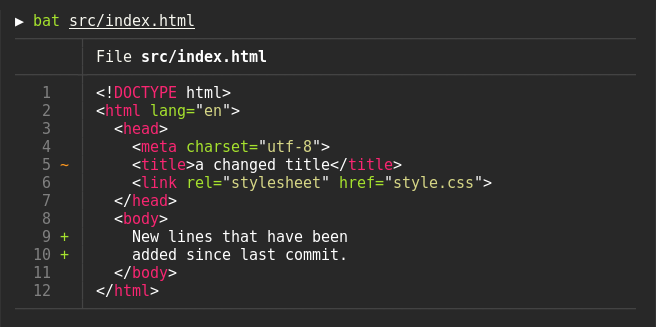
  </p>
</p>

<p align="center">
  <h1 align="center">
    <a href="https://github.com/ogham/exa"><code>exa</code></a>
  </h1>
  <p align="center">A modern replacement for <code>ls</code>.</p>
  <p align="center">
    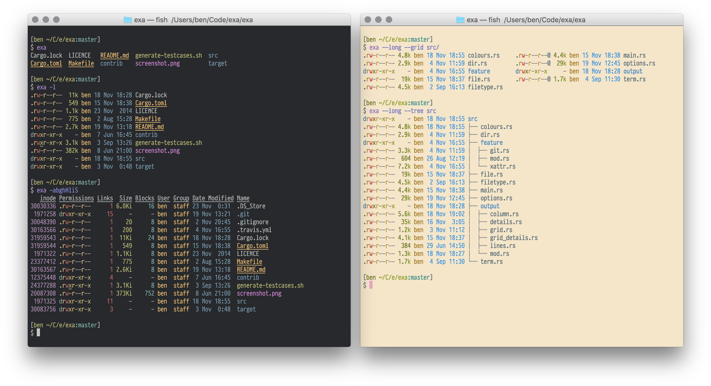
  </p>
</p>

<p align="center">
  <h1 align="center">
    <a href="https://github.com/Peltoche/lsd"><code>lsd</code></a>
  </h1>
  <p align="center">The next gen file listing command. Backwards compatible with <code>ls</code>.</p>
  <p align="center">
    
  </p>
</p>

<p align="center">
  <h1 align="center">
    <a href="https://github.com/dandavison/delta"><code>delta</code></a>
  </h1>
  <p align="center">A viewer for <code>git</code> and <code>diff</code> output</p>
  <p align="center">
    
  </p>
</p>

<p align="center">
  <h1 align="center">
    <a href="https://github.com/bootandy/dust"><code>dust</code></a>
  </h1>
  <p align="center">A more intuitive version of <code>du</code> written in rust.</p>
  <p align="center">
    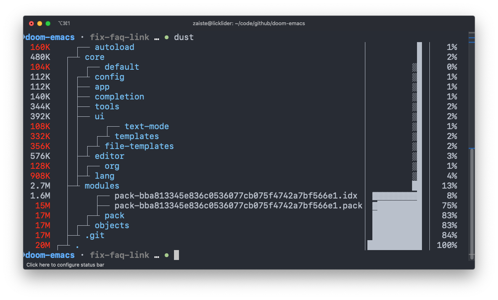
  </p>
</p>

<p align="center">
  <h1 align="center">
    <a href="https://github.com/muesli/duf"><code>duf</code></a>
  </h1>
  <p align="center">A better <code>df</code> alternative </p>
  <p align="center">
    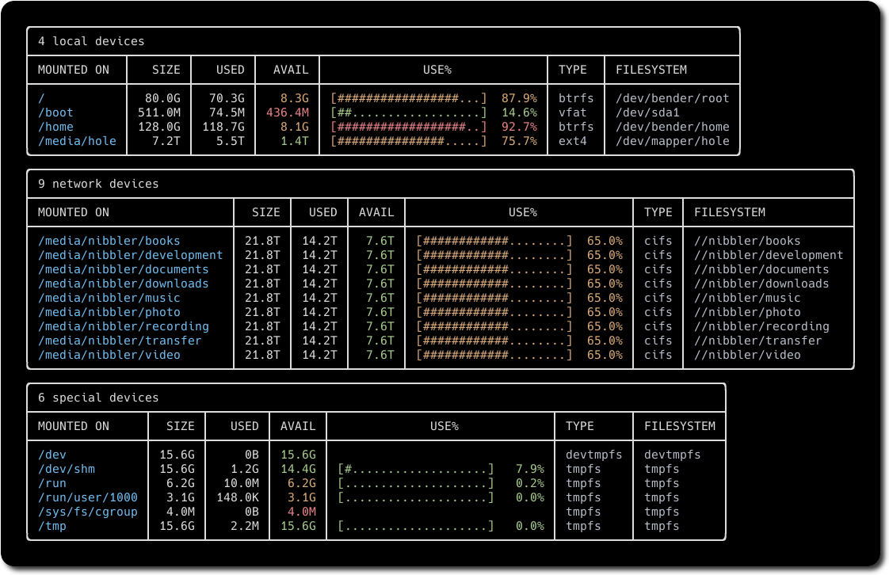
  </p>
</p>

<p align="center">
  <h1 align="center">
    <a href="https://github.com/Canop/broot"><code>broot</code></a>
  </h1>
  <p align="center">A new way to see and navigate directory <code>tree</code>s</p>
  <p align="center">
    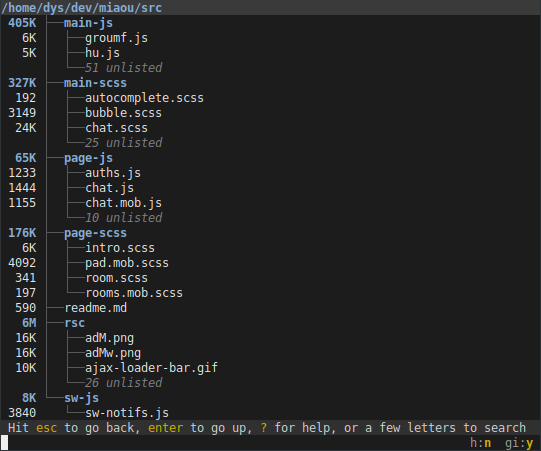
  </p>
</p>

<p align="center">
  <h1 align="center">
    <a href="https://github.com/sharkdp/fd"><code>fd</code></a>
  </h1>
  <p align="center">A simple, fast and user-friendly alternative to <code>find</code>.</p>
  <p align="center">
    
  </p>
</p>

<p align="center">
  <h1 align="center">
    <a href="https://github.com/BurntSushi/ripgrep"><code>ripgrep</code></a>
  </h1>
  <p align="center">An extremely fast alternative to <code>grep</code> that respects your gitignore</p>
  <p align="center">
    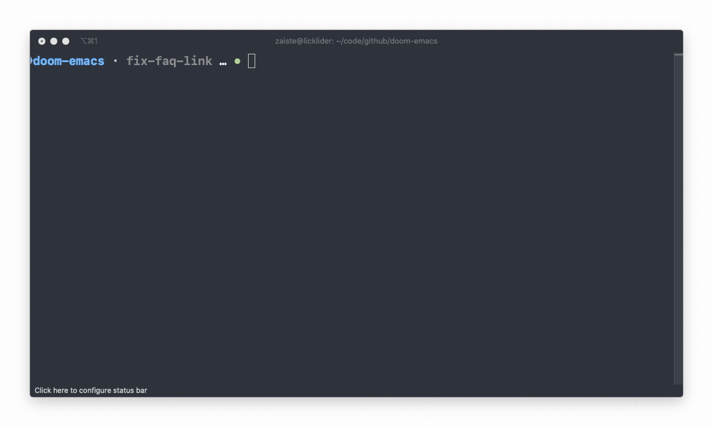
  </p>
</p>

<p align="center">
  <h1 align="center">
    <a href="https://github.com/ggreer/the_silver_searcher"><code>ag</code></a>
  </h1>
  <p align="center">A code searching tool similar to <code>ack</code>, but faster.</p>
  <p align="center">
    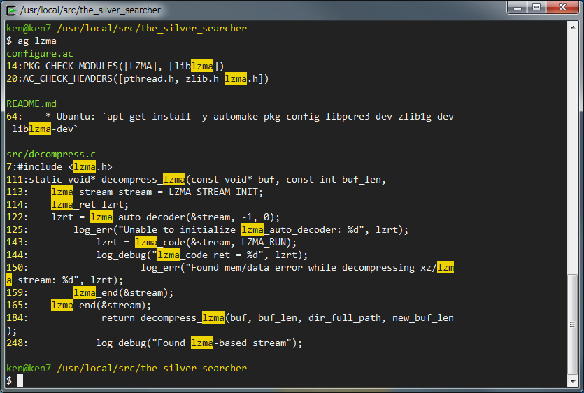
  </p>
</p>

<p align="center">
  <h1 align="center">
    <a href="https://github.com/junegunn/fzf"><code>fzf</code></a>
  </h1>
  <p align="center">A general purpose command-line fuzzy finder.</p>
  <p align="center">
    
  </p>
</p>

<p align="center">
  <h1 align="center">
    <a href="https://github.com/cantino/mcfly"><code>mcfly</code></a>
  </h1>
  <p align="center">Fly through your shell <code>history</code>. Great Scott! </p>
  <p align="center">
    
  </p>
</p>

<p align="center">
  <h1 align="center">
    <a href="https://github.com/theryangeary/choose"><code>choose</code></a>
  </h1>
  <p align="center"> A human-friendly and fast alternative to <code>cut</code> and (sometimes) <code>awk</code> </p>
  <p align="center">
    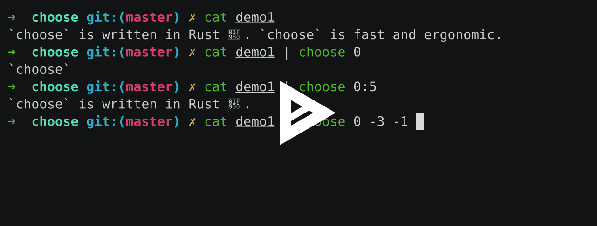
  </p>
</p>

<p align="center">
  <h1 align="center">
    <a href="https://github.com/stedolan/jq"><code>jq</code></a>
  </h1>
  <p align="center">
    <code>sed</code> for JSON data.
  </p>
  <p align="center">
    
  </p>
</p>

<p align="center">
  <h1 align="center">
    <a href="https://github.com/chmln/sd"><code>sd</code></a>
  </h1>
  <p align="center">An intuitive find & replace CLI (<code>sed</code> alternative).</p>
  <p align="center">
    
  </p>
</p>

<p align="center">
  <h1 align="center">
    <a href="https://github.com/cheat/cheat"><code>cheat</code></a>
  </h1>
  <p align="center">Create and view interactive cheatsheets on the command-line.</p>
  <p align="center">
    
  </p>
</p>

<p align="center">
  <h1 align="center">
    <a href="https://github.com/tldr-pages/tldr"><code>tldr</code></a>
  </h1>
  <p align="center">A community effort to simplify <code>man</code> pages with practical examples.</p>
  <p align="center">
    
  </p>
</p>

<p align="center">
  <h1 align="center">
    <a href="https://github.com/ClementTsang/bottom"><code>bottom</code></a>
  </h1>
  <p align="center">Yet another cross-platform graphical process/system monitor.</p>
  <p align="center">
    
  </p>
</p>

<p align="center">
  <h1 align="center">
    <a href="https://github.com/nicolargo/glances"><code>glances</code></a>
  </h1>
  <p align="center">Glances an Eye on your system. A <code>top</code>/<code>htop</code> alternative for GNU/Linux, BSD, Mac OS and Windows operating systems.</p>
  <p align="center">
    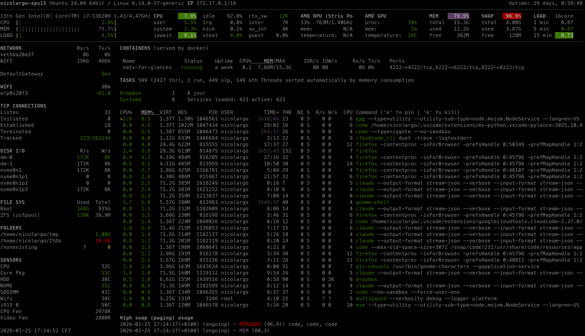
  </p>
</p>

<p align="center">
  <h1 align="center">
    <a href="https://github.com/aksakalli/gtop"><code>gtop</code></a>
  </h1>
  <p align="center">System monitoring dashboard for terminal.</p>
  <p align="center">
    
  </p>
</p>

<p align="center">
  <h1 align="center">
    <a href="https://github.com/sharkdp/hyperfine"><code>hyperfine</code></a>
  </h1>
  <p align="center">A command-line benchmarking tool.</p>
  <p align="center">
    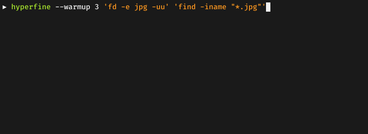
  </p>
</p>

<p align="center">
  <h1 align="center">
    <a href="https://github.com/orf/gping"><code>gping</code></a>
  </h1>
  <p align="center"><code>ping</code>, but with a graph.</p>
  <p align="center">
    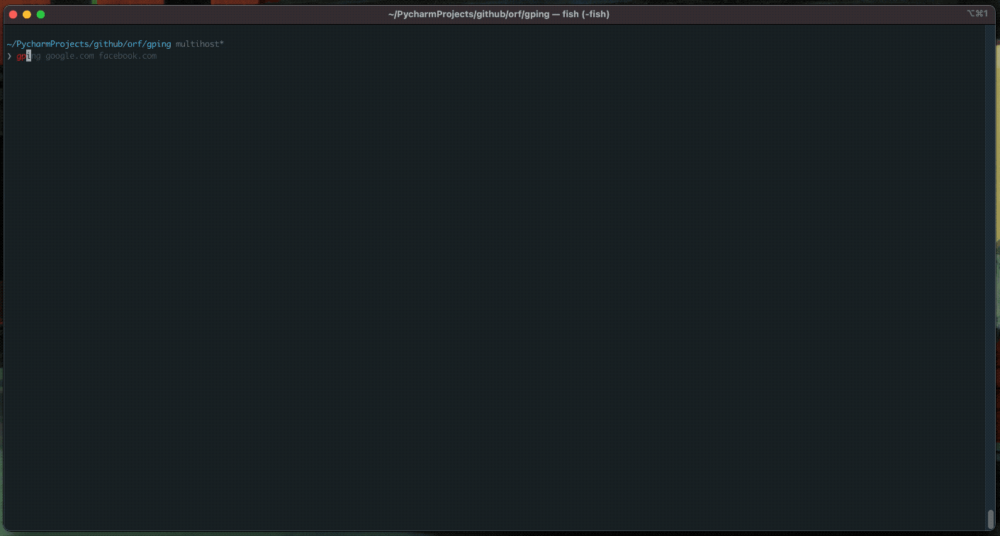
  </p>
</p>

<p align="center">
  <h1 align="center">
    <a href="https://github.com/dalance/procs"><code>procs</code></a>
  </h1>
  <p align="center">A modern replacement for <code>ps</code> written in Rust.</p>
  <p align="center">
    
  </p>
</p>

<p align="center">
  <h1 align="center">
    <a href="https://github.com/httpie/httpie"><code>httpie</code></a>
  </h1>
  <p align="center">A modern, user-friendly command-line HTTP client for the API era.</p>
  <p align="center">
    
  </p>
</p>

<p align="center">
  <h1 align="center">
    <a href="https://github.com/rs/curlie"><code>curlie</code></a>
  </h1>
  <p align="center">The power of <code>curl</code>, the ease of use of <code>httpie</code>.</p>
  <p align="center">
    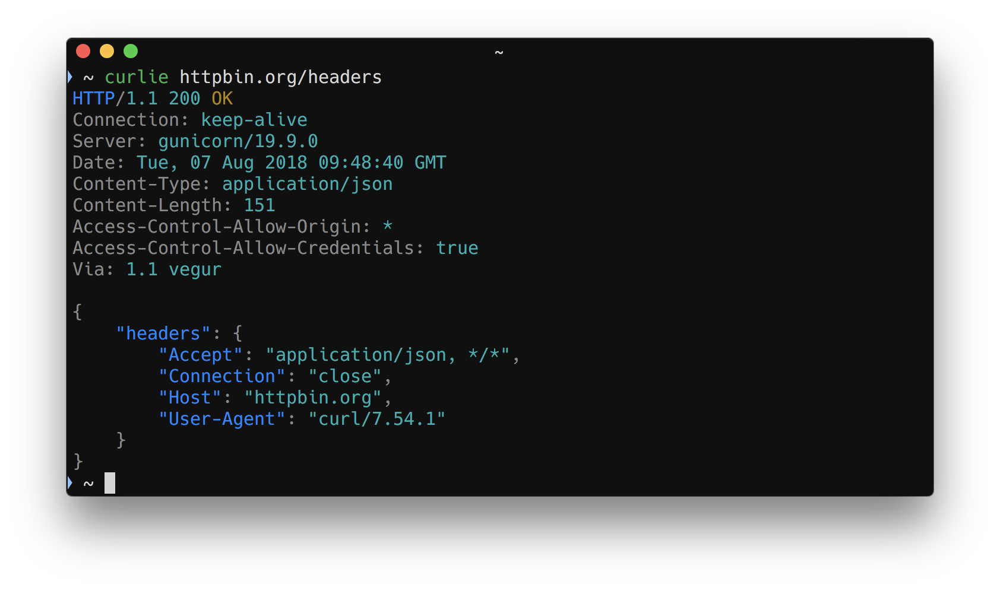
  </p>
</p>

<p align="center">
  <h1 align="center">
    <a href="https://github.com/ducaale/xh"><code>xh</code></a>
  </h1>
  <p align="center">A friendly and fast tool for sending HTTP requests. It reimplements as much as possible of HTTPie's excellent design, with a focus on improved performance.</p>
  <p align="center">
    
  </p>
</p>

<p align="center">
  <h1 align="center">
    <a href="https://github.com/ajeetdsouza/zoxide"><code>zoxide</code></a>
  </h1>
  <p align="center">A smarter <code>cd</code> command inspired by <code>z</code>.</p>
  <p align="center">
    
  </p>
</p>

<p align="center">
  <h1 align="center">
    <a href="https://github.com/ogham/dog"><code>dog</code></a>
  </h1>
  <p align="center">A user-friendly command-line DNS client. <code>dig</code> on steroids</p>
  <p align="center">
    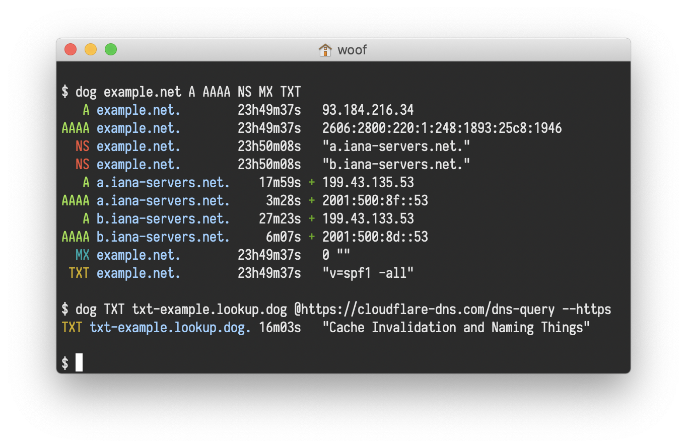
  </p>
</p>



## File Permissions

> ## Recommended Videos
> - [File Permission and chmod](https://www.youtube.com/watch?v=3gcSeDoQ_rU)
> - [Linux File Permissions](https://www.youtube.com/watch?v=LnKoncbQBsM)
{: .callout}

In Unix/Linux systems, every file and directory has associated permissions that control who can read, write, or execute them.

> ## Setup: Create Practice Directory
> ```bash
> cd ~
> mkdir -p permission_practice
> cd permission_practice
> ```
{: .prereq}

### Understanding Permission Notation

Run `ls -l` to see permission strings:

```
-rwxr-xr-x  1  user  group  1234  Jan 20 10:00  filename
│├─┤├─┤├─┤
│ │  │  └── Others permissions (r-x = read + execute)
│ │  └───── Group permissions (r-x = read + execute)
│ └──────── Owner permissions (rwx = read + write + execute)
└────────── File type (- = file, d = directory, l = link)
```

**Permission values:**
| Symbol | Permission | Numeric Value |
|--------|------------|---------------|
| `r` | read | 4 |
| `w` | write | 2 |
| `x` | execute | 1 |
| `-` | none | 0 |

> ## Step 1: View Default Permissions
> ```bash
> touch testfile.txt
> ls -l testfile.txt
> ```
> ```output
> -rw-r--r-- 1 username group 0 Jan 20 10:00 testfile.txt
> ```
> The default `644` means: owner can read/write, others can only read.
{: .checklist}

> ## Step 2: chmod with Numbers
> Calculate permissions by adding: r(4) + w(2) + x(1)
>
> | Permission | Calculation | Result |
> |------------|-------------|--------|
> | rwx | 4+2+1 | 7 |
> | rw- | 4+2+0 | 6 |
> | r-x | 4+0+1 | 5 |
> | r-- | 4+0+0 | 4 |
>
> **Try this: Make a script executable**
> ```bash
> # Create a test script
> echo '#!/bin/bash' > myscript.sh
> echo 'echo "Hello from script!"' >> myscript.sh
> cat myscript.sh
> ```
> ```output
> #!/bin/bash
> echo "Hello from script!"
> ```
> ```bash
> # Try to run it (will fail)
> ./myscript.sh
> ```
> ```output
> bash: ./myscript.sh: Permission denied
> ```
> ```bash
> # Add execute permission (755 = rwxr-xr-x)
> chmod 755 myscript.sh
> ls -l myscript.sh
> ```
> ```output
> -rwxr-xr-x 1 username group 42 Jan 20 10:00 myscript.sh
> ```
> ```bash
> # Now run it
> ./myscript.sh
> ```
> ```output
> Hello from script!
> ```
{: .keypoints}

> ## Step 3: chmod with Letters
> Use: `u`(user/owner), `g`(group), `o`(others), `a`(all)
> Operators: `+`(add), `-`(remove), `=`(set exactly)
>
> ```bash
> touch symbolic_test.txt
> ls -l symbolic_test.txt
> ```
> ```output
> -rw-r--r-- 1 username group 0 Jan 20 10:00 symbolic_test.txt
> ```
> ```bash
> # Add execute for owner
> chmod u+x symbolic_test.txt
> ls -l symbolic_test.txt
> ```
> ```output
> -rwxr--r-- 1 username group 0 Jan 20 10:00 symbolic_test.txt
> ```
> ```bash
> # Remove read for others
> chmod o-r symbolic_test.txt
> ls -l symbolic_test.txt
> ```
> ```output
> -rwxr----- 1 username group 0 Jan 20 10:00 symbolic_test.txt
> ```
{: .keypoints}

> ## Common Permission Patterns
> | Numeric | Symbolic | Use Case |
> |---------|----------|----------|
> | `755` | rwxr-xr-x | Executable scripts, directories |
> | `644` | rw-r--r-- | Regular files |
> | `700` | rwx------ | Private directories |
> | `600` | rw------- | Private files (SSH keys) |
{: .checklist}

> ## Challenge: Create a Private Directory
> ```bash
> mkdir my_private
> chmod 700 my_private
> ls -ld my_private
> ```
> > ## Expected Output
> > ```output
> > drwx------ 2 username group 4096 Jan 20 10:00 my_private
> > ```
> > The `d` indicates directory. Only owner has rwx access.
> {: .solution}
{: .challenge}


## Environment Variables

Environment variables store system settings and user preferences that programs can access.

> ## Step 1: View Your Environment
> ```bash
> # See common variables
> echo "Home directory: $HOME"
> echo "Current user: $USER"
> echo "Current shell: $SHELL"
> echo "Current directory: $PWD"
> ```
> ```output
> Home directory: /home/username
> Current user: username
> Current shell: /bin/bash
> Current directory: /home/username/permission_practice
> ```
> ```bash
> # View PATH (where system looks for commands)
> echo $PATH
> ```
> ```output
> /usr/local/bin:/usr/bin:/bin:/usr/local/sbin:/usr/sbin
> ```
{: .keypoints}

> ## Common Environment Variables
> | Variable | Description | Example |
> |----------|-------------|---------|
> | `HOME` | User's home directory | `/home/username` |
> | `PATH` | Search path for commands | `/usr/bin:/bin` |
> | `USER` | Current username | `username` |
> | `SHELL` | Current shell | `/bin/bash` |
> | `PWD` | Current directory | `/home/username` |
{: .checklist}

> ## Step 2: Create and Use Variables
> ```bash
> # Create a variable (no spaces around =)
> MYNAME="Student"
> echo "Hello, $MYNAME"
> ```
> ```output
> Hello, Student
> ```
> ```bash
> # Export makes it available to child processes
> export PROJECT_DIR="$HOME/myproject"
> echo $PROJECT_DIR
> ```
> ```output
> /home/username/myproject
> ```
> ```bash
> # Unset removes a variable
> unset MYNAME
> echo "Name is: $MYNAME"
> ```
> ```output
> Name is:
> ```
{: .keypoints}

> ## Step 3: Make Variables Permanent
> Add to `~/.bashrc` for permanent variables:
> ```bash
> # View current bashrc (last 5 lines)
> tail -5 ~/.bashrc
>
> # Add a custom variable (be careful with >>)
> echo 'export BIOINF_DATA="$HOME/biodata"' >> ~/.bashrc
>
> # Reload bashrc
> source ~/.bashrc
>
> # Verify
> echo $BIOINF_DATA
> ```
> ```output
> /home/username/biodata
> ```
{: .checklist}


## Process Management

Managing processes is essential for running long bioinformatics analyses.

> ## Step 1: View Running Processes
> ```bash
> # Show your current processes
> ps
> ```
> ```output
>   PID TTY          TIME CMD
> 12345 pts/0    00:00:00 bash
> 12400 pts/0    00:00:00 ps
> ```
> ```bash
> # Show all processes (abbreviated output)
> ps aux | head -5
> ```
> ```output
> USER       PID %CPU %MEM    VSZ   RSS TTY   STAT START   TIME COMMAND
> root         1  0.0  0.1  16894  1340 ?     Ss   Jan19   0:02 /sbin/init
> root         2  0.0  0.0      0     0 ?     S    Jan19   0:00 [kthreadd]
> ...
> ```
> ```bash
> # Interactive view (press 'q' to quit)
> top
> ```
{: .keypoints}

> ## Step 2: Run Commands in Background
> ```bash
> # Start a long-running process (sleep simulates a long job)
> sleep 60 &
> ```
> ```output
> [1] 12456
> ```
> ```bash
> # List background jobs
> jobs
> ```
> ```output
> [1]+  Running                 sleep 60 &
> ```
> ```bash
> # Bring to foreground
> fg %1
> # Press Ctrl+C to stop, or Ctrl+Z to suspend
> ```
{: .keypoints}

> ## Step 3: Kill Processes
> ```bash
> # Start a background process
> sleep 300 &
> ```
> ```output
> [1] 12500
> ```
> ```bash
> # Kill by job number
> kill %1
> jobs
> ```
> ```output
> [1]+  Terminated              sleep 300
> ```
> ```bash
> # Or kill by PID
> sleep 300 &
> ps | grep sleep
> ```
> ```output
> 12510 pts/0    00:00:00 sleep
> ```
> ```bash
> kill 12510
> ```
{: .keypoints}

> ## Step 4: Keep Processes Running After Logout
> ```bash
> # nohup keeps process running after you log out
> nohup sleep 120 > mysleep.log 2>&1 &
> ```
> ```output
> [1] 12600
> ```
> ```bash
> # Check it's running
> jobs
> ps aux | grep sleep
>
> # You can now log out and the process continues!
> ```
{: .checklist}

> ## Process Signals Reference
> | Signal | Number | Shortcut | Description |
> |--------|--------|----------|-------------|
> | SIGINT | 2 | Ctrl+C | Interrupt (stop) |
> | SIGTSTP | 20 | Ctrl+Z | Suspend (pause) |
> | SIGTERM | 15 | `kill PID` | Terminate gracefully |
> | SIGKILL | 9 | `kill -9 PID` | Force kill |
{: .checklist}


## Symbolic Links

Symbolic links (symlinks) are shortcuts that point to other files or directories.

> ## Step 1: Create a Symbolic Link
> ```bash
> # Create a test file
> echo "Original content" > original_file.txt
> cat original_file.txt
> ```
> ```output
> Original content
> ```
> ```bash
> # Create a symbolic link
> ln -s original_file.txt my_shortcut.txt
>
> # View the link (note the -> arrow)
> ls -l my_shortcut.txt
> ```
> ```output
> lrwxrwxrwx 1 user group 17 Jan 20 10:00 my_shortcut.txt -> original_file.txt
> ```
> ```bash
> # Access through the link
> cat my_shortcut.txt
> ```
> ```output
> Original content
> ```
{: .keypoints}

> ## Step 2: Understand Link Behavior
> ```bash
> # Modify through the link
> echo "Added via link" >> my_shortcut.txt
>
> # Original file is modified!
> cat original_file.txt
> ```
> ```output
> Original content
> Added via link
> ```
> ```bash
> # Delete original - link becomes broken
> rm original_file.txt
> cat my_shortcut.txt
> ```
> ```output
> cat: my_shortcut.txt: No such file or directory
> ```
> ```bash
> # Link still exists but is broken (red in colored ls)
> ls -l my_shortcut.txt
> ```
> ```output
> lrwxrwxrwx 1 user group 17 Jan 20 10:00 my_shortcut.txt -> original_file.txt
> ```
{: .keypoints}

> ## Symbolic vs Hard Links
> | Feature | Symbolic Link | Hard Link |
> |---------|---------------|-----------|
> | Command | `ln -s target link` | `ln target link` |
> | Link to directories | Yes | No |
> | Original deleted | Link breaks | Link works |
> | Cross filesystems | Yes | No |
>
> ```bash
> # Create files to compare
> echo "test" > testfile.txt
> ln -s testfile.txt symlink.txt    # Symbolic
> ln testfile.txt hardlink.txt      # Hard
>
> # Check inode numbers (-i flag)
> ls -li testfile.txt symlink.txt hardlink.txt
> ```
> ```output
> 123456 -rw-r--r-- 2 user group 5 Jan 20 testfile.txt
> 123457 lrwxrwxrwx 1 user group 12 Jan 20 symlink.txt -> testfile.txt
> 123456 -rw-r--r-- 2 user group 5 Jan 20 hardlink.txt
> ```
> Note: hardlink.txt has the SAME inode (123456) as testfile.txt
{: .checklist}


## Find Command

The `find` command searches for files based on name, size, time, and more.

> ## Setup: Create Test Files
> ```bash
> cd ~/permission_practice
> mkdir -p find_test/{dir1,dir2}
> touch find_test/file1.txt find_test/file2.txt find_test/script.sh
> touch find_test/dir1/data.csv find_test/dir2/notes.txt
> echo "sample content" > find_test/file1.txt
> ```
{: .prereq}

> ## Step 1: Find by Name
> ```bash
> # Find all .txt files
> find find_test -name "*.txt"
> ```
> ```output
> find_test/file1.txt
> find_test/file2.txt
> find_test/dir2/notes.txt
> ```
> ```bash
> # Case-insensitive search
> find find_test -iname "*.TXT"
> ```
{: .keypoints}

> ## Step 2: Find by Type
> ```bash
> # Find only files
> find find_test -type f
> ```
> ```output
> find_test/file1.txt
> find_test/file2.txt
> find_test/script.sh
> find_test/dir1/data.csv
> find_test/dir2/notes.txt
> ```
> ```bash
> # Find only directories
> find find_test -type d
> ```
> ```output
> find_test
> find_test/dir1
> find_test/dir2
> ```
{: .keypoints}

> ## Step 3: Find with Actions
> ```bash
> # Make all .sh files executable
> find find_test -name "*.sh" -exec chmod +x {} \;
> ls -l find_test/script.sh
> ```
> ```output
> -rwxr-xr-x 1 user group 0 Jan 20 10:00 find_test/script.sh
> ```
> ```bash
> # Delete all .txt files (careful!)
> # Use -print first to preview
> find find_test -name "*.txt" -print
> ```
{: .keypoints}

> ## Quick Reference
> | Option | Description | Example |
> |--------|-------------|---------|
> | `-name` | Match filename | `find . -name "*.fa"` |
> | `-type f` | Files only | `find . -type f` |
> | `-type d` | Directories only | `find . -type d` |
> | `-size +10M` | Larger than 10MB | `find . -size +10M` |
> | `-mtime -7` | Modified last 7 days | `find . -mtime -7` |
{: .checklist}


## sed - Stream Editor

`sed` performs text transformations on files. Great for find-and-replace.

> ## Setup: Create Sample File
> ```bash
> cat > sample.txt << 'EOF'
> Hello World
> hello world
> The quick brown fox
> Line with spaces
> Another line
> EOF
> cat sample.txt
> ```
> ```output
> Hello World
> hello world
> The quick brown fox
> Line with spaces
> Another line
> ```
{: .prereq}

> ## Step 1: Basic Substitution
> ```bash
> # Replace first 'o' with 'O' on each line
> sed 's/o/O/' sample.txt
> ```
> ```output
> HellO World
> hellO world
> The quick brOwn fox
> Line with spaces
> AnOther line
> ```
> ```bash
> # Replace ALL 'o' with 'O' (global flag)
> sed 's/o/O/g' sample.txt
> ```
> ```output
> HellO WOrld
> hellO wOrld
> The quick brOwn fOx
> Line with spaces
> AnOther line
> ```
> ```bash
> # Case-insensitive replace
> sed 's/hello/Hi/i' sample.txt
> ```
> ```output
> Hi World
> Hi world
> The quick brown fox
> Line with spaces
> Another line
> ```
{: .keypoints}

> ## Step 2: Line Operations
> ```bash
> # Print only line 3
> sed -n '3p' sample.txt
> ```
> ```output
> The quick brown fox
> ```
> ```bash
> # Print lines 2-4
> sed -n '2,4p' sample.txt
> ```
> ```output
> hello world
> The quick brown fox
> Line with spaces
> ```
> ```bash
> # Delete lines containing 'world'
> sed '/world/d' sample.txt
> ```
> ```output
> The quick brown fox
> Line with spaces
> Another line
> ```
{: .keypoints}

> ## Step 3: Edit File In-Place
> ```bash
> # Create a backup and edit
> cp sample.txt sample_backup.txt
> sed -i 's/World/Universe/g' sample.txt
> cat sample.txt
> ```
> ```output
> Hello Universe
> hello world
> The quick brown fox
> Line with spaces
> Another line
> ```
{: .checklist}

> ## sed Quick Reference
> | Command | Description |
> |---------|-------------|
> | `s/old/new/` | Replace first match |
> | `s/old/new/g` | Replace all matches |
> | `s/old/new/i` | Case-insensitive |
> | `-n '5p'` | Print line 5 only |
> | `/pattern/d` | Delete matching lines |
> | `-i` | Edit file in-place |
{: .checklist}


## awk - Pattern Scanning and Processing

`awk` processes structured text data (columns). Essential for bioinformatics files.

> ## Setup: Create Sample Data
> ```bash
> cat > genes.txt << 'EOF'
> chr1	100	500	geneA	45.2
> chr1	600	900	geneB	78.9
> chr2	200	400	geneC	23.1
> chr2	800	1200	geneD	92.5
> chr3	150	350	geneE	15.8
> EOF
> cat genes.txt
> ```
> ```output
> chr1	100	500	geneA	45.2
> chr1	600	900	geneB	78.9
> chr2	200	400	geneC	23.1
> chr2	800	1200	geneD	92.5
> chr3	150	350	geneE	15.8
> ```
{: .prereq}

> ## Step 1: Print Columns
> ```bash
> # Print first column (chromosome)
> awk '{print $1}' genes.txt
> ```
> ```output
> chr1
> chr1
> chr2
> chr2
> chr3
> ```
> ```bash
> # Print columns 1 and 4 (chromosome and gene name)
> awk '{print $1, $4}' genes.txt
> ```
> ```output
> chr1 geneA
> chr1 geneB
> chr2 geneC
> chr2 geneD
> chr3 geneE
> ```
> ```bash
> # Print last column
> awk '{print $NF}' genes.txt
> ```
> ```output
> 45.2
> 78.9
> 23.1
> 92.5
> 15.8
> ```
{: .keypoints}

> ## Step 2: Filter with Conditions
> ```bash
> # Print only chr1 genes
> awk '$1 == "chr1"' genes.txt
> ```
> ```output
> chr1	100	500	geneA	45.2
> chr1	600	900	geneB	78.9
> ```
> ```bash
> # Print genes with score > 50
> awk '$5 > 50' genes.txt
> ```
> ```output
> chr1	600	900	geneB	78.9
> chr2	800	1200	geneD	92.5
> ```
> ```bash
> # Combine conditions (chr2 AND score > 50)
> awk '$1 == "chr2" && $5 > 50' genes.txt
> ```
> ```output
> chr2	800	1200	geneD	92.5
> ```
{: .keypoints}

> ## Step 3: Calculations
> ```bash
> # Sum of scores (column 5)
> awk '{sum += $5} END {print "Total:", sum}' genes.txt
> ```
> ```output
> Total: 255.5
> ```
> ```bash
> # Average score
> awk '{sum += $5; count++} END {print "Average:", sum/count}' genes.txt
> ```
> ```output
> Average: 51.1
> ```
> ```bash
> # Calculate gene length (end - start)
> awk '{print $4, $3 - $2}' genes.txt
> ```
> ```output
> geneA 400
> geneB 300
> geneC 200
> geneD 400
> geneE 200
> ```
{: .keypoints}

> ## awk Built-in Variables
> | Variable | Description | Example |
> |----------|-------------|---------|
> | `$0` | Entire line | `awk '{print $0}'` |
> | `$1, $2...` | Column 1, 2, etc. | `awk '{print $1}'` |
> | `NF` | Number of columns | `awk '{print NF}'` |
> | `NR` | Line number | `awk '{print NR, $0}'` |
> | `-F` | Set delimiter | `awk -F',' '{print $1}'` |
{: .checklist}

> ## Challenge: Analyze Gene Data
> Using genes.txt, find:
> 1. All genes on chr2
> 2. The gene with highest score
> 3. Total length of all genes
>
> > ## Solutions
> > ```bash
> > # 1. Genes on chr2
> > awk '$1 == "chr2" {print $4}' genes.txt
> > ```
> > ```output
> > geneC
> > geneD
> > ```
> > ```bash
> > # 2. Gene with highest score
> > awk 'NR==1 || $5 > max {max=$5; gene=$4} END {print gene, max}' genes.txt
> > ```
> > ```output
> > geneD 92.5
> > ```
> > ```bash
> > # 3. Total gene length
> > awk '{len += $3 - $2} END {print "Total length:", len}' genes.txt
> > ```
> > ```output
> > Total length: 1500
> > ```
> {: .solution}
{: .challenge}


## Shell Scripting Basics

Automate repetitive tasks by combining commands into scripts.

> ## Step 1: Create Your First Script
> ```bash
> # Create a simple script
> cat > hello.sh << 'EOF'
> #!/bin/bash
> echo "Hello, World!"
> echo "Today is $(date +%Y-%m-%d)"
> EOF
>
> # View it
> cat hello.sh
> ```
> ```output
> #!/bin/bash
> echo "Hello, World!"
> echo "Today is $(date +%Y-%m-%d)"
> ```
> ```bash
> # Make it executable and run
> chmod +x hello.sh
> ./hello.sh
> ```
> ```output
> Hello, World!
> Today is 2026-01-20
> ```
{: .keypoints}

> ## Step 2: Using Variables
> ```bash
> cat > variables.sh << 'EOF'
> #!/bin/bash
> # Variables (no spaces around =)
> NAME="Student"
> COUNT=5
>
> echo "Hello, $NAME"
> echo "Count is $COUNT"
>
> # Command substitution
> TODAY=$(date +%Y-%m-%d)
> NUM_FILES=$(ls | wc -l)
> echo "Today: $TODAY, Files in directory: $NUM_FILES"
> EOF
>
> chmod +x variables.sh
> ./variables.sh
> ```
> ```output
> Hello, Student
> Count is 5
> Today: 2026-01-20, Files in directory: 12
> ```
{: .keypoints}

> ## Step 3: Command Line Arguments
> ```bash
> cat > args.sh << 'EOF'
> #!/bin/bash
> echo "Script: $0"
> echo "First arg: $1"
> echo "Second arg: $2"
> echo "All args: $@"
> echo "Num args: $#"
> EOF
>
> chmod +x args.sh
> ./args.sh apple banana cherry
> ```
> ```output
> Script: ./args.sh
> First arg: apple
> Second arg: banana
> All args: apple banana cherry
> Num args: 3
> ```
{: .keypoints}

> ## Step 4: If Statements
> ```bash
> cat > checker.sh << 'EOF'
> #!/bin/bash
> if [ -z "$1" ]; then
>     echo "Usage: $0 <filename>"
>     exit 1
> fi
>
> if [ -f "$1" ]; then
>     echo "$1 is a file"
> elif [ -d "$1" ]; then
>     echo "$1 is a directory"
> else
>     echo "$1 does not exist"
> fi
> EOF
>
> chmod +x checker.sh
> ./checker.sh genes.txt
> ```
> ```output
> genes.txt is a file
> ```
> ```bash
> ./checker.sh find_test
> ```
> ```output
> find_test is a directory
> ```
>
> **Test operators:** `-f` (file exists), `-d` (directory), `-z` (empty string), `-eq` (equal), `-gt` (greater than)
{: .keypoints}

> ## Step 5: For Loops
> ```bash
> cat > loop.sh << 'EOF'
> #!/bin/bash
> # Loop over files
> for file in *.txt; do
>     echo "Found: $file"
> done
>
> # Loop with range
> for i in {1..3}; do
>     echo "Count: $i"
> done
> EOF
>
> chmod +x loop.sh
> ./loop.sh
> ```
> ```output
> Found: genes.txt
> Found: sample.txt
> Found: testfile.txt
> Count: 1
> Count: 2
> Count: 3
> ```
{: .keypoints}

> ## Challenge: Bioinformatics Script
> Create a script that counts lines in all .txt files:
> ```bash
> cat > count_lines.sh << 'EOF'
> #!/bin/bash
> for file in *.txt; do
>     lines=$(wc -l < "$file")
>     echo "$file: $lines lines"
> done
> EOF
>
> chmod +x count_lines.sh
> ./count_lines.sh
> ```
> ```output
> genes.txt: 5 lines
> sample.txt: 5 lines
> testfile.txt: 1 lines
> ```
{: .challenge}


## Standard Streams and Redirection

Every command has three data streams: input (stdin), output (stdout), and errors (stderr).

> ## The Three Streams
> | Stream | Number | Description |
> |--------|--------|-------------|
> | stdin | 0 | Input (from keyboard/file) |
> | stdout | 1 | Normal output |
> | stderr | 2 | Error messages |
{: .checklist}

> ## Step 1: Output Redirection
> ```bash
> # Redirect output to file (overwrites)
> echo "Hello" > output.txt
> cat output.txt
> ```
> ```output
> Hello
> ```
> ```bash
> # Append to file (>>)
> echo "World" >> output.txt
> cat output.txt
> ```
> ```output
> Hello
> World
> ```
> ```bash
> # Redirect errors separately
> ls nonexistent 2> errors.txt
> cat errors.txt
> ```
> ```output
> ls: cannot access 'nonexistent': No such file or directory
> ```
> ```bash
> # Redirect both stdout and stderr
> ls genes.txt nonexistent > all.txt 2>&1
> cat all.txt
> ```
> ```output
> ls: cannot access 'nonexistent': No such file or directory
> genes.txt
> ```
{: .keypoints}

> ## Step 2: Input Redirection
> ```bash
> # Read input from file
> wc -l < genes.txt
> ```
> ```output
> 5
> ```
{: .keypoints}

> ## Step 3: Pipes
> Connect commands: output of one becomes input of next.
> ```bash
> # Count chr1 genes in our data
> cat genes.txt | grep "chr1" | wc -l
> ```
> ```output
> 2
> ```
> ```bash
> # Sort by score (column 5), show top 3
> sort -k5 -rn genes.txt | head -3
> ```
> ```output
> chr2	800	1200	geneD	92.5
> chr1	600	900	geneB	78.9
> chr1	100	500	geneA	45.2
> ```
> ```bash
> # Save intermediate result with tee
> cat genes.txt | grep "chr1" | tee chr1_genes.txt | wc -l
> cat chr1_genes.txt
> ```
> ```output
> 2
> chr1	100	500	geneA	45.2
> chr1	600	900	geneB	78.9
> ```
{: .keypoints}

> ## Redirection Quick Reference
> | Symbol | Description | Example |
> |--------|-------------|---------|
> | `>` | Redirect stdout (overwrite) | `cmd > file` |
> | `>>` | Redirect stdout (append) | `cmd >> file` |
> | `2>` | Redirect stderr | `cmd 2> errors` |
> | `&>` | Redirect both | `cmd &> all` |
> | `<` | Read from file | `cmd < file` |
> | `\|` | Pipe to next command | `cmd1 \| cmd2` |
{: .checklist}


## Screen and tmux - Terminal Multiplexers

Run long jobs that continue after you disconnect from the server.

> ## tmux Quick Start
> ```bash
> # Start a new named session
> tmux new -s analysis
>
> # Run your long command
> # ... your command here ...
>
> # Detach: Press Ctrl+B, then D
>
> # List sessions
> tmux ls
> ```
> ```output
> analysis: 1 windows (created Mon Jan 20 10:00:00 2026)
> ```
> ```bash
> # Reattach later
> tmux attach -t analysis
>
> # Kill session when done
> tmux kill-session -t analysis
> ```
{: .keypoints}

> ## tmux Key Bindings (Ctrl+B, then)
> | Key | Action |
> |-----|--------|
> | `d` | Detach from session |
> | `c` | Create new window |
> | `n` | Next window |
> | `p` | Previous window |
> | `%` | Split vertically |
> | `"` | Split horizontally |
{: .checklist}


## Micromamba - Package Management

Install bioinformatics software without admin privileges. Micromamba is a fast, lightweight package manager.

> ## Step 1: Install Micromamba
> ```bash
> # Download and install micromamba
> "${SHELL}" <(curl -L micro.mamba.pm/install.sh)
>
> # Restart your shell or run:
> source ~/.bashrc
>
> # Verify installation
> micromamba --version
> ```
> ```output
> 1.5.6
> ```
> ```bash
> # Create symbolic link so 'conda' runs micromamba
> mkdir -p ~/bin
> ln -s $(which micromamba) ~/bin/conda
>
> # Make sure ~/bin is in your PATH
> echo 'export PATH="$HOME/bin:$PATH"' >> ~/.bashrc
> source ~/.bashrc
>
> # Now you can use 'conda' command
> conda --version
> ```
> ```output
> 1.5.6
> ```
{: .keypoints}

> ## Step 2: Create an Environment
> ```bash
> # Create a new environment with Python
> micromamba create -n biotools python=3.10 -c conda-forge
> ```
> ```output
> Create environment? [y/N] y
> ```
> ```bash
> # Activate the environment
> micromamba activate biotools
>
> # Your prompt changes to show active environment
> # (biotools) $
>
> # Check Python version
> python --version
> ```
> ```output
> Python 3.10.0
> ```
{: .keypoints}

> ## Step 3: Install Bioinformatics Tools
> ```bash
> # Install from bioconda channel
> micromamba install -c bioconda -c conda-forge samtools
>
> # Verify installation
> samtools --version | head -2
> ```
> ```output
> samtools 1.17
> Using htslib 1.17
> ```
> ```bash
> # Install multiple tools at once
> micromamba install -c bioconda -c conda-forge bwa fastqc multiqc
>
> # List installed packages
> micromamba list | head -5
> ```
> ```output
> List of packages in environment: "biotools"
> Name            Version    Build          Channel
> python          3.10.0     ...            conda-forge
> samtools        1.17       ...            bioconda
> ```
{: .keypoints}

> ## Step 4: Manage Environments
> ```bash
> # List all environments
> micromamba env list
> ```
> ```output
> Name       Active  Path
> biotools   *       /home/user/micromamba/envs/biotools
> ```
> ```bash
> # Deactivate current environment
> micromamba deactivate
>
> # Remove an environment
> micromamba env remove -n biotools
> ```
{: .keypoints}

> ## Micromamba Commands Reference
> | Command | Description |
> |---------|-------------|
> | `micromamba create -n NAME` | Create environment |
> | `micromamba activate NAME` | Activate environment |
> | `micromamba deactivate` | Deactivate |
> | `micromamba env list` | List environments |
> | `micromamba list` | List packages |
> | `micromamba install PKG` | Install package |
> | `-c bioconda -c conda-forge` | Use bioconda channel |
{: .checklist}

> ## Quick Setup: Bioinformatics Environment
> Create an environment with common tools:
> ```bash
> micromamba create -n rnaseq -c bioconda -c conda-forge \
>     python=3.10 \
>     samtools bcftools bedtools \
>     bwa hisat2 star \
>     fastqc multiqc \
>     pandas numpy
>
> micromamba activate rnaseq
> ```
{: .challenge}


## Git Basics - Version Control

Track changes to your code and collaborate with others.

> ## Step 1: Configure Git
> ```bash
> # Set your identity (one-time setup)
> git config --global user.name "Your Name"
> git config --global user.email "your.email@example.com"
>
> # Verify
> git config --list | grep user
> ```
> ```output
> user.name=Your Name
> user.email=your.email@example.com
> ```
{: .keypoints}

> ## Step 2: Create a Repository
> ```bash
> # Create and initialize a project
> mkdir my_analysis
> cd my_analysis
> git init
> ```
> ```output
> Initialized empty Git repository in /home/user/my_analysis/.git/
> ```
> ```bash
> # Create some files
> echo "# My Analysis" > README.md
> echo "data/" > .gitignore
>
> # Check status
> git status
> ```
> ```output
> On branch main
> Untracked files:
>   README.md
>   .gitignore
> ```
{: .keypoints}

> ## Step 3: Make Your First Commit
> ```bash
> # Add files to staging
> git add README.md .gitignore
>
> # Commit with a message
> git commit -m "Initial commit: add README and gitignore"
> ```
> ```output
> [main (root-commit) abc1234] Initial commit: add README and gitignore
>  2 files changed, 2 insertions(+)
> ```
> ```bash
> # View history
> git log --oneline
> ```
> ```output
> abc1234 Initial commit: add README and gitignore
> ```
{: .keypoints}

> ## Git Commands Reference
> | Command | Description |
> |---------|-------------|
> | `git init` | Initialize repository |
> | `git status` | Check file status |
> | `git add FILE` | Stage changes |
> | `git commit -m "msg"` | Commit changes |
> | `git log` | View history |
> | `git diff` | See changes |
> | `git clone URL` | Clone repository |
{: .checklist}


## Bioinformatics File Formats

Understanding common bioinformatics file formats is essential for working with genomic data.

### SAM/BAM Format

SAM (Sequence Alignment Map) is a text format for storing sequence alignments. BAM is its binary, compressed version.

> ## SAM Format Structure
> A SAM file consists of:
> 1. **Header section** (lines starting with @)
> 2. **Alignment section** (tab-delimited fields)
>
> **Header lines:**
> - `@HD` - Header line
> - `@SQ` - Reference sequence dictionary
> - `@RG` - Read group
> - `@PG` - Program used
>
> **Alignment fields (11 mandatory):**
> | Col | Field | Description |
> |-----|-------|-------------|
> | 1 | QNAME | Query name |
> | 2 | FLAG | Bitwise flag |
> | 3 | RNAME | Reference name |
> | 4 | POS | Position |
> | 5 | MAPQ | Mapping quality |
> | 6 | CIGAR | CIGAR string |
> | 7 | RNEXT | Mate reference name |
> | 8 | PNEXT | Mate position |
> | 9 | TLEN | Template length |
> | 10 | SEQ | Sequence |
> | 11 | QUAL | Quality string |
{: .keypoints}

> ## Working with SAM/BAM
> ```bash
> # View SAM file
> $ less alignment.sam
>
> # Convert SAM to BAM
> $ samtools view -bS alignment.sam > alignment.bam
>
> # Sort BAM file
> $ samtools sort alignment.bam -o alignment.sorted.bam
>
> # Index BAM file
> $ samtools index alignment.sorted.bam
>
> # View BAM file
> $ samtools view alignment.bam | head
>
> # View specific region
> $ samtools view alignment.sorted.bam chr1:1000-2000
>
> # Get statistics
> $ samtools flagstat alignment.bam
> $ samtools stats alignment.bam
> ```
{: .keypoints}

### BED Format

BED (Browser Extensible Data) format is used to define genomic regions.

> ## BED Format Structure
> BED files are tab-delimited with at least 3 columns:
>
> | Column | Name | Description |
> |--------|------|-------------|
> | 1 | chrom | Chromosome |
> | 2 | chromStart | Start position (0-based) |
> | 3 | chromEnd | End position |
> | 4 | name | Feature name (optional) |
> | 5 | score | Score (optional) |
> | 6 | strand | + or - (optional) |
>
> **Example:**
> ```
> chr1    1000    2000    gene1    100    +
> chr1    3000    4000    gene2    200    -
> chr2    5000    6000    gene3    150    +
> ```
>
> **Important:** BED uses 0-based, half-open coordinates
{: .keypoints}

> ## Working with BED Files
> ```bash
> # Sort BED file
> $ sort -k1,1 -k2,2n input.bed > sorted.bed
>
> # Merge overlapping intervals
> $ bedtools merge -i sorted.bed > merged.bed
>
> # Find intersections
> $ bedtools intersect -a file1.bed -b file2.bed > common.bed
>
> # Subtract regions
> $ bedtools subtract -a file1.bed -b file2.bed > unique.bed
>
> # Get flanking regions
> $ bedtools flank -i genes.bed -g genome.txt -b 1000 > flanks.bed
> ```
{: .keypoints}

### VCF Format

VCF (Variant Call Format) stores genetic variation data.

> ## VCF Format Structure
> VCF files have:
> 1. **Meta-information lines** (starting with ##)
> 2. **Header line** (starting with #CHROM)
> 3. **Data lines** (one per variant)
>
> **Fixed columns:**
> | Col | Field | Description |
> |-----|-------|-------------|
> | 1 | CHROM | Chromosome |
> | 2 | POS | Position (1-based) |
> | 3 | ID | Variant ID |
> | 4 | REF | Reference allele |
> | 5 | ALT | Alternate allele(s) |
> | 6 | QUAL | Quality score |
> | 7 | FILTER | Filter status |
> | 8 | INFO | Additional info |
> | 9 | FORMAT | Genotype format |
> | 10+ | SAMPLE | Sample genotypes |
>
> **Example:**
> ```
> #CHROM  POS     ID      REF     ALT     QUAL    FILTER  INFO    FORMAT  SAMPLE1
> chr1    100     rs123   A       G       30      PASS    DP=50   GT:DP   0/1:50
> ```
{: .keypoints}

> ## Working with VCF Files
> ```bash
> # View VCF file
> $ bcftools view variants.vcf | head
>
> # Compress and index
> $ bgzip variants.vcf
> $ tabix -p vcf variants.vcf.gz
>
> # Filter variants
> $ bcftools filter -i 'QUAL>30' variants.vcf.gz > filtered.vcf
>
> # Extract specific region
> $ bcftools view variants.vcf.gz chr1:1000-2000 > region.vcf
>
> # Statistics
> $ bcftools stats variants.vcf.gz > stats.txt
>
> # Convert to table
> $ bcftools query -f '%CHROM\t%POS\t%REF\t%ALT\n' variants.vcf.gz
> ```
{: .keypoints}


## Common Bioinformatics Tools

### samtools

samtools is a suite of programs for interacting with SAM/BAM files.

> ## Essential samtools Commands
> ```bash
> # Convert SAM to BAM
> $ samtools view -bS input.sam > output.bam
>
> # Sort BAM file
> $ samtools sort input.bam -o sorted.bam
>
> # Index BAM file (required for many operations)
> $ samtools index sorted.bam
>
> # View alignment statistics
> $ samtools flagstat sorted.bam
>
> # Calculate depth
> $ samtools depth sorted.bam > depth.txt
>
> # Extract reads from region
> $ samtools view sorted.bam chr1:1000-2000 > region.sam
>
> # Extract unmapped reads
> $ samtools view -f 4 sorted.bam > unmapped.sam
>
> # Extract properly paired reads
> $ samtools view -f 2 sorted.bam > proper_pairs.sam
>
> # Merge multiple BAM files
> $ samtools merge merged.bam file1.bam file2.bam file3.bam
>
> # Create FASTA index
> $ samtools faidx reference.fa
>
> # Extract sequence from FASTA
> $ samtools faidx reference.fa chr1:1000-2000
> ```
{: .keypoints}

### bedtools

bedtools is a powerful suite for genomic arithmetic operations.

> ## Essential bedtools Commands
> ```bash
> # Find overlapping features
> $ bedtools intersect -a genes.bed -b peaks.bed > overlaps.bed
>
> # Count overlaps
> $ bedtools intersect -a genes.bed -b peaks.bed -c > counts.bed
>
> # Find features NOT overlapping
> $ bedtools intersect -a genes.bed -b peaks.bed -v > no_overlap.bed
>
> # Merge overlapping intervals
> $ bedtools merge -i sorted.bed > merged.bed
>
> # Calculate coverage
> $ bedtools coverage -a genes.bed -b reads.bam > coverage.bed
>
> # Get closest feature
> $ bedtools closest -a query.bed -b reference.bed > closest.bed
>
> # Generate genome windows
> $ bedtools makewindows -g genome.txt -w 1000 > windows.bed
>
> # Get FASTA sequences for BED regions
> $ bedtools getfasta -fi genome.fa -bed regions.bed > sequences.fa
>
> # Shuffle features randomly
> $ bedtools shuffle -i features.bed -g genome.txt > shuffled.bed
>
> # Compute Jaccard statistic
> $ bedtools jaccard -a file1.bed -b file2.bed
> ```
{: .keypoints}

> ## Combining Tools in Pipelines
> ```bash
> # Example: Find genes with mapped reads and count
> $ bedtools intersect -a genes.bed -b aligned.bam -c | \
>     awk '$4 > 10' | \
>     sort -k4,4rn > highly_expressed.bed
>
> # Example: Get sequences of peaks
> $ bedtools sort -i peaks.bed | \
>     bedtools merge -i - | \
>     bedtools getfasta -fi genome.fa -bed - > peak_sequences.fa
>
> # Example: Calculate mapping statistics per gene
> $ samtools view -F 4 aligned.bam | \
>     bedtools bamtobed -i stdin | \
>     bedtools intersect -a genes.bed -b stdin -c > gene_counts.bed
> ```
{: .challenge}
