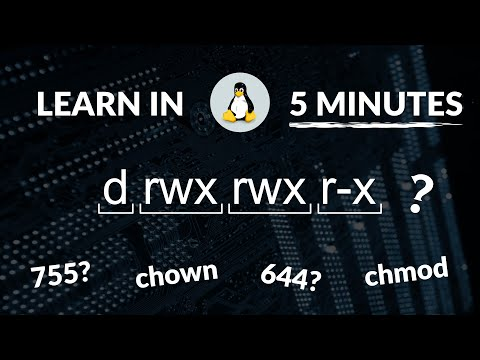



## File Permissions

> ## Linux File Permissions
> [](https://www.youtube.com/watch?v=LnKoncbQBsM)
>
> [Watch: Linux File Permissions](https://www.youtube.com/watch?v=LnKoncbQBsM)
>
> See also: [File Permission and chmod](https://www.youtube.com/watch?v=3gcSeDoQ_rU)
{: .callout}

In Unix/Linux systems, every file and directory has associated permissions that control who can read, write, or execute them.

> ## Setup: Create Practice Directory
> ```bash
> cd ~
> mkdir -p permission_practice
> cd permission_practice
> ```
{: .prereq}

### Understanding Permission Notation

Run `ls -l` to see permission strings:

```
-rwxr-xr-x  1  user  group  1234  Jan 20 10:00  filename
│├─┤├─┤├─┤
│ │  │  └── Others permissions (r-x = read + execute)
│ │  └───── Group permissions (r-x = read + execute)
│ └──────── Owner permissions (rwx = read + write + execute)
└────────── File type (- = file, d = directory, l = link)
```

**Permission values:**

| Symbol | Permission | Numeric Value |
|--------|------------|---------------|
| `r`    | read       | 4             |
| `w`    | write      | 2             |
| `x`    | execute    | 1             |
| `-`    | none       | 0             |

> ## Step 1: View Default Permissions
> ```bash
> touch testfile.txt
> ls -l testfile.txt
> ```
> ```output
> -rw-r--r-- 1 username group 0 Jan 20 10:00 testfile.txt
> ```
> The default `644` means: owner can read/write, others can only read.
{: .checklist}

> ## Step 2: chmod with Numbers
> Calculate permissions by adding: r(4) + w(2) + x(1)
{: .callout}

| Permission | Calculation | Result |
|------------|-------------|--------|
| rwx | 4+2+1 | 7 |
| rw- | 4+2+0 | 6 |
| r-x | 4+0+1 | 5 |
| r-- | 4+0+0 | 4 |

> **Try this: Make a script executable**
> ```bash
> # Create a test script
> echo '#!/bin/bash' > myscript.sh
> echo 'echo "Hello from script!"' >> myscript.sh
> cat myscript.sh
> ```
> ```output
> #!/bin/bash
> echo "Hello from script!"
> ```
> ```bash
> # Try to run it (will fail)
> ./myscript.sh
> ```
> ```output
> bash: ./myscript.sh: Permission denied
> ```
> ```bash
> # Add execute permission (755 = rwxr-xr-x)
> chmod 755 myscript.sh
> ls -l myscript.sh
> ```
> ```output
> -rwxr-xr-x 1 username group 42 Jan 20 10:00 myscript.sh
> ```
> ```bash
> # Now run it
> ./myscript.sh
> ```
> ```output
> Hello from script!
> ```
{: .keypoints}

> ## Step 3: chmod with Letters
> Use: `u`(user/owner), `g`(group), `o`(others), `a`(all)
> Operators: `+`(add), `-`(remove), `=`(set exactly)
>
> ```bash
> touch symbolic_test.txt
> ls -l symbolic_test.txt
> ```
> ```output
> -rw-r--r-- 1 username group 0 Jan 20 10:00 symbolic_test.txt
> ```
> ```bash
> # Add execute for owner
> chmod u+x symbolic_test.txt
> ls -l symbolic_test.txt
> ```
> ```output
> -rwxr--r-- 1 username group 0 Jan 20 10:00 symbolic_test.txt
> ```
> ```bash
> # Remove read for others
> chmod o-r symbolic_test.txt
> ls -l symbolic_test.txt
> ```
> ```output
> -rwxr----- 1 username group 0 Jan 20 10:00 symbolic_test.txt
> ```
{: .keypoints}

### Common Permission Patterns

| Numeric | Symbolic | Use Case |
|---------|----------|----------|
| `755` | rwxr-xr-x | Executable scripts, directories |
| `644` | rw-r--r-- | Regular files |
| `700` | rwx------ | Private directories |
| `600` | rw------- | Private files (SSH keys) |

> ## Challenge: Create a Private Directory
> ```bash
> mkdir my_private
> chmod 700 my_private
> ls -ld my_private
> ```
> > ## Expected Output
> > ```output
> > drwx------ 2 username group 4096 Jan 20 10:00 my_private
> > ```
> > The `d` indicates directory. Only owner has rwx access.
> {: .solution}
{: .challenge}
