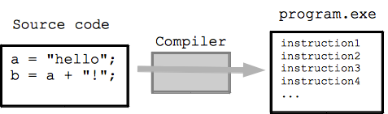



This lesson covers how to install software on Linux and macOS systems, including system package managers (APT, Homebrew), Conda/Micromamba for bioinformatics, and compiling software from source code.



---

## System Prerequisites

### macOS

> ### Install Homebrew
> Homebrew is a package manager for macOS. Install it with:
> ```bash
> $ /bin/bash -c "$(curl -fsSL https://raw.githubusercontent.com/Homebrew/install/HEAD/install.sh)"
> ```
> After installation, update Homebrew:
> ```bash
> $ brew update
> ```
{: .prereq}

### Install Prerequisite Software
```bash
$ brew install openssl readline sqlite3 xz wget
```

### Ubuntu/WSL

Install essential build tools and libraries:
```bash
$ sudo apt update
$ sudo apt install -y build-essential git curl wget libssl-dev libbz2-dev libreadline-dev libsqlite3-dev llvm libncurses5-dev libncursesw5-dev xz-utils tk-dev libffi-dev liblzma-dev zlib1g-dev
```

### Verify Installation

**On Ubuntu/WSL:**
```bash
$ sudo apt install screenfetch
$ screenfetch
```

**On macOS:**
```bash
$ brew install screenfetch
$ screenfetch
```

---

## Programming Languages Overview

| Type | Languages |
|------|-----------|
| Compiled | FORTRAN, C, C++, Java, Rust, Go |
| Interpreted | Unix-Shell, awk, Perl, Ruby, Python, R, JavaScript |

### Bioinformatics Languages

#### Perl
Perl is flexible and has a global repository (CPAN), which makes it easy to install new modules. It also has BioPerl, one of the first biological unit repositories, enhancing usability for tasks such as phylogenetic analysis. Although Perl was widely used, Python has become more popular due to its ease of use, especially for beginners.

#### R & Python
R is excellent for statistical analysis, but if you prefer coding, Python might suit you more. Python's rules are easier to follow, making it more beginner-friendly. It's also easier to develop command-line tools in Python, and there are useful bioinformatics packages available in Python.

#### Bash
Bash (or shell scripting) is essential for bioinformaticians. It's a powerful tool for data manipulation (sorting, filtering, etc.) and is often used on institutional clusters. It may seem intimidating at first, but with time, you will find it very efficient for repetitive tasks and system administration.

#### Recommendation for Beginners

For wet-lab researchers starting with bioinformatics, R is a good choice to learn first. If you aim for a bioinformatics career, knowing R, Python, and Bash is recommended. For beginners, focusing on either R or Python, while learning Bash, can still be effective.

### Other Languages

#### C and C++
C and C++ are great for high-performance tools like aligners, but they are harder to learn and take more code to accomplish tasks that can be done more simply in Python.

#### Ruby
Ruby is popular for web applications but lacks the package support for bioinformatics that Python and R have.

#### JavaScript or PHP
These languages are better suited for web applications. Bioinformatics beginners should start with Python or R before considering web development languages.

#### Java
Java has some uses in bioinformatics (e.g., IGV genome browser), but it's not beginner-friendly, especially when compared to Python or R.


### Packages, Libraries, and Modules

| Term | Description |
|------|-------------|
| **Library** | A collection of related packages or modules (e.g., Python Standard Library) |
| **Module** | A single file containing code that can be imported and reused |
| **Package** | A collection of related modules organized in a specific structure |

### Language Package Managers

| Language | Package Manager |
|----------|-----------------|
| Python | pip |
| Perl | CPAN |
| R | Built-in (`install.packages()`) |

---

## File Permissions


### Understanding `ls -l` Output


### Using chmod (Change Mode)

The `chmod` command changes file access permissions. Permissions control who can read, write, or execute files.


### Octal Notation for Permissions


---

## System Information

### Check CPUs and Memory

Understanding your system resources is important for running bioinformatics tools efficiently.

```bash
# Check CPU information
$ lscpu

# Check memory usage
$ free -h

# Interactive process viewer (press 'q' to quit)
$ htop

# Check number of CPU cores
$ nproc
```

> ## Quick System Info
> ```bash
> # One-liner to show cores and memory
> $ echo "CPUs: $(nproc), Memory: $(free -h | awk '/^Mem:/ {print $2}')"
> ```
{: .callout}

### Shell Configuration Files (.bashrc, .zshrc)

RC files configure the environment and prepare the system to run specific software. These are commonly used in Unix-like systems to automate shell configurations.

### Shell Customization

> ## Prompt Customization for Linux/WSL
> ```bash
> $ echo 'export PS1="\[\033[38;5;164m\]\u\[\033[0m\]@\[\033[38;5;2m\]\h\[\033[0m\] \[\033[38;5;172m\]\t\[\033[0m\] \[\033[38;5;2m\]\w\[\033[0m\]\n$ "' >> ~/.bashrc
> $ echo "alias ls='ls --color=auto'" >> ~/.bashrc
> $ source ~/.bashrc
> ```
{: .solution}

> ## Prompt Customization for macOS (Oh My Zsh)
> ```bash
> $ sh -c "$(curl -fsSL https://raw.githubusercontent.com/ohmyzsh/ohmyzsh/master/tools/install.sh)"
> $ source ~/.zshrc
> ```
{: .solution}

> ## Connecting to HPC Cluster
> For information on connecting to Pronghorn HPC cluster, see the [HPC Cluster lesson](HPC_cluster.html).
{: .callout}

---

## System Package Management

For reference: [Linux Distribution Family Tree](https://en.wikipedia.org/wiki/List_of_Linux_distributions)

> ## Package Management Concepts
> 
> Package management in Linux allows for easier installation and updating of software. It handles dependencies and ensures proper installation across systems. Popular tools include APT (Debian/Ubuntu), YUM (CentOS/Fedora), and Homebrew (macOS).
>
> Without package management, users must ensure that all of the required dependencies for a piece of software are installed and up-to-date, compile the software from the source code (which takes time and introduces compiler-based variations from system to system), and manage configuration for each piece of software. Without package management, application files are located in the standard locations for the system to which the developers are accustomed, regardless of which system they’re using.
>
> Package management systems attempt to solve these problems and are the tools through which developers attempt to increase the overall quality and coherence of a Linux-based operating system. The features that most package management applications provide are:
>
> - Package downloading: Operating-system projects provide package repositories which allow users to download their packages from a single, trusted provider. When you download from a package manager, the software can be authenticated and will remain in the repository even if the original source becomes unreliable.
> - Dependency resolution: Packages contain metadata which provides information about what other files are required by each respective package. This allows applications and their dependencies to be installed with one command, and for programs to rely on common, shared libraries, reducing bulk and allowing the operating system to manage updates to the packages.
> - A standard binary package format: Packages are uniformly prepared across the system to make installation easier. While some distributions share formats, compatibility issues between similarly formatted packages for different operating systems can occur.
> - Common installation and configuration locations: Linux distribution developers often have conventions for how applications are configured and the layout of files in the /etc/ and /etc/init.d/ directories; by using packages, distributions are able to enforce a single standard.
> - Additional system-related configuration and functionality: Occasionally, operating system developers will develop patches and helper scripts for their software which get distributed within the packages. These modifications can have a significant impact on user experience.
> - Quality control: Operating-system developers use the packaging process to test and ensure that the software is stable and free of bugs that might affect product quality and that the software doesn't cause the system to become unstable. The subjective judgments and community standards that guide packaging and package management also guide the "feel" and "stability" of a given system.
>
> In general, we recommend that you install the versions of software available in your distribution’s repository and packaged for your operating system. If packages for the application or software that you need to install aren’t available, we recommend that you find packages for your operating system, when available, before installing from source code.
>
> The remainder of this guide will cover how to use specific package management systems and how to compile and package software yourself.
{: .prereq}

> ## Advanced Packaging Tool (APT)
> APT is the package management system for Debian-based distributions (Ubuntu, Linux Mint, etc.). The modern `apt` command combines the most commonly used features of `apt-get` and `apt-cache`:
>
> **Common apt commands (require sudo):**
> - `sudo apt update` - Update package list from repositories
> - `sudo apt upgrade` - Upgrade all installed packages
> - `sudo apt install <package>` - Install a package
> - `sudo apt remove <package>` - Remove a package (keep config files)
> - `sudo apt purge <package>` - Remove package and config files
> - `sudo apt autoremove` - Remove orphaned dependencies
> - `sudo apt search <keyword>` - Search for packages
> - `sudo apt show <package>` - Show package details
> - `sudo apt list --installed` - List installed packages
>
> **Note:** The older `apt-get` and `apt-cache` commands still work, but `apt` is recommended for interactive use as it provides better output formatting and progress bars.
{: .callout}

> ## Using dpkg
> Apt-get and apt-cache are merely frontend programs that provide a more usable interface and connections to repositories for the underlying package management tools called dpkg and debconf. These tools are quite powerful, and fully explaining their functionality is beyond the scope of this document. However, a basic understanding of how to use these tools is useful. Some important commands are:
> 
> - `dpkg -i package-file-name.deb` - Installs a .deb file.
> - `dpkg --list search-pattern` - Lists packages currently installed on the system.
> - `dpkg --configure package-name(s)` - Runs a configuration interface to set up a package.
> - `dpkg-reconfigure package-name(s)` - Runs a configuration interface on an already installed package.
{: .callout}

> ## RHEL-based Package Management (Fedora, Rocky, Alma)
> Red Hat Enterprise Linux (RHEL) and its derivatives use the `dnf` package manager (which replaced the older `yum`).
>
> **Popular RHEL-based distributions:**
> - **Fedora** - Cutting-edge, upstream of RHEL
> - **Rocky Linux** - Community-driven RHEL rebuild (replaced CentOS)
> - **AlmaLinux** - Another RHEL rebuild, backed by CloudLinux
>
> **Common dnf commands:**
> - `sudo dnf update` - Update all packages
> - `sudo dnf install <package>` - Install a package
> - `sudo dnf remove <package>` - Remove a package
> - `sudo dnf search <keyword>` - Search for packages
> - `sudo dnf list installed` - List installed packages
> - `sudo dnf info <package>` - Show package details
>
> **Note:** CentOS Linux was discontinued in 2021. Rocky Linux and AlmaLinux are the recommended replacements for production servers.
{: .callout}

> ## How about macOS?
> Homebrew is the most popular package manager for macOS. It simplifies installing software like Git, Python, and development tools without requiring `sudo` for most operations.
>
> Key features:
> - **Homebrew Core**: Command-line tools and libraries
> - **Homebrew Cask**: GUI applications (VS Code, Chrome, etc.)
> - **Taps**: Third-party repositories for specialized software
> - Works on both Intel and Apple Silicon Macs
{: .prereq}

> ## macOS Requirements
> - macOS 11 (Big Sur) or higher
> - Intel or Apple Silicon (M1/M2/M3/M4) processor
> - [Command Line Tools (CLT) for Xcode](https://plantgenomicslab.github.io/BCH709/CLT/index.html)
> - A Bourne-compatible shell (bash or zsh)
{: .prereq}

[](https://brew.sh/)

> ## Homebrew Commands
> **Update Homebrew:**
> ```bash
> $ brew update
> ```
> **Uninstall Homebrew:**
> ```bash
> $ /bin/bash -c "$(curl -fsSL https://raw.githubusercontent.com/Homebrew/install/HEAD/uninstall.sh)"
> ```
{: .callout}

### Common Package Management Commands

| Task | Ubuntu/Debian (APT) | macOS (Homebrew) | RHEL/Rocky/Alma (DNF) |
|------|---------------------|------------------|----------------------|
| List installed | `sudo apt list --installed` | `brew list` | `sudo dnf list installed` |
| Search packages | `sudo apt search <pkg>` | `brew search <pkg>` | `sudo dnf search <pkg>` |
| Install package | `sudo apt install <pkg>` | `brew install <pkg>` | `sudo dnf install <pkg>` |
| Remove package | `sudo apt remove <pkg>` | `brew uninstall <pkg>` | `sudo dnf remove <pkg>` |
| Update package list | `sudo apt update` | `brew update` | `sudo dnf check-update` |
| Upgrade all | `sudo apt upgrade` | `brew upgrade` | `sudo dnf update` |

### Installing Specific Versions

**Ubuntu:**
```bash
# Check available versions
$ sudo apt-cache policy <package-name>

# Install specific version (example)
$ sudo apt install vim=2:9.0.1000-1ubuntu1
```

**macOS:**
```bash
# Search for versions
$ brew search <package-name>

# Install specific version (example)
$ brew install python@3.11
```

> **Tip:** Use `^` at the start of a search pattern for exact matching:
> ```bash
> $ sudo apt search ^firefox    # Ubuntu
> $ brew search /^firefox/ # macOS
> ```
{: .callout}

### Snap Package Manager (Ubuntu)

Snap is a universal package manager developed by Canonical. It provides sandboxed applications that work across many Linux distributions.

**Install snapd:**
```bash
$ sudo apt update
$ sudo apt install snapd
```

**Common snap commands:**

| Task | Command |
|------|---------|
| Search packages | `snap find <pkg>` |
| Install package | `sudo snap install <pkg>` |
| List installed | `snap list` |
| Update package | `sudo snap refresh <pkg>` |
| Update all | `sudo snap refresh` |
| Remove package | `sudo snap remove <pkg>` |
| Package info | `snap info <pkg>` |

**Example - Install VS Code via snap:**
```bash
$ sudo snap install code --classic
```

> **Note:** The `--classic` flag allows the app to access the system like a traditional package (needed for IDEs and development tools).
{: .callout}

### Common Bioinformatics Software

| Software | Description | Documentation |
|----------|-------------|---------------|
| [FastQC](https://www.bioinformatics.babraham.ac.uk/projects/fastqc/) | Quality control for sequencing data | [Manual](https://www.bioinformatics.babraham.ac.uk/projects/fastqc/) |
| [HISAT2](https://daehwankimlab.github.io/hisat2/) | RNA-seq read alignment | [Manual](https://daehwankimlab.github.io/hisat2/) |
| [BWA](https://bio-bwa.sourceforge.net/) | DNA sequence alignment | [Manual](https://bio-bwa.sourceforge.net/bwa.shtml) |

---

## Conda (Micromamba) for Bioinformatics

Micromamba is a fast, lightweight package manager that is fully compatible with conda. It helps manage package dependencies and environments, making it easier to install packages and maintain reproducibility. In this course, we install Micromamba and set up an alias so you can use familiar `conda` commands.

> **Why Micromamba?**
> - **Fast**: Micromamba is written in C++ and is significantly faster than conda
> - **Lightweight**: No base environment or Python required
> - **Compatible**: Uses the same package repositories as conda (conda-forge, bioconda)
> - **Simple**: Single binary with no dependencies
{: .callout}

### Micromamba vs Conda vs Miniconda

These three tools all manage conda environments and packages, but they differ in implementation and features:

| Feature | Micromamba | Miniconda | Anaconda (Conda) |
|---------|------------|-----------|------------------|
| **Language** | C++ | Python | Python |
| **Installation Size** | ~5 MB | ~400 MB | ~3 GB |
| **Base Environment** | None | Minimal (Python + pip) | Full (250+ packages) |
| **Speed** | Fastest | Slow | Slow |
| **Package Solver** | libmamba (fast) | Classic (slow) or libmamba | Classic (slow) or libmamba |
| **Python Required** | No | Yes | Yes |
| **Best For** | HPC, minimal setups | General use | Data science beginners |

> ## Which Should You Use?
>
> | Use Case | Recommendation |
> |----------|----------------|
> | **HPC clusters / servers** | **Micromamba** - lightweight, no sudo needed |
> | **Bioinformatics workflows** | **Micromamba** - fast, minimal overhead |
> | **Personal laptop (beginner)** | **Miniconda** - familiar conda commands |
> | **Data science (pre-installed packages)** | **Anaconda** - includes everything |
> | **CI/CD pipelines** | **Micromamba** - fast installation, small size |
>
> **In this course, we use Micromamba** because it's fast, lightweight, and works well on both personal computers and HPC clusters. We set up an alias so you can use familiar `conda` commands.
{: .callout}

> ## Command Compatibility
> All three tools use the same commands:
> ```bash
> # These commands work with micromamba, miniconda, and anaconda
> $ conda create -n myenv python=3.12
> $ conda activate myenv
> $ conda install numpy pandas
> $ conda env list
> $ conda deactivate
> ```
> The only difference is speed and installation size. With our `conda` alias, you won't notice any difference in daily use.
{: .prereq}

### Why Conda Instead of APT or Homebrew?

System package managers like APT and Homebrew are great for general system software, but they fall short for bioinformatics workflows. Conda solves these problems:

```
 ┌─────────────────────────────────────────────────────────────────────┐
 │          System Package Managers          │          Conda          │
 │            (APT / Homebrew)               │   (conda-forge/bioconda)│
 ├───────────────────────────────────────────┼─────────────────────────┤
 │  Requires root/admin (sudo)              │  User-level install     │
 │  One version per package system-wide     │  Multiple versions      │
 │  No environment isolation                │  Isolated environments  │
 │  Limited bioinformatics software         │  9,000+ bio packages    │
 │  OS-dependent packages                   │  Cross-platform         │
 │  Hard to reproduce on another machine    │  Export & share envs    │
 │  Upgrading one tool can break another    │  Each project isolated  │
 └───────────────────────────────────────────┴─────────────────────────┘
```

> ## The Version Conflict Problem
> Imagine you have two projects:
>
> | | Project A (RNA-Seq 2022) | Project B (RNA-Seq 2025) |
> |---|---|---|
> | **Python** | 3.8 | 3.12 |
> | **samtools** | 1.13 | 1.20 |
> | **DESeq2** | 1.36 | 1.42 |
>
> With APT or Homebrew, you can only have **one version** installed at a time. Upgrading for Project B would **break** Project A.
>
> With Conda, each project gets its own **isolated environment** with exactly the versions it needs -- both can coexist on the same machine.
>
> ```
>  ┌──────────────────┐    ┌──────────────────┐
>  │  Environment:    │    │  Environment:    │
>  │  project_a       │    │  project_b       │
>  │                  │    │                  │
>  │  Python 3.8      │    │  Python 3.12     │
>  │  samtools 1.13   │    │  samtools 1.20   │
>  │  DESeq2 1.36     │    │  DESeq2 1.42     │
>  └──────────────────┘    └──────────────────┘
>          Both run on the same machine!
> ```
{: .prereq}

**Key advantages for bioinformatics:**

- **Dependencies**: When you install a package like Matplotlib, it automatically installs all dependencies (Numpy, Scipy, etc.) so you don't have to install them manually.

- **Environments**: You can have multiple isolated environments for different projects. For example, Project A needs Python 2.7 and Biopython 1.60, while Project B needs Python 3.12 and Biopython 1.80. Conda lets you switch between them easily.

- **Reproducibility**: Share your exact environment with collaborators using a single YAML file. They can recreate your setup with one command.

- **No root access needed**: On HPC clusters and shared servers, you typically don't have `sudo`. Conda installs everything in your home directory.

- **Bioconda channel**: Access to 9,000+ bioinformatics packages (HISAT2, BWA, samtools, GATK, etc.) pre-built and ready to install.

### Install Micromamba

> ## Linux / WSL
>
> ```bash
> $ "${SHELL}" <(curl -L micro.mamba.pm/install.sh)
> ```
>
> Follow the prompts, then restart your shell or run:
> ```bash
> $ source ~/.bashrc
> ```
{: .solution}

> ## macOS (Intel and Apple Silicon)
>
> ```bash
> $ "${SHELL}" <(curl -L micro.mamba.pm/install.sh)
> ```
>
> Follow the prompts, then restart your shell or run:
> ```bash
> $ source ~/.zshrc
> ```
{: .solution}

### Verify Installation

```bash
$ micromamba --version
```
```output
2.0.0
```

### Set Up Conda Alias

To use the familiar `conda` command instead of `micromamba`, set up an alias. This allows you to use `conda` commands while actually running micromamba.

> ## Linux / WSL
>
> ```bash
> $ echo 'alias conda=micromamba' >> ~/.bashrc
> $ source ~/.bashrc
> ```
>
> Verify the alias works:
> ```bash
> $ conda --version
> ```
> ```output
> 2.0.0
> ```
{: .solution}

> ## macOS
>
> ```bash
> $ echo 'alias conda=micromamba' >> ~/.zshrc
> $ source ~/.zshrc
> ```
>
> Verify the alias works:
> ```bash
> $ conda --version
> ```
> ```output
> 2.0.0
> ```
{: .solution}

> **Note:** From this point forward, we will use `conda` commands. If you haven't set up the alias, replace `conda` with `micromamba` in all commands below.
{: .callout}

### Creating and Using Environments

To create a new environment with Python 3.12 and activate it:

```bash
$ conda create -n bch709 python=3.12
$ conda activate bch709
```
```output
(bch709) $
```

You will see the environment name `(bch709)` in your prompt.

### Installing Packages

Install packages in your active environment:

```bash
$ conda install <package-name>
```

*Environments are stored in `~/micromamba/envs/<environment_name>`.*

### Deactivating and Removing Environments

Deactivate the current environment:
```bash
$ conda deactivate
```

Remove an environment:
```bash
$ conda env remove --name bch709
```

### Setting Up Channels for Bioinformatics

Bioconda is a channel dedicated to bioinformatics software. Set up channels in the correct priority order:

```bash
$ conda config --add channels bioconda
$ conda config --add channels conda-forge
$ conda config --set channel_priority strict
```

> **Not Recommended:** Adding the `defaults` channel (`conda config --add channels defaults`) is no longer recommended. The `defaults` channel is maintained by Anaconda and requires a [commercial license](https://www.anaconda.com/pricing) for many use cases. Using only `conda-forge` and `bioconda` provides all the packages needed for bioinformatics work without licensing concerns.
{: .callout}

### Installing Bioinformatics Packages

Search for a package:
```bash
$ conda search hisat2
```

Install from Bioconda:
```bash
$ conda install -c bioconda hisat2
```

[](https://bioconda.github.io/recipes/hisat2/README.html)

### Installing R and R Packages

Install R and popular R packages:
```bash
$ conda install -c conda-forge r-base r-essentials
```

### Quick Reference: Common Commands

| Command | Description |
|---------|-------------|
| `conda create -n <env> python=3.12` | Create new environment |
| `conda activate <env>` | Activate environment |
| `conda deactivate` | Deactivate current environment |
| `conda env list` | List all environments |
| `conda list` | List installed packages |
| `conda install <package>` | Install a package |
| `conda update <package>` | Update a package |
| `conda remove <package>` | Remove a package |
| `conda env remove -n <env>` | Remove an environment |
| `conda search <package>` | Search for a package |

### Environment Management In-Depth

#### Listing Environments

View all your environments:
```bash
$ conda env list
```
```output
  Name       Active  Path
──────────────────────────────────────────────────────────
  base               /home/user/micromamba
  bch709      *      /home/user/micromamba/envs/bch709
  rnaseq             /home/user/micromamba/envs/rnaseq
```

The `*` indicates the currently active environment.

#### Creating Environments with Specific Packages

Create an environment with multiple packages at once:
```bash
# Create environment with Python and packages
$ conda create -n rnaseq python=3.12 hisat2 samtools fastqc

# Create environment with specific versions
$ conda create -n legacy python=2.7 biopython=1.70
```

#### Cloning an Environment

Make a copy of an existing environment:
```bash
$ conda create --name rnaseq_backup --clone rnaseq
```

#### Installing Specific Package Versions

```bash
# Install specific version
$ conda install numpy=1.24.0

# Install minimum version
$ conda install "numpy>=1.20"

# Install within version range
$ conda install "numpy>=1.20,<1.25"
```

#### Searching for Packages

```bash
# Search for package
$ conda search biopython

# Search with channel
$ conda search -c bioconda hisat2

# Show detailed package info
$ conda search biopython --info
```
```output
biopython 1.81 py312h5eee18b_0
────────────────────────────────
file name   : biopython-1.81-py312h5eee18b_0.conda
channel     : conda-forge
dependencies:
  - numpy >=1.22
  - python >=3.12,<3.13.0a0
```

#### Updating Packages

```bash
# Update specific package
$ conda update numpy

# Update all packages in environment
$ conda update --all

# Update conda itself
$ conda self-update
```

#### Removing Packages

```bash
# Remove a package
$ conda remove numpy

# Remove multiple packages
$ conda remove numpy scipy pandas
```

### Using pip Inside Conda Environments

Sometimes packages are only available via pip. Always install conda packages first, then pip packages.

```bash
# Activate your environment first
$ conda activate bch709

# Install pip packages
$ pip install some-package

# Best practice: create environment with pip included
$ conda create -n myenv python=3.12 pip
```

> ## Warning: Mixing Conda and Pip
> - Always install as many packages as possible with conda first
> - Only use pip for packages not available in conda channels
> - After using pip, avoid running `conda install` (can cause conflicts)
> - If you must mix, reinstall pip packages after conda changes
{: .callout}

### Environment History and Reverting Changes

View environment change history:
```bash
$ conda list --revisions
```
```output
2024-01-20 10:00:00  (rev 0)
    +python-3.12.0
    +pip-24.0

2024-01-20 10:05:00  (rev 1)
    +numpy-1.24.0
    +scipy-1.11.0
```

Revert to a previous revision:
```bash
$ conda install --revision 0
```

### Exporting and Importing Environments

#### Export Full Environment (Exact Reproduction)

```bash
$ conda env export --name bch709 > bch709_env.yaml
```

This creates a file like:
```yaml
name: bch709
channels:
  - conda-forge
  - bioconda
dependencies:
  - python=3.12.13
  - numpy=1.24.0
  - pandas=2.0.3
  - hisat2=2.2.1
```

#### Export Cross-Platform Environment (Recommended)

For sharing with others on different systems:
```bash
$ conda env export --name bch709 --no-builds > bch709_env.yaml
```

#### Create Environment from File

```bash
$ conda env create --file bch709_env.yaml
```

#### Update Existing Environment from File

```bash
$ conda env update --name bch709 --file bch709_env.yaml
```

### Environment Best Practices

#### 1. One Project = One Environment

```bash
# Create separate environments for each project
$ conda create -n project_rnaseq python=3.12 hisat2 samtools
$ conda create -n project_variant python=3.12 bwa gatk4
```

#### 2. Document Your Environment

Always save your environment specification:
```bash
# After installing all packages
$ conda env export --no-builds > environment.yaml

# Add to your project's git repository
$ git add environment.yaml
$ git commit -m "Add conda environment specification"
```

#### 3. Use Environment Files for Reproducibility

Create `environment.yaml` manually for your project:
```yaml
name: my_rnaseq_project
channels:
  - conda-forge
  - bioconda
dependencies:
  - python=3.12
  - hisat2=2.2.1
  - samtools=1.17
  - fastqc=0.12.1
  - multiqc=1.14
  - pandas
  - matplotlib
  - pip:
    - some-pip-only-package
```

Then create the environment:
```bash
$ conda env create -f environment.yaml
```

#### 4. Naming Conventions

Use your project folder name as the environment name so you always know which environment belongs to which project:
```bash
# Good — matches the project folder name
$ conda create -n BCH709 python=3.12
$ conda create -n rnaseq_project python=3.12
$ conda create -n chipseq_analysis python=3.12

# Avoid generic names
# Bad: env1, test, myenv
```

### Troubleshooting Common Issues

#### Environment Activation Not Working

```bash
# Initialize shell (run once after installation)
$ conda shell init --shell bash --root-prefix ~/micromamba

# Restart your terminal or source the rc file
$ source ~/.bashrc
```

#### Solving Package Conflicts

If conda is slow or fails to solve:
```bash
# Create minimal environment first
$ conda create -n myenv python=3.12

# Then install packages one by one
$ conda activate myenv
$ conda install numpy
$ conda install pandas
```

#### Disk Space Issues

Environments can grow large. Clean up unused packages:
```bash
# Remove unused packages and cache
$ conda clean --all

# Check environment size
$ du -sh ~/micromamba/envs/*
```
```output
2.1G    /home/user/micromamba/envs/bch709
1.5G    /home/user/micromamba/envs/rnaseq
```

### Using Environments Without Activation

You can run commands from a specific environment without activating it first. This is useful for scripts, automation, and one-off commands.

#### Method 1: Using Full Path to Executable

Run programs directly using their full path:

**WSL/Linux:**
```bash
# Run Python from a specific environment
$ ~/micromamba/envs/bch709/bin/python script.py

# Run hisat2 from a specific environment
$ ~/micromamba/envs/bch709/bin/hisat2 --version

# Run any tool
$ ~/micromamba/envs/bch709/bin/fastqc reads.fastq.gz
```

**macOS:**
```bash
# Run Python from a specific environment
$ ~/micromamba/envs/bch709/bin/python script.py

# Run hisat2 from a specific environment
$ ~/micromamba/envs/bch709/bin/hisat2 --version
```

#### Method 2: Using `conda run` (Recommended)

The `conda run` command executes a command in an environment without activation:

```bash
# Basic syntax
$ conda run -n <env_name> <command>

# Examples
$ conda run -n bch709 python --version
```
```output
Python 3.12.0
```

```bash
$ conda run -n bch709 hisat2 --version
```
```output
hisat2-align-s version 2.2.1
```

```bash
# Run a Python script
$ conda run -n bch709 python my_analysis.py

# Run with arguments
$ conda run -n bch709 fastqc -o results/ reads.fastq.gz

# Run multiple commands (use quotes)
$ conda run -n bch709 bash -c "hisat2 --version && samtools --version"
```

#### Use Cases for Running Without Activation

**1. Shell Scripts:**
```bash
#!/bin/bash
# No need to activate - just use conda run
conda run -n bch709 fastqc raw_reads/*.fastq.gz
conda run -n bch709 multiqc .
```

**2. Cron Jobs / Scheduled Tasks:**
```bash
# In crontab - run daily at midnight
0 0 * * * /home/user/micromamba/bin/micromamba run -n bch709 python /home/user/scripts/backup.py
# Note: cron jobs need the full path to micromamba since aliases aren't available
```

**3. One-off Commands:**
```bash
# Quick check without changing your current environment
$ conda run -n rnaseq samtools --version
$ conda run -n variant bwa
```

**4. Comparing Tool Versions Across Environments:**
```bash
$ conda run -n env1 python --version
$ conda run -n env2 python --version
```

#### Setting PATH Temporarily

You can also prepend the environment's bin directory to PATH:

```bash
# Temporarily use environment's tools (single command)
$ PATH=~/micromamba/envs/bch709/bin:$PATH hisat2 --version

# For a subshell session
$ (export PATH=~/micromamba/envs/bch709/bin:$PATH; hisat2 --version; samtools --version)
```

### Quick Reference: Environment Commands

| Command | Description |
|---------|-------------|
| `conda env list` | List all environments |
| `conda create -n <name>` | Create environment |
| `conda create -n <name> --clone <source>` | Clone environment |
| `conda activate <name>` | Activate environment |
| `conda deactivate` | Deactivate environment |
| `conda run -n <name> <cmd>` | Run command without activation |
| `conda env remove -n <name>` | Remove environment |
| `conda env export > env.yaml` | Export environment |
| `conda env create -f env.yaml` | Create from file |
| `conda env update -f env.yaml` | Update from file |
| `conda list --revisions` | Show history |
| `conda install --revision N` | Revert to revision |
| `conda clean --all` | Clean cache |

### Using Conda Environments in VS Code

VS Code integrates well with conda/micromamba environments, making it easy to develop and run code in isolated environments.

#### Step 1: Install VS Code

> ## Windows (WSL)
> 1. Download VS Code from [https://code.visualstudio.com/](https://code.visualstudio.com/)
> 2. Install on Windows (not inside WSL)
> 3. Install the **WSL** extension in VS Code
> 4. Open WSL terminal and type `code .` to launch VS Code connected to WSL
{: .solution}

> ## macOS
> 1. Download VS Code from [https://code.visualstudio.com/](https://code.visualstudio.com/)
> 2. Move to Applications folder
> 3. Open VS Code, press `Cmd+Shift+P`, type "Shell Command: Install 'code' command in PATH"
> 4. Now you can use `code .` from Terminal
{: .solution}

#### Step 2: Install Required Extensions

Open VS Code and install these extensions:

| Platform | Open Extensions |
|----------|-----------------|
| **WSL/Linux** | `Ctrl+Shift+X` |
| **macOS** | `Cmd+Shift+X` |

Install these extensions:
1. **Python** (by Microsoft) - Required for Python development
2. **Pylance** (by Microsoft) - Enhanced Python language support
3. **WSL** (by Microsoft) - **Required for Windows/WSL users**

Or install from command line:
```bash
$ code --install-extension ms-python.python
$ code --install-extension ms-vscode-remote.remote-wsl  # WSL only
```

#### Step 3: Select Python Interpreter (Conda Environment)

1. Open VS Code in your project folder:
   ```bash
   $ cd ~/my_project
   $ code .
   ```

2. Open Command Palette:
   - **WSL/Linux**: `Ctrl+Shift+P`
   - **macOS**: `Cmd+Shift+P`

3. Type "Python: Select Interpreter" and press Enter

4. You'll see a list of available environments:

   **WSL/Linux:**
   ```
   Python 3.12.0 ('bch709')    ~/micromamba/envs/bch709/bin/python
   Python 3.12.0 ('rnaseq')    ~/micromamba/envs/rnaseq/bin/python
   ```

   **macOS:**
   ```
   Python 3.12.0 ('bch709')    ~/micromamba/envs/bch709/bin/python
   Python 3.12.0 ('rnaseq')    ~/micromamba/envs/rnaseq/bin/python
   ```

5. Select your desired environment (e.g., `bch709`)

6. The selected environment appears in the bottom status bar

> ## Can't Find Your Environment? (WSL/Linux)
> If your environment doesn't appear:
> ```bash
> # Make sure conda is initialized
> $ conda shell init --shell bash --root-prefix ~/micromamba
> $ source ~/.bashrc
>
> # Verify environment exists
> $ conda env list
> ```
> Then restart VS Code and try again.
{: .solution}

> ## Can't Find Your Environment? (macOS)
> If your environment doesn't appear:
> ```bash
> # Make sure conda is initialized
> $ conda shell init --shell zsh --root-prefix ~/micromamba
> $ source ~/.zshrc
>
> # Verify environment exists
> $ conda env list
> ```
> Then restart VS Code and try again.
{: .solution}

#### Step 4: Understanding VS Code Settings

VS Code has two types of settings:

| Type | Location | Scope |
|------|----------|-------|
| **User Settings** | `settings.json` | Applies to ALL projects |
| **Workspace Settings** | `.vscode/settings.json` | Applies to ONE project only |

**Workspace settings override User settings** for that specific project.

#### Step 5: Configure User Settings (Global)

User settings apply to all your VS Code projects.

**How to open User settings.json:**

| Platform | Method 1: Command Palette | Method 2: File Location |
|----------|--------------------------|------------------------|
| **WSL/Linux** | `Ctrl+Shift+P` → "Preferences: Open User Settings (JSON)" | `~/.config/Code/User/settings.json` |
| **macOS** | `Cmd+Shift+P` → "Preferences: Open User Settings (JSON)" | `~/Library/Application Support/Code/User/settings.json` |

> ## Complete User settings.json for WSL/Linux
> ```json
> {
>     // Python and Conda/Micromamba Settings
>     "python.condaPath": "/home/YOURUSERNAME/micromamba/bin/micromamba",
>     "python.defaultInterpreterPath": "/home/YOURUSERNAME/micromamba/envs/bch709/bin/python",
>     "python.terminal.activateEnvironment": true,
>     "python.terminal.activateEnvInCurrentTerminal": true,
>
>     // Terminal Settings
>     "terminal.integrated.env.linux": {
>         "PATH": "/home/YOURUSERNAME/micromamba/bin:/home/YOURUSERNAME/micromamba/condabin:${env:PATH}"
>     },
>     "terminal.integrated.defaultProfile.linux": "bash",
>
>     // Editor Settings (optional but recommended)
>     "editor.fontSize": 14,
>     "editor.tabSize": 4,
>     "editor.insertSpaces": true,
>     "files.autoSave": "afterDelay"
> }
> ```
> **Important:** Replace `YOURUSERNAME` with your actual username (use `whoami` command to check).
{: .solution}

> ## Complete User settings.json for macOS
> ```json
> {
>     // Python and Conda/Micromamba Settings
>     "python.condaPath": "/Users/YOURUSERNAME/micromamba/bin/micromamba",
>     "python.defaultInterpreterPath": "/Users/YOURUSERNAME/micromamba/envs/bch709/bin/python",
>     "python.terminal.activateEnvironment": true,
>     "python.terminal.activateEnvInCurrentTerminal": true,
>
>     // Terminal Settings
>     "terminal.integrated.env.osx": {
>         "PATH": "/Users/YOURUSERNAME/micromamba/bin:/Users/YOURUSERNAME/micromamba/condabin:${env:PATH}"
>     },
>     "terminal.integrated.defaultProfile.osx": "zsh",
>
>     // Editor Settings (optional but recommended)
>     "editor.fontSize": 14,
>     "editor.tabSize": 4,
>     "editor.insertSpaces": true,
>     "files.autoSave": "afterDelay"
> }
> ```
> **Important:** Replace `YOURUSERNAME` with your actual username (use `whoami` command to check).
{: .solution}

#### Step 6: Configure Workspace Settings (Project-Specific)

Workspace settings apply only to a specific project. This is useful when different projects need different Python environments.

**How to create .vscode/settings.json:**

```bash
# Navigate to your project folder
$ cd ~/my_project

# Create .vscode directory
$ mkdir -p .vscode

# Create settings.json file
$ nano .vscode/settings.json
```

Or in VS Code:
1. Open Command Palette (`Ctrl+Shift+P` / `Cmd+Shift+P`)
2. Type "Preferences: Open Workspace Settings (JSON)"
3. This creates `.vscode/settings.json` automatically

> ## Complete .vscode/settings.json for WSL/Linux
> ```json
> {
>     // Project-specific Python environment
>     "python.defaultInterpreterPath": "/home/YOURUSERNAME/micromamba/envs/bch709/bin/python",
>     "python.terminal.activateEnvironment": true,
>
>     // Terminal will use this environment
>     "terminal.integrated.env.linux": {
>         "PATH": "/home/YOURUSERNAME/micromamba/envs/bch709/bin:${env:PATH}",
>         "CONDA_DEFAULT_ENV": "bch709",
>         "CONDA_PREFIX": "/home/YOURUSERNAME/micromamba/envs/bch709"
>     },
>
>     // Python analysis settings
>     "python.analysis.extraPaths": [
>         "${workspaceFolder}/src",
>         "${workspaceFolder}/lib"
>     ],
>
>     // File associations (optional)
>     "files.associations": {
>         "*.fasta": "plaintext",
>         "*.fastq": "plaintext",
>         "*.fa": "plaintext",
>         "*.fq": "plaintext",
>         "*.gff": "plaintext",
>         "*.gtf": "plaintext",
>         "*.bed": "plaintext",
>         "*.sam": "plaintext",
>         "*.vcf": "plaintext"
>     }
> }
> ```
{: .solution}

> ## Complete .vscode/settings.json for macOS
> ```json
> {
>     // Project-specific Python environment
>     "python.defaultInterpreterPath": "/Users/YOURUSERNAME/micromamba/envs/bch709/bin/python",
>     "python.terminal.activateEnvironment": true,
>
>     // Terminal will use this environment
>     "terminal.integrated.env.osx": {
>         "PATH": "/Users/YOURUSERNAME/micromamba/envs/bch709/bin:${env:PATH}",
>         "CONDA_DEFAULT_ENV": "bch709",
>         "CONDA_PREFIX": "/Users/YOURUSERNAME/micromamba/envs/bch709"
>     },
>     "terminal.integrated.defaultProfile.osx": "zsh",
>
>     // Python analysis settings
>     "python.analysis.extraPaths": [
>         "${workspaceFolder}/src",
>         "${workspaceFolder}/lib"
>     ],
>
>     // File associations (optional)
>     "files.associations": {
>         "*.fasta": "plaintext",
>         "*.fastq": "plaintext",
>         "*.fa": "plaintext",
>         "*.fq": "plaintext",
>         "*.gff": "plaintext",
>         "*.gtf": "plaintext",
>         "*.bed": "plaintext",
>         "*.sam": "plaintext",
>         "*.vcf": "plaintext"
>     }
> }
> ```
{: .solution}

#### Settings Reference

| Setting | Description |
|---------|-------------|
| `python.condaPath` | Path to conda/micromamba executable |
| `python.defaultInterpreterPath` | Default Python interpreter for the project |
| `python.terminal.activateEnvironment` | Auto-activate environment in terminal |
| `python.terminal.activateEnvInCurrentTerminal` | Activate in existing terminal |
| `terminal.integrated.env.linux` | Environment variables for Linux terminal |
| `terminal.integrated.env.osx` | Environment variables for macOS terminal |
| `terminal.integrated.defaultProfile.linux` | Default shell (bash) |
| `terminal.integrated.defaultProfile.osx` | Default shell (zsh) |
| `python.analysis.extraPaths` | Additional paths for Python imports |
| `files.associations` | Associate file extensions with languages |

#### Finding Your Username and Paths

```bash
# Find your username
$ whoami
```
```output
john
```

```bash
# Find conda path
$ which conda
```
```output
/home/john/micromamba/bin/micromamba
```

```bash
# Find Python path in environment
$ conda activate bch709
$ which python
```
```output
/home/john/micromamba/envs/bch709/bin/python
```

#### Example Project Structure with .vscode

```
my_rnaseq_project/
├── .vscode/
│   └── settings.json      # Project-specific VS Code settings
├── data/
│   ├── raw/
│   └── processed/
├── scripts/
│   ├── qc.py
│   └── analysis.py
├── results/
├── environment.yaml       # Conda environment file
└── README.md
```

#### Quick Setup Script

Create your `.vscode/settings.json` quickly:

**WSL/Linux:**
```bash
$ cd ~/my_project
$ mkdir -p .vscode
$ USERNAME=$(whoami)
$ cat > .vscode/settings.json << EOF
{
    "python.defaultInterpreterPath": "/home/${USERNAME}/micromamba/envs/bch709/bin/python",
    "python.terminal.activateEnvironment": true,
    "terminal.integrated.env.linux": {
        "PATH": "/home/${USERNAME}/micromamba/envs/bch709/bin:\${env:PATH}"
    }
}
EOF
```

**macOS:**
```bash
$ cd ~/my_project
$ mkdir -p .vscode
$ USERNAME=$(whoami)
$ cat > .vscode/settings.json << EOF
{
    "python.defaultInterpreterPath": "/Users/${USERNAME}/micromamba/envs/bch709/bin/python",
    "python.terminal.activateEnvironment": true,
    "terminal.integrated.env.osx": {
        "PATH": "/Users/${USERNAME}/micromamba/envs/bch709/bin:\${env:PATH}"
    },
    "terminal.integrated.defaultProfile.osx": "zsh"
}
EOF
```

Now VS Code will use this environment whenever you open this project.

#### Running Python Scripts

| Method | How |
|--------|-----|
| **Run Button** | Click ▶️ in top-right corner of `.py` file |
| **Terminal** | `` Ctrl+` `` → `python my_script.py` |
| **Run Selection** | Select code → `Shift+Enter` |

#### Running Bioinformatics Tools

When your conda environment is active in VS Code terminal:

```bash
# Check that tools are available
(bch709) $ which hisat2
(bch709) $ which samtools

# Run tools directly
(bch709) $ fastqc reads.fastq.gz
(bch709) $ hisat2 --version
```

#### VS Code Keyboard Shortcuts

> **Note:** On macOS, replace `Ctrl` with `Cmd`

| Action | Shortcut |
|--------|----------|
| Command Palette | `Ctrl+Shift+P` |
| Open Settings | `Ctrl+,` |
| Toggle Terminal | `` Ctrl+` `` |
| Run Python File | `F5` or Click ▶️ |
| Run Selection | `Shift+Enter` |
| Save File | `Ctrl+S` |
| Find in Files | `Ctrl+Shift+F` |
| Go to File | `Ctrl+P` |

#### Troubleshooting VS Code + Conda

| Issue | Solution |
|-------|----------|
| Environment not listed | Restart VS Code, run `source ~/.bashrc` (Linux) or `source ~/.zshrc` (macOS) |
| Terminal not activating | Add `"python.terminal.activateEnvironment": true` to settings.json |
| Import errors | Verify package installed: `conda list` |
| WSL not connecting | Install WSL extension, reopen folder in WSL |
| Settings not applying | Check for JSON syntax errors in settings.json |
| Path not found | Use absolute paths, verify with `which python` |

### References

- [Conda Documentation](https://docs.conda.io/en/latest/)
- [Micromamba Documentation](https://mamba.readthedocs.io/en/latest/user_guide/micromamba.html)
- [Conda-forge](https://conda-forge.org/)
- [BioConda](https://bioconda.github.io/)
- [VS Code Python Environments](https://code.visualstudio.com/docs/python/environments)

---

## Compiling Software from Source

Sometimes you need to compile software from source code when:
- The software isn't available in package managers
- You need a specific version or custom options
- You want the latest development version

### Prerequisites for Compiling

Make sure you have build tools installed:

**Linux/WSL:**
```bash
$ sudo apt update
$ sudo apt install build-essential git curl wget
```

**macOS:**
```bash
$ xcode-select --install
$ brew install gcc make
```

If you see an error about `zlib.h`:

**Linux/WSL:**
```bash
$ sudo apt install zlib1g-dev
```

**macOS:**
```bash
$ brew install zlib
```

Then run `make` again.

### Example 1: Compiling HISAT2 from GitHub

HISAT2 is a fast aligner for RNA-seq data.

```bash
# Create a directory for bioinformatics tools
$ mkdir -p ~/bch709/bin
$ cd ~/bch709/bin

# Clone the repository
$ git clone https://github.com/DaehwanKimLab/hisat2.git
$ cd hisat2

# Check the documentation
$ less README.md

# Compile (replace <NUM_CPUS> with number of CPU cores, e.g., 4)
$ make -j 4
```

> ## Adding HISAT2 to PATH
> After compilation, add to your PATH:
> ```bash
> $ echo 'export PATH="$HOME/bch709/bin/hisat2:$PATH"' >> ~/.bashrc
> $ source ~/.bashrc
>
> # Test installation
> $ hisat2 --version
> ```
{: .solution}

### Example 2: Compiling BWA from Source

BWA is a DNA sequence aligner.

```bash
$ cd ~/bch709/bin

# Download source code
$ curl -OL https://sourceforge.net/projects/bio-bwa/files/bwa-0.7.17.tar.bz2
$ tar xvf bwa-0.7.17.tar.bz2
$ cd bwa-0.7.17

# Compile
$ make
```

> ## Troubleshooting: Missing zlib
> If you see an error about `zlib.h`:
> ```bash
> # Linux/WSL
> $ sudo apt install zlib1g-dev
>
> # macOS
> $ brew install zlib
> ```
> Then run `make` again.
{: .solution}

> ## Adding BWA to PATH
> Test the installation and add to your PATH:
> ```bash
> $ ./bwa
>
> # Add to PATH
> $ echo 'export PATH="$HOME/bch709/bin/bwa-0.7.17:$PATH"' >> ~/.bashrc
> $ source ~/.bashrc
> ```
{: .solution}

### Basic BWA Usage

```bash
# Index a reference genome
$ bwa index reference.fasta

# Align reads to reference
$ bwa mem reference.fasta reads.fastq > aligned.sam
```

### Conda vs. Compiling from Source

| Method | Pros | Cons |
|--------|------|------|
| **Conda** | Easy, handles dependencies | May not have latest version |
| **Source** | Latest version, customizable | More complex, manual dependencies |

**Recommendation:** Use conda when possible. Compile from source only when needed.

---

## Advanced: Build Systems

### Makefile Basics

Most bioinformatics tools use `make` for compilation. Understanding Makefiles helps troubleshoot build errors.

**Basic Makefile structure:**
```makefile
# Target: dependencies
#     commands (must use TAB, not spaces)

CC = gcc
CFLAGS = -O3 -Wall

all: my_program

my_program: main.o utils.o
	$(CC) $(CFLAGS) -o my_program main.o utils.o

main.o: main.c
	$(CC) $(CFLAGS) -c main.c

clean:
	rm -f *.o my_program
```

**Common make commands:**
```bash
# Compile with default target
$ make

# Compile with multiple CPU cores (faster)
$ make -j $(nproc)

# Clean compiled files
$ make clean

# Install to system (usually requires sudo)
$ sudo make install

# Specify installation directory
$ make install PREFIX=$HOME/local
```

### CMake for Complex Projects

Some modern tools use CMake instead of Makefiles:

```bash
# Typical CMake workflow
$ mkdir build
$ cd build
$ cmake ..
$ make -j $(nproc)
$ make install
```

**Example: Compiling samtools**
```bash
$ cd ~/bch709/bin
$ git clone https://github.com/samtools/samtools.git
$ cd samtools
$ autoheader
$ autoconf -Wno-syntax
$ ./configure --prefix=$HOME/local
$ make -j $(nproc)
$ make install
```

### Common Compilation Errors and Solutions

| Error | Cause | Solution |
|-------|-------|----------|
| `zlib.h: No such file` | Missing zlib | `sudo apt install zlib1g-dev` |
| `curses.h: No such file` | Missing ncurses | `sudo apt install libncurses5-dev` |
| `openssl/ssl.h: No such file` | Missing OpenSSL | `sudo apt install libssl-dev` |
| `bz2.h: No such file` | Missing bzip2 | `sudo apt install libbz2-dev` |
| `lzma.h: No such file` | Missing LZMA | `sudo apt install liblzma-dev` |
| `Permission denied` | No write access | Use `PREFIX=$HOME/local` |

### Setting Up Local Installation Directory

Install software to your home directory (no sudo required):

```bash
# Create local directories
$ mkdir -p ~/local/bin ~/local/lib ~/local/include

# Add to PATH permanently
$ echo 'export PATH="$HOME/local/bin:$PATH"' >> ~/.bashrc
$ echo 'export LD_LIBRARY_PATH="$HOME/local/lib:$LD_LIBRARY_PATH"' >> ~/.bashrc
$ source ~/.bashrc
```

### Parallel Compilation

Speed up compilation with multiple CPU cores:

```bash
# Check available CPU cores
$ nproc
```
```output
8
```

```bash
# Compile using all cores
$ make -j $(nproc)

# Or specify number of cores
$ make -j 4
```

> ## Pro Tip: Compilation Flags
> Many bioinformatics tools can be optimized for your CPU:
> ```bash
> # Enable CPU-specific optimizations
> $ CFLAGS="-O3 -march=native" make
> ```
> This can significantly improve performance for computationally intensive tools.
{: .callout}
