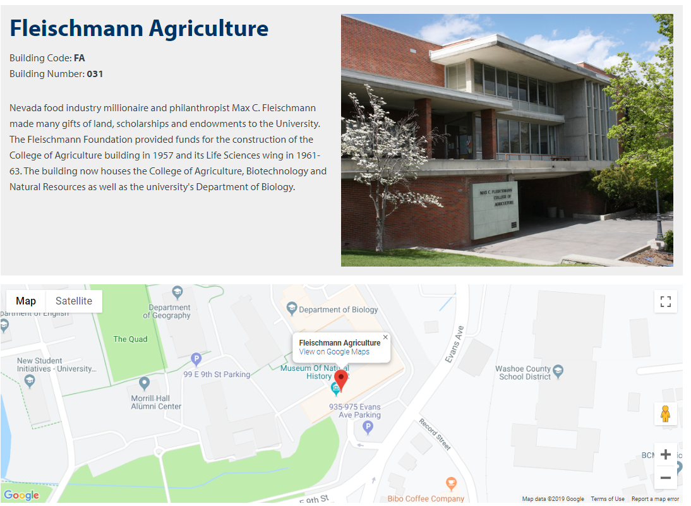

---
---

# Biochemistry (BCH) 709
# Introduction to Bioinformatics Spring 2026 (Section 1001)

> ## Class Schedule
> TuTh 9:00AM - 10:15AM
> Jan 20, 2026 - May 5, 2026
{: .prereq}

> ## Class Room Location
> [Lombardi Recreation Center 204 (LRC 204)](https://share.google/TdWdQ9G44lbg9ylvM)
> {: width="50%" height="50%"}
{: .prereq}

> ## Class Information
> **Course Number:** BCH 709-1001 (22030)
> **Credits:** 3
> **Semester:** Spring 2026
{: .prereq}

## Instructor Information

**Instructor:** Dr. Won C. Yim
**Office:** Howard Medical Sciences 216
**Tel:** 775-784-9447
**Email:** wyim@unr.edu
**Office hours:** 10:30 – noon, Thursday or by appointment.

To make an appointment, please e-mail Dr. Yim.

## Course Description

For contemporary biologists, computational skills have become indispensable. The electronic manipulation and analysis of DNA, RNA, and protein data are now routine tasks, and the volume of sequence data in public databases continues to grow exponentially. With advancing sequencing technologies, this growth will only accelerate. Given the vast scale of modern biological data, manual analysis by individual researchers is no longer feasible, making computational approaches essential for extracting meaningful insights.

Despite its importance, computational biology training is often reserved for advanced graduate study and rarely included in undergraduate curricula. This course aims to bridge that gap by introducing students to bioinformatics early in their academic journey. Students will gain hands-on experience with Linux command-line environments, software installation and management, version control with GitHub, sequence analysis, RNA-Seq workflows, variant calling, and data visualization in R. The course also introduces AI-assisted coding approaches to enhance productivity in computational research.

This foundational knowledge is essential for any student pursuing a degree in biology, biochemistry, or the medical sciences.

**Short Description:** A hands-on bioinformatics course covering Linux command-line fundamentals, sequence analysis, RNA-Seq, variant calling, and R-based data visualization, with emphasis on practical problem-solving skills for computational research in the molecular biosciences.

> ## Syllabus
> Please read our [Syllabus](./syllabus/BCH709_2026spring.pdf).
{: .prereq}

> ## BCH709 AI Assistant
> Have questions about this class? Ask our AI assistant powered by Google NotebookLM!
>
> **[Ask BCH709 LLM](https://notebooklm.google.com/notebook/c1b66fa0-fce3-4625-96bc-03122b9165e1)**
{: .callout}

## Course Pre/Co-requisites

**Course Prerequisite:** BCH 400 (Introductory Biochemistry) or equivalent, plus two semesters of general biology. BCH 413/613 (Molecular Biophysics) is required as a prerequisite or corequisite, or consent of the instructor.

**Strongly Recommended:** Prior or concurrent enrollment in BCH 705 (Molecular Genetics) and completion of BCH 405/BIOL 405 (Molecular Biology). Students without this background may find the course material more challenging.

## Required Texts/Course Materials

List of required course materials for reading, in-class work, writing, homework, viewing, and listening, including calculators, specialized materials or equipment, and computer software.

- Laptop (Mac / Windows OS)
- Keyboard
- Internet connection
- Chrome / Edge / Safari / Explorer
- SLACK

## Class Procedures/Structures

**In person class:** This course will be offered through in-person participation at TuTh 9:00AM - 10:15AM at LRC 204

**General meeting:** General meeting will be offered through SLACK and need to be arranged.

> ## Course Prerequisites
> - http://bch709.plantgenomicslab.org/
> - Computer with ethernet port or wifi (If in case you bring your desktop, please do not bring your monitor. we have a monitor in our classroom)
> - Online introduction to Linux. Students must complete one of the following online tutorials (or both) before class begins.
> - UNR affiliated email **\<ID\>@unr.edu or \<ID\>@nevada.unr.edu** - [How to Activate](https://oit.unr.edu/services-and-support/login-ids-and-passwords/netid/netid-activation/)
> - [Setup your computer](https://plantgenomicslab.github.io/BCH709/setup.html)
> - [Setup Slack ID](https://unrrc.slack.com/)
> - [Register GitHub](https://github.com/)
> - Please register by using UNR email [DataCamp](https://www.datacamp.com/)
> - Please fill this [form](https://forms.gle/nAH3wkjnfkNhrWM47)
{: .callout}

## Student Learning Outcomes

This course emphasizes hands-on terminal usage, investigative approaches, and computational problem-solving. Students will regularly analyze data, write and execute code, troubleshoot errors, and engage in scientific discussions.

Upon successful completion of this course, students will be able to:

- **Experimental Design:** Design bioinformatics strategies using current methods to address biological questions.
- **Computational Proficiency:** Demonstrate solid understanding of bioinformatics concepts through computational exercises and in-class discussions.
- **Scientific Communication:** Critically evaluate primary research articles and articulate key findings through written and oral summaries.
- **Discussion Leadership:** Summarize and lead effective discussions on primary research literature.
- **NGS Analysis:** Analyze RNA-Seq and related experiments using current methods to explore biological questions.

## Course Requirements

1. Students must attend all scheduled classes (on both Monday and Wednesday) or watch the recorded online material by Friday noon of the same week.
2. Complete all assignments, including bioinformatics exercises, that align with the course objectives.
3. Participate in the exams. There will be one midterm and one final exam, both of which will be written and conducted on the computer. The midterm will cover material from the first half of the course, and the final will cover the second half. Additionally, the final exam will include a written bioinformatics analysis. Both exams will have a three-day window for completion. Further details can be found in the WebCampus course section.

## Grading Criteria, Scale, and Standards

Points will be distributed as follows:

| Category                      | Points |
| ----------------------------- | ------ |
| Class Participation           | 100    |
| Homework Assignments          | 400    |
| Presentation and Discussion   | 150    |
| Midterm exam                  | 200    |
| Final exam                    | 250    |
| **Total**                     | **1200** |

Within each category above, the grading scale will be:

| Rating                              | Percentile | Letter grade |
| ----------------------------------- | ---------- | ------------ |
| Excellent                           | 90-100%    | A            |
| Good (acceptable for graduate work) | 80-89%     | B            |
| Fair (unacceptable for graduate work) | 70-79%   | C            |
| Poor                                | 60-69%     | D            |
| Failing                             | < 60%      | F            |

## Late Work / Make-up Exams / Participation Policies

A penalty of 20 % per day will be imposed on a pro rata basis for any late work or attendance. You will be graded on the quality of the assignments listed below and the quality and quantity of your participation in class discussions. Final grades may be adjusted at the discretion of the instructor.

No make-up exams allowed. If you cannot finish exam due to circumstances beyond your control, the instructor kindly requests the professional courtesy of being notified of your absence ahead of time. **Email only**

Class participation points will be deducted for each unexcused absence (10 points per class missed without informing the instructor before the class meets). For a full description of UNR's class attendance policies, please see: [https://www.unr.edu/administrative-manual/3000-3999-students/3020-class-absence-policy](https://www.unr.edu/administrative-manual/3000-3999-students/3020-class-absence-policy). **Email only**

**Attendance.** You are required to attend lecture/online sessions. If you cannot attend due to circumstances beyond your control, the instructor kindly requests the professional courtesy of being notified of your absence ahead of time. (Dr's notes etcs). **Email only**

## Plagiarism Policy

Plagiarism, using someone else's work and presenting it as your own which is a serious academic violation and will not be tolerated in this class. This includes submitting the language, ideas, thoughts, or work of another as your own, or allowing your work to be used by others in this manner. "The work of another" encompasses not only complete papers or articles but also any information, ideas, sentences, or phrases from external sources, including: books, journal articles, websites, videos, lecture notes or handouts from other courses, and any other materials. All sources must be properly acknowledged through in-text citations or footnotes, accompanied by a complete bibliography. Even when paraphrasing without direct quotation, you must cite the original source. Citations are also required for lesser-known facts and statistics.

Ignorance of these standards is not an excuse for plagiarism. If you are uncertain whether a citation is needed or how to properly cite a source, consult the instructor before submitting your work.

## AI/LLM Use Policy

Generative AI tools (e.g., CODEX, Claude, Gemini, Microsoft Copilot) are permitted for all coursework, including exams, in this course. This reflects the reality of modern computational biology, AI tools are integrated into research workflows and you should learn to use them effectively.

However, AI is not a substitute for understanding. You are fully responsible for the accuracy and validity of all submitted work. AI outputs must be meticulously reviewed before submission.

### Core Principle: You Own Your Answers

AI tools can hallucinate, provide outdated information, generate incorrect code, and confidently present wrong answers. When you submit work:
- You are certifying it is correct
- You will be graded on correctness, not on AI use
- "The AI told me" is not a valid excuse for errors

### Requirements

**1. Meticulous Review (Required)**

Before submitting any AI-assisted work, you must:
- Verify biological/computational accuracy against course materials, documentation, or literature
- Test all code and confirm it runs correctly with expected outputs
- Check that citations exist and are correctly attributed
- Ensure explanations reflect actual understanding, not parroted text

**2. Disclosure (Required)**

Include a brief AI use statement with submissions:

"Used [tool] for [purpose]. Verified by [method]."

**Example:** "Used Claude to draft BLAST parsing script. Verified by running on test dataset and reviewing logic line-by-line."

**Example:** "Used CODEX to explain Smith-Waterman algorithm. Cross-checked against lecture slides and corrected AI's error about gap penalty initialization."

**3. Exam-Specific Guidelines**
- AI tools are permitted during exams
- Time limits remain, manage your time accordingly
- Incorrect answers will receive no credit regardless of AI use
- You may be asked to explain your reasoning in follow-up questions

## Tentative Course Schedule

| Week   | Date      | Days     | Subject                                                            |
| ------ | --------- | -------- | ------------------------------------------------------------------ |
| Week1  | 1/20/2026 | Tuesday  | Introduction                                                       |
| Week1  | 1/22/2026 | Thursday | Introduction to Bioinformatics                                     |
| Week2  | 1/27/2026 | Tuesday  | [Linux Environment and command line](Linux_Enviroment_and_command_line/index.html)                                 |
| Week2  | 1/29/2026 | Thursday | [Linux Environment and command line](Linux_Enviroment_and_command_line/index.html)                                 |
| Week3  | 2/3/2026  | Tuesday  | [Conda, Compile & Software Installations](compile/index.html)                            |
| Week3  | 2/5/2026  | Thursday | [Conda, Compile & Software Installations](compile/index.html)                            |
| Week4  | 2/10/2026 | Tuesday  | [GitHub and server](github_server/index.html)                                                  |
| Week4  | 2/12/2026 | Thursday | [Vibe coding](vibe_coding/index.html)                              |
| Week5  | 2/17/2026 | Tuesday  | Sequence manipulation                                              |
| Week5  | 2/19/2026 | Thursday | Sequence manipulation                                              |
| Week6  | 2/24/2026 | Tuesday  | Sequencing methods and strategies                                  |
| Week6  | 2/26/2026 | Thursday | Sequencing methods and strategies                                  |
| Week7  | 3/3/2026  | Tuesday  | Introduction of R & R plotting (Tong Zhou PhD)                     |
| Week7  | 3/5/2026  | Thursday | RNA-Seq                                                            |
| Week8  | 3/10/2026 | Tuesday  | BLAST search and gene alignment                                    |
| Week8  | 3/12/2026 | Thursday | BLAST search and gene alignment                                    |
| Week9  | 3/17/2026 | Tuesday  | Genome assembly & annotation & structure                           |
| Week9  | 3/19/2026 | Thursday | Midterm Exam                                                       |
|        | 3/24/2026 | Tuesday  | Spring Break                                                       |
|        | 3/26/2026 | Thursday | Spring Break                                                       |
| Week10 | 3/31/2026 | Tuesday  | R in RNA-Seq / DESeq2 / EdgeR                                      |
| Week10 | 4/2/2026  | Thursday | R in RNA-Seq / DESeq2 / EdgeR                                      |
| Week11 | 4/7/2026  | Tuesday  | Variant analysis                                                   |
| Week11 | 4/9/2026  | Thursday | Viral variant identification in NGS data (Richard Tillet, Ph. D)   |
| Week12 | 4/14/2026 | Tuesday  | Gene family analysis and phylogenetics (David Alvarez-Ponce, PhD)  |
| Week12 | 4/16/2026 | Thursday | Enrichment analysis                                                |
| Week13 | 4/21/2026 | Tuesday  | Guest Lecture Dr. TongZhou                                         |
| Week13 | 4/23/2026 | Thursday | [Vibe coding examples](vibe_coding/index.html)                     |
| Week14 | 4/28/2026 | Tuesday  | Presentation & Discussions                                         |
| Week14 | 4/30/2026 | Thursday | Presentation & Discussions                                         |
| Week15 | 5/5/2026  | Tuesday  | Class Review                                                       |
| Week15 | 5/7/2026  | Thursday | Final Exam                                                         |

## SLACK Etiquette or Netiquette Expectations

**Discussion and video meeting through SLACK**

Any class related questions are allowed through SLACK. You are required to chat with instructor in class channel only. Direct message will not be allowed and will be ignored. Assignments and exam related questions are not allowed through SLACK.

## University Policies

### Statement on Academic Dishonesty

"The University Academic Standards Policy defines academic dishonesty, and mandates specific sanctions for violations. See the University Academic Standards policy: UAM 6,502."

### Statement of Disability Services

**For Traditional and Seated Classrooms:**

"Any student with a disability needing academic adjustments or accommodations is requested to speak with me or the Disability Resource Center (Pennington Achievement Center Suite 230) as soon as possible to arrange for appropriate accommodations."

**For Online Courses:**

"If you are a student who would normally seek accommodations in a traditional classroom, please contact me as soon as possible. You may also contact the Disability Resource Center for services for online courses by emailing drc@unr.edu or calling 775-784-6000. Academic accommodations for online courses may be different than those for seated classrooms; it is important that you contact us as soon as possible to discuss services. The University of Nevada, Reno supports equal access for students with disabilities. For more information, visit the Disability Resource Center."

This course may leverage 3rd party web/multimedia content, if you experience any issues accessing this content, please notify your instructor.

### Statement on Audio and Video Recording

**Student-created Recordings**

"Surreptitious or covert video-taping of class or unauthorized audio recording of class is prohibited by law and by Board of Regents policy. This class may be videotaped or audio recorded only with the written permission of the instructor. In order to accommodate students with disabilities, some students may have been given permission to record class lectures and discussions. Therefore, students should understand that their comments during class may be recorded."

**Instructor-created Recordings**

Class sessions may be audio-visually recorded for students in the class to review and for enrolled students who are unable to attend live to view. Students who participate with their camera on or who use a profile image are consenting to have their video or image recorded. If you do not consent to have your profile or video image recorded, keep your camera off and do not use a profile image. Students who un-mute during class and participate orally are consenting to have their voices recorded. If you do not consent to have your voice recorded during class, keep your mute button activated and only communicate by using the "chat" feature, which allows you to type questions and comments live.

### Statement on Maintaining a Safe Learning and Work Environment

The University of Nevada, Reno is committed to providing a safe learning and work environment for all. If you believe you have experienced discrimination, sexual harassment, sexual assault, domestic/dating violence, or stalking, whether on or off campus, or need information related to immigration concerns, please contact the University's Equal Opportunity & Title IX office at 775-784-1547. Resources and interim measures are available to assist you. For more information, please visit the Equal Opportunity and Title IX page.

### Statement for Academic Success Services

Your student fees cover usage of the [University Math Center](https://www.unr.edu/university-math-center), (775) 784-4433; [University Tutoring Center](https://www.unr.edu/tutoring-center), (775) 784-6801; and [University Writing & Speaking Center](https://www.unr.edu/writing-speaking-center), (775) 784-6030. These centers support your classroom learning; it is your responsibility to take advantage of their services. Keep in mind that seeking help outside of class is the sign of a responsible and successful student.

## Optional Additional Meeting

### Research Computing Hackathon ([Hosted by HPC team](https://www.unr.edu/research-computing/hpc))

Every Friday at 2:00pm to 4:00pm through SLACK

[Hackathons](https://en.wikipedia.org/wiki/Hackathon) provide a space for hands-on training and solution development within a Research Computing environment at the University. This is also a place to get clarification on questions/concerns regarding the HPC environment. Please bring problems to challenge the HPC team, the Office of Information Technology, and research colleagues. If you don't need help, we still encourage you to attend and share your time and expertise with those in need of assistance. You don't need to be an expert to attend a hackathon. Individuals at all computing skill levels are welcome! Won Yim will attend this hackathon.

### Meeting

Office [Howard Medical Science 216](https://goo.gl/maps/o41BMmcawsTPoES57)
I prefer to have online meeting through SLACK.

## Optional Reading Materials

- [Introduction to Bioinformatics (3rd Edition)](http://app.knovel.com/web/toc.v/cid:kpIBE00007/viewerType:toc/)
- [Learn Linux Shell Scripting - Fundamentals of Bash 4.4](https://www.oreilly.com/library/view/learn-linux-shell/9781788995597/)
- [Effective awk Programming, 3rd Edition](https://www.oreilly.com/library/view/effective-awk-programming/0596000707/)
- [Bioinformatics with Python Cookbook - Second Edition](https://www.oreilly.com/library/view/bioinformatics-with-python/9781789344691/)
- [Basic Applied Bioinformatics](https://www.oreilly.com/library/view/basic-applied-bioinformatics/9781119244332/)
- [Ubuntu Linux Unleashed 2021 Edition, 14th Edition](https://www.oreilly.com/library/view/ubuntu-linux-unleashed/9780136685395/)
- [Unix and Perl Primer for Biologists (Keith Bradnam & Ian Korf)](https://github.com/KorfLab/unix_and_perl/blob/main/UnP4B-3.1.2.pdf)
- [Other bioinformatics books from knovel](http://app.knovel.com/web/search.v?q=bioinformatics&search_type=tech-reference&rows=10&offset=0&group_by=true&my_subscription=true&sort_on=default&content_type=all_references&include_synonyms=no)
- [Other bioinformatics books from O'Reilly](https://www.oreilly.com/search/?q=bioinformatics)

**Note: all reading material can be freely accessed and downloaded from the UNR internet.**

## Other Websites

[Plant Genomics Lab](https://www.plantbioinformatics.org/)
[Lecture website](https://plantgenomicslab.github.io/BCH709/)
[Lecture Github](https://github.com/plantgenomicslab/BCH709)

> ## Frequently Asked Questions
> Read our [FAQ](./_episodes/FAQ/FAQ.md). Currently, this page is empty, but we will build it through the class.
{: .prereq}

> ## Teaching Platform
> This lecture was designed to be run on [Unix-base system](https://en.wikipedia.org/wiki/Unix) such as Ubuntu, mac, etc. All the software and data used in the class will be open source. All example data will be hosted on a Google Cloud Service. If you want to know how to use Unix-base system on your computer, please follow the directions in the [Setup](setup.html) tab.
{: .prereq}

---

The website theme was adapted from the original by [Data Carpentry](https://datacarpentry.org/). The infrastructure, including adventure-time and docker-browser-server, was built by @maxogden and @mafintosh. The setup of this app was based on the get-data adventure. This adventure app was made by Richard Smith-Unna. The lecture materials were crafted by Won Yim. This work is licensed under a Creative Commons 4.0 International License.
