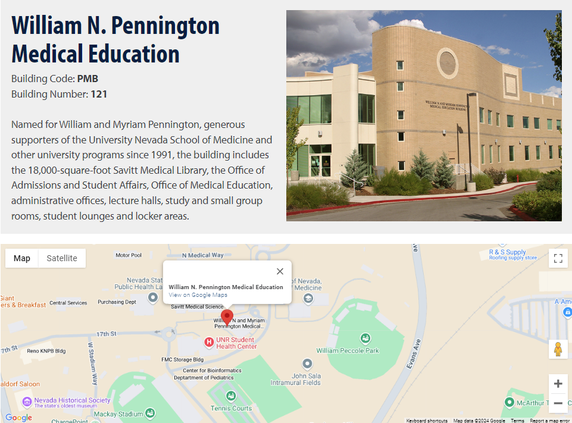

---
---

The philosophy of 'BCH709 Introduction to Bioinformatics' is to teach researchers basic concepts, skills, and tools for working with data so that student can get their own bioinformatics work done without pain. This illustrates the concept of bioinformatics analysis and Next Generation Sequencing for genomics including hands-on bioinformatics, understanding genomics through bioinformatics, use of command-line in multiple platforms, use of command-line tools to analyze sequencing data, and connecting to and using cloud computing.

> ## Class Room location
> Classroom was changed to Fleischmann Agriculture Building room 234 (FA234)
> {: width="50%" height="50%"}
> 
> [FA234](https://www.google.com/maps/place/39%C2%B032'15.7%22N+119%C2%B048'43.5%22W/@39.5385648,-119.8114072,17.67z/data=!4m5!3m4!1s0x0:0x0!8m2!3d39.5376946!4d-119.81208)  
{: .prereq}

> ## Class Schedule
> MonWed 9:00AM - 10:15AM  
> Jan 1, 2020 - May 4, 2020
{: .prereq}

> ## Prerequisites
> Online introduction to Linux. Students must complete one of the following online tutorials (or both) before class begins.
> - Please fill this [form](https://forms.gle/AC4uFx9RHQWbZRyq8)
> - Computer with ethernet port or wifi (If in case you bring your **desktop**, please do not bring your monitor. we have a monitor in our classroom)
> - UNR affilated email **\<ID\>@unr.edu or \<ID\>@nevada.unr.edu** - [How to Activate](https://oit.unr.edu/services-and-support/login-ids-and-passwords/netid/netid-activation/)
> - [Setup your computer](https://plantgenomicslab.github.io/BCH709/setup.html)
> - [Please apply your Pronghorn account here](https://www.unr.edu/research-computing/hpc-accounts)
> -- [Please follow this instrunction](https://plantgenomicslab.github.io/BCH709/pronghorn/index.html)
> - [Code academy's Intro to Unix](https://www.codecademy.com/learn/learn-the-command-line "Code academy")  - **Due to Next Tuesday (9/3/19)**
{: .callout}

> ## Course description
>As contemporary biologists we have entered an age where the use of computers in our daily work has become all but essential. The manipulation and analysis of DNA, RNA, and protein data by electronic means has become a routine task. Further, the amount of DNA, RNA and protein sequence data we are putting into databases every day is expanding at a geometric rate, and with coming advances in sequencing technology, this rate is only expected to increase. With all this new data, analysis by individual humans is simply not possible. Thus, in the past 15 years, computational biology has emerged as a field concerned with storage, manipulation, and extraction of valuable information from all this new data. However, because computational biology is an emerging field, organized courses are generally saved for higher-level study, and often are not required parts of an undergraduate curriculum. We seek to fill this void in education and create a course that will introduce students to bioinformatics at an earlier point in their education. This knowledge will prove to be not simply useful, but essential, for any student considering a degree in any area of biology and medical science.
{: .prereq}

## Course Overview 
|              | Date | Topics                                          |
|--------------|------|-------------------------------------------------|
| Week1        | 1/22 | [Orientation](https://plantgenomicslab.github.io/BCH709/Orientation/index.html)                                   |
| Week2        | 1/27 | [Intro Bioinformatics / Linux Enviroment and command line](https://plantgenomicslab.github.io/BCH709/Linux_Enviroment_and_command_line/index.html) |
| Week2        | 1/29 | [Linux Enviroment and command line](https://plantgenomicslab.github.io/BCH709/Linux_Enviroment_and_command_line/index.html)               |
| Week3        | 2/3  | [Github / Compile](https://plantgenomicslab.github.io/BCH709/compile/index.html)      |
| Week3        | 2/5  | [Sequencing methods and strategies](https://www.dropbox.com/s/5ajz4e6kd9twxux/Sequencing.pdf)  |
| Week4        | 2/10 | [RNA-Seq](https://plantgenomicslab.github.io/BCH709/RNASeq/index.html) |
| Week4        | 2/12 | [Transcriptome assembly](https://plantgenomicslab.github.io/BCH709/transcriptome_assembly/index.html) |
| Week5        | 2/17 | Presidents day                                  |
| Week5        | 2/19 | Sequence similarity searching                   |
| Week6        | 2/24 | Functional annotation                           |
| Week6        | 2/26 | Database                                        |
| Week7        | 3/2  | DEG analysis(https://plantgenomicslab.github.io/BCH709/DEG2/index.html)                                    |
| Week7        | 3/4  | Gene family analysis and phylogenetics          |
| Week8        | 3/9  | [Introduction of R R plotting (Heatmap & others)](https://plantgenomicslab.github.io/BCH709/intro_R/index.html) |
| Week8        | 3/11 | Midterm                                         |
| Spring Break | 3/16 | Spring Break                                    |
| Spring Break | 3/18 | Spring Break                                    |
| Week9        | 3/23 | [Genome assembly](https://plantgenomicslab.github.io/BCH709/Genome_assembly_1/index.html)                                 |
| Week9        | 3/25 | [Genome assembly](https://plantgenomicslab.github.io/BCH709/Genome_assembly_1/index.html)                                 |
| Week10       | 3/30 | [Genome assembly](https://plantgenomicslab.github.io/BCH709/Genome_assembly_2/index.html)                                 |
| Week10       | 4/1  | Hi-C scaffolding                                |
| Week11       | 4/6  | [Genome structure](https://plantgenomicslab.github.io/BCH709/Genome_annotation/index.html)                                |
| Week11       | 4/8  | How to annotate genomes                         |
| Week12       | 4/13 | Student presentation                            |
| Week13       | 4/15 | Student presentation                            |
| Week13       | 4/20 | [Genome assembly and annotation](https://plantgenomicslab.github.io/BCH709/Genome_annotation/index.html)                  |
| Week14       | 4/22 | [DEG analaysis](https://plantgenomicslab.github.io/BCH709/Genome_RNASeq/index.html)                                   |
| Week14       | 4/27 | Transcriptome analysis                          |
| Week15       | 4/29 | [Enrichment analysis](https://plantgenomicslab.github.io/BCH709/Genome_description/index.html)                             |
| Week15       | 5/4  | Variant analaysis                               |
|              | 5/11 | Final                                           |

> ## Getting Started
>
> This lesson assumes that learners have no prior experience with the tools covered in the workshop. 
> However, learners are expected to have some familiarity with biological concepts,
> including the concept of genomic variation within a population. Participants should bring their own laptops and plan to participate actively. 
> 
> To get started, follow the directions in the [Setup](setup.html) tab to 
> get access to the required software and data for this workshop.
> 
{: .prereq}
<!-- 
> ## Data
> 
> This workshop uses data from a long term evolution experiment published in 2016: [Tempo and mode of genome evolution in a 50,000-generation experiment](https://www.ncbi.nlm.nih.gov/pmc/articles/PMC4988878/) by Tenaillon O, Barrick JE, Ribeck N, Deatherage DE, Blanchard JL, Dasgupta A, Wu GC, Wielgoss S, Cruveiller S, Médigue C, Schneider D, and Lenski RE. (doi: 10.1038/nature18959)
>
> All of the data used in this workshop can be [downloaded from Figshare](https://figshare.com/articles/Data_Carpentry_Genomics_beta_2_0/7726454). 
> More information about this data is available on the [Data page](https://datacarpentry.org/organization-genomics/data/).
{: .prereq} 
-->

## Optional Additional Meeting

### _Research Computing Hackathon_  ([Hosted by HPC team](https://www.unr.edu/research-computing/hpc))  
 [Mathewson-IGT Knowledge Center, MIKC 414 or MIKC 121](https://events.unr.edu/mathewson-igt_knowledge_center_508#.XVyb3OhKiiM)  
Please check the [schedule here](https://events.unr.edu/search/events?event_types%5B%5D=28250&order=date&event_types%5B%5D=44657)
Every Friday at 2:00pm to 4:00pm

[Hackathons](https://en.wikipedia.org/wiki/Hackathon) provide a space for hands-on training and solution development within a Research Computing environment at the University. This is also a place to get clarification on questions/concerns regarding the HPC environment. Please bring problems to challenge the HPC team, the Office of Information Technology, and research colleagues. If you don't need help, we still encourage you to attend and share your time and expertise with those in need of assistance. You don’t need to be an expert to attend a hackathon. Individuals at all computing skill levels are welcome! Won Yim will attend this hackathon.

### _Meeting with Won Yim_  
[Howard Molecular Science 216](https://goo.gl/maps/o41BMmcawsTPoES57)  
After Thursday class, we can have a meeting. We are not providing financial aid, but we can discuss your research bottleneck in terms of bioinformatics perspective. **Please schedule after Tuesday class.**   
  
## Optional Reading materials
- [Introduction to Bioinformatics (3rd Edition)](http://app.knovel.com/web/toc.v/cid:kpIBE00007/viewerType:toc/ "Introduction to Bioinformatics (3rd Edition)")

- [Learn Linux Shell Scripting - Fundamentals of Bash 4.4](https://learning.oreilly.com/library/view/learn-linux-shell/9781788995597/ "Learn Linux Shell Scripting - Fundamentals of Bash 4.4")

- [Effective awk Programming, 3rd Edition](https://learning.oreilly.com/library/view/effective-awk-programming/0596000707/ "Effective awk Programming, 3rd Edition")

- [Bioinformatics with Python Cookbook - Second Edition](https://learning.oreilly.com/library/view/bioinformatics-with-python/9781789344691/ "Bioinformatics with Python Cookbook - Second Edition")

- [Basic Applied Bioinformatics](https://learning.oreilly.com/library/view/basic-applied-bioinformatics/9781119244332/ "Basic Applied Bioinformatics")

- [Ubuntu Unleashed 2019 Edition: Covering 18.04, 18.10, 19.04, 13/e](https://learning.oreilly.com/library/view/ubuntu-unleashed-2019/9780134985497/ "Ubuntu Unleashed 2019 Edition: Covering 18.04, 18.10, 19.04, 13/e")

- [Unix and Perl: Keith Bradnam & Ian Korf](https://j.p.gogarten.uconn.edu/mcb5472_2018/current.pdf)

- [Other bioinformatics books from knovel](http://app.knovel.com/web/search.v?q=bioinformatics&search_type=tech-reference&rows=10&offset=0&group_by=true&my_subscription=true&sort_on=default&content_type=all_references&include_synonyms=no "Other bioinformatics books from knovel")

- [Other bioinformatics books from Oreilly](https://learning.oreilly.com/search/?query=bioinformatics&extended_publisher_data=true&highlight=true&include_assessments=false&include_case_studies=true&include_courses=true&include_orioles=true&include_playlists=true&include_collections=false&include_notebooks=false&is_academic_institution_account=false&sort=relevance&facet_json=true "Other bioinformatics books from Oreilly")

**Note: all reading material can be freely accessed and downloaded from the UNR internet.**

## Other Website
[Command line website](http://35.199.189.11:8081/  "Command line website")  
[Plant Genomics Lab](https://www.plantbioinformatics.org/ "Plant Genomics Lab")

  
> ## Frequently Asked Questions  
Read our [FAQ](./_episodes/FAQ/FAQ.md). Currently, this page is empty, but we will build it through the class.
{: .prereq}

  
>## Teaching Platform
This lecture was designed to be run on [Unix-base system](https://en.wikipedia.org/wiki/Unix) such as 
Ubuntu, mac, etc. All the software and data used in the class will be open source. All example data will be hosted on a Google Cloud Service. If you want to know how to use Unix-base system on your computer, please follow the directions in the [Setup](setup.html) tab.
{: .prereq}

  

The website theme was adapted from the original by [Data Carpentry](https://datacarpentry.org/). The infrastructure, including adventure-time and docker-browser-server, was built by @maxogden and @mafintosh. The setup of this app was based on the get-data adventure. This adventure app was made by Richard Smith-Unna. The lecture materials were crafted by Won Yim. This work is licensed under a Creative Commons 4.0 International License.
