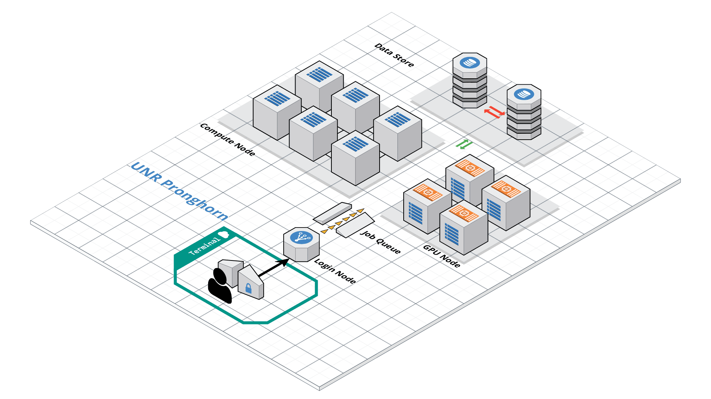

# Overview

This lecture is designed to be run on a terminal program. With the exception of a GUI program, all of the software and data used in the terminal. Please follow the instructions below to prepare your computer for the lecture.

**Please do not buy a new laptop. Your level is not that high, and our lecture will not need a new fancy computer.**
**Please read below and think about the best way.**

## Required Operating System + Laptop

> ## Windows 10
> - Install MSOffice by going to [the installation page](https://oit.unr.edu/services-and-support/software-and-online-applications/software-purchasing-and-installation/microsoft-office-365-for-personal-computers/install-microsoft-office-for-home-student/) or [connect this site](https://oit.unr.edu/services-and-support/data-storage/office-365/). The version for Windows should automatically be selected. Once the installer is downloaded, double click on it and MSOffice should install.

> If you use the most reent version of Windows
> Step 1 - Enable the Windows Subsystem for Linux
> You must first enable the "Windows Subsystem for Linux" optional feature before installing any Linux distributions on Windows.
> Open PowerShell as Administrator and run:
> - Open PowerShell with right click and "choose Run it as administrator."
>{: width="50%" height="50%"}
> PowerShell
>~~~
>dism.exe /online /enable-feature /featurename:Microsoft-Windows-Subsystem-Linux /all /norestart
>~~~
> Install your Linux distribution of choice
>  - **Please install Ubuntu 18.04 LTS.**
> Open the [Microsoft Store](https://aka.ms/wslstore) and select your favorite Linux distribution.
> {: width="70%" height="70%"}
>
> - **If you use older version of Windows 10**
> - Install [Bash on Windows](https://www.linux.com/news/bash-windows-what-does-it-mean/) by Enable “Windows Subsystem for Linux” feature.
> - Open PowerShell with right click and "choose Run it as administrator."
>{: width="50%" height="50%"}
>Once you have the PowerShell running, use the command below to enable Bash in Windows 10.
>~~~
>Enable-WindowsOptionalFeature -Online -FeatureName Microsoft-Windows-Subsystem-Linux
>~~~
>- You’ll be asked to confirm your choice. Type Y or press enter:
>{: width="70%" height="70%"}
> - Now you should be asked to reboot. Even if you are not asked to, you must restart your system. Once your system has rebooted, go to the Windows Store and search for “Linux.”
>{: width="70%" height="70%"}
> - **Please install Ubuntu 18.04 LTS.**
> Open the [Microsoft Store](https://aka.ms/wslstore) and select your favorite Linux distribution.
>{: width="70%" height="70%"}
> - Once you choose the distribution of your choice, you’ll see the option to install it. Do note that it will download files of around 1Gb in size. So you should have a good internet connection here.
> - Press "windows key + s" and search "ubuntu". *If you have Contana, you can use it at home*.
> - Please be patience then it will ask id and password. 
>{: width="70%" height="70%"}
>- If you find the following message, please go back to the top of this article and do it again.
>~~~
>The WSL optional component is not enabled. Please enable it and try again.
>See https://aka.ms/wslinstall for details.
>Error: 0x8007007e
>Press any key to continue...
>~~~
>- If you cannot get the Fall Creator’s update on Windows 10 for some reason, please update your Windows 10 first. If you still have trouble, please follow "Windows 7 and under the section."
{: .solution}

> ## Windows 7 and under
> - Install MSOffice by going to [the installation page](hhttps://oit.unr.edu/services-and-support/software-and-online-applications/software-purchasing-and-installation/microsoft-office-365-for-personal-computers/install-microsoft-office-for-home-student/). The version for Windows should automatically be selected. Once the installer is downloaded, double click on it and MSOffice should install.
> - Install Putty by going to [the installation page](https://www.chiark.greenend.org.uk/~sgtatham/putty/latest.html). For most newer computers, click on putty-64bit-X.XX-installer.msi to download the 64-bit version. If you have an older laptop, you may need to get the 32-bit version putty-X.XX-installer.msi. If you aren't sure whether you need the 64 or 32-bit version, you can check your laptop version by following [the instructions here](https://support.microsoft.com/en-us/help/15056/windows-32-64-bit-faq)
> - Once the installer is downloaded, double click on it, and PuTTY should install.
{: .solution}

> ## Mac OS X
> - Install MSOffice by going to [the installation page](hhttps://oit.unr.edu/services-and-support/software-and-online-applications/software-purchasing-and-installation/microsoft-office-365-for-personal-computers/install-microsoft-office-for-home-student/). The version cannot be selected. Once the installer is downloaded, double click on it and MSOffice should install.
> - Once the installer is downloaded, double click on it and MSOffice should install.
>
> - Mac has native Terminal (command + space) and search terminal
> - However, I personally recommend to use [iTerm2](https://www.iterm2.com/) for a better experience.
> Additionally, I would recommend to install [MacOS command-line tools with the following instruction](https://plantgenomicslab.github.io/BCH709/CLT/index.html).
{: .solution}

> ## Linux
>  - Install LibreOffice by going to [the installation page](https://www.libreoffice.org/download/libreoffice-fresh/). The version for Linux should automatically be selected. Click Download Version X.X.X (whichever is the most recent version). You will go to a page that asks about a donation, but you don't need to make one. Your download should begin automatically.  
> - Once the installer is downloaded, double click on it and LibreOffice should install.
>
>
> - Please find terminal  Ctrl+Alt+T or terminal or xterm or uxterm
{: .solution}

> ## Old laptop
>If you're laptop is old; We still have an option. Please choose one option in High-Performance Computing and Cloud service and connect to [Google Cloud SSh](https://ssh.cloud.google.com/)
{: .solution}

> ## Chromebook
>Of course you can do it with [Secure Shell App](https://chrome.google.com/webstore/detail/secure-shell-app/pnhechapfaindjhompbnflcldabbghjo)
{: .solution}

> ## Phone (Android/IOS)
>Of course you can do it with [Termius](https://www.termius.com/)
>Not recommended.
{: .solution}

> ## Pencil 
>Of course you can do it with [Termius](https://www.termius.com/)
>Not recommended.
{: .solution}

## Required Additional Software

This lesson requires a working web browser, terminal, spreadsheet program. If you don't have a spreadsheet program already, you can use MSOffice for free with your affiliated email. 
The following guide will provide the specific information about the required software. Please select your [OS system](https://en.wikipedia.org/wiki/Operating_system) to install the software.

## High-Performance Computing and Cloud service

### Option A: Using the lessons on your local machine

It is possible to work through the lessons on your local machine (i.e., without using cloud or Pronghorn). However, I would recommend experiencing in High-Performance Computing and Cloud service.

### Option B: Using Pronghorn (High-Performance Computing)

**Pronghorn** is the University of Nevada, Reno's new High-Performance Computing (HPC) cluster. The GPU-accelerated system is designed, built and maintained by the Office of Information Technology's HPC Team. Pronghorn and the HPC Team supports general research across the Nevada System of Higher Education (NSHE).

Pronghorn is composed of CPU, GPU, and Storage subsystems interconnected by a 100Gb/s non-blocking Intel Omni-Path fabric. The CPU partition features 93 nodes, 2,976 CPU cores, and 21TiB of memory. The GPU partition features 44 NVIDIA Tesla P100 GPUs, 352 CPU cores, and 2.75TiB of memory. The storage system uses the IBM SpectrumScale file system to provide 1PB of high-performance storage. The computational and storage capabilities of Pronghorn will regularly expand to meet NSHE computing demands.

Pronghorn is collocated at the Switch Citadel Campus located 25 miles East of the University of Nevada, Reno. Switch is the definitive leader of sustainable data center design and operation. The Switch Citadel is rated Tier 5 Platinum, and will be the largest, most advanced data center campus on the planet.

Pronghorn is available to all University of Nevada, Reno faculty, staff, students, and sponsored affiliates. Priority access to the system is available for purchase.
[Please apply your account here](https://www.unr.edu/research-computing/hpc-accounts)

{: width="70%" height="70%"}

### Option C: Using Google Cloud Platform (GCP)
Currently, this lecture is supported by the Google Cloud Platform. If you want to try, we will provide free credit for your usage (about USD $1.50 per user, per day). If you choose this option, you need to have a Google account. We will mainly use the compute engine to run our bioinformatics project. Please check below.

Won Yim has *no* control over GCP pricing structure and provides this
cost estimate with no guarantees. Please read the documentation on pricing for up-to-date information.

### Option D: Using Amazon Web Service
If you would like to work through Amazon Web Service (AWS). I will not stop you.
The cost of using this AWS for a few days, with the t2.medium instance type is very low (about USD $1.50 per user, per day). Won Yim has *no* control over AWS pricing structure and provides this
cost estimate with no guarantees. Please read GCP documentation on pricing for up-to-date information.

### Data
The data used in this lecture will be available by direct link.
